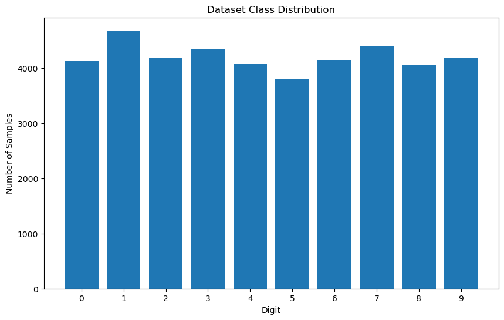
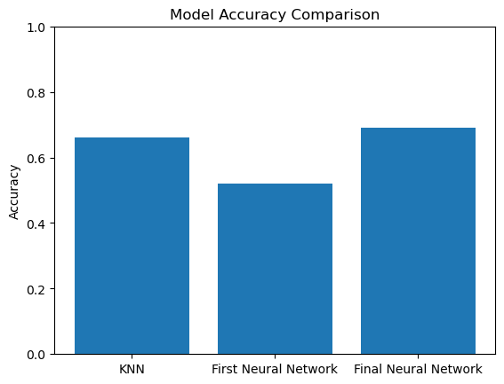
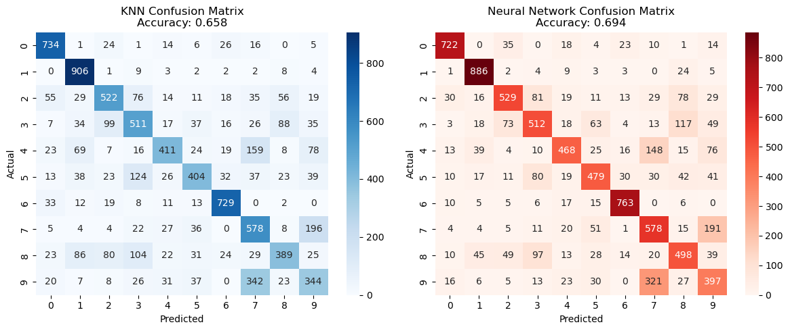

```python
import matplotlib.pyplot as plt
import numpy as np
import pandas as pd
from sklearn import datasets
from sklearn.model_selection import train_test_split
from sklearn.model_selection import cross_val_score
import statsmodels.api as sm
from sklearn.preprocessing import LabelEncoder
import seaborn as sns
from sklearn.neural_network import MLPClassifier
from sklearn.neighbors import KNeighborsClassifier
from sklearn.preprocessing import StandardScaler
from sklearn.metrics import accuracy_score, classification_report
```


```python
# read in the data
df = pd.read_csv(r"C:\Users\jhack\ALY6020\Week Five\letters.csv")
```


```python
# examine the dataset
df.info()
```

    <class 'pandas.core.frame.DataFrame'>
    RangeIndex: 42000 entries, 0 to 41999
    Data columns (total 46 columns):
     #   Column    Non-Null Count  Dtype
    ---  ------    --------------  -----
     0   label     42000 non-null  int64
     1   pixel43   42000 non-null  int64
     2   pixel44   42000 non-null  int64
     3   pixel92   42000 non-null  int64
     4   pixel124  42000 non-null  int64
     5   pixel125  42000 non-null  int64
     6   pixel126  42000 non-null  int64
     7   pixel127  42000 non-null  int64
     8   pixel128  42000 non-null  int64
     9   pixel129  42000 non-null  int64
     10  pixel130  42000 non-null  int64
     11  pixel131  42000 non-null  int64
     12  pixel132  42000 non-null  int64
     13  pixel133  42000 non-null  int64
     14  pixel134  42000 non-null  int64
     15  pixel135  42000 non-null  int64
     16  pixel136  42000 non-null  int64
     17  pixel137  42000 non-null  int64
     18  pixel138  42000 non-null  int64
     19  pixel146  42000 non-null  int64
     20  pixel147  42000 non-null  int64
     21  pixel148  42000 non-null  int64
     22  pixel149  42000 non-null  int64
     23  pixel150  42000 non-null  int64
     24  pixel151  42000 non-null  int64
     25  pixel152  42000 non-null  int64
     26  pixel153  42000 non-null  int64
     27  pixel154  42000 non-null  int64
     28  pixel155  42000 non-null  int64
     29  pixel156  42000 non-null  int64
     30  pixel157  42000 non-null  int64
     31  pixel158  42000 non-null  int64
     32  pixel159  42000 non-null  int64
     33  pixel160  42000 non-null  int64
     34  pixel327  42000 non-null  int64
     35  pixel328  42000 non-null  int64
     36  pixel329  42000 non-null  int64
     37  pixel351  42000 non-null  int64
     38  pixel410  42000 non-null  int64
     39  pixel411  42000 non-null  int64
     40  pixel412  42000 non-null  int64
     41  pixel413  42000 non-null  int64
     42  pixel414  42000 non-null  int64
     43  pixel415  42000 non-null  int64
     44  pixel416  42000 non-null  int64
     45  pixel417  42000 non-null  int64
    dtypes: int64(46)
    memory usage: 14.7 MB
    


```python
# observation counts for each number
df['label'].value_counts()
```


    label
    1    4684
    7    4401
    3    4351
    9    4188
    2    4177
    6    4137
    0    4132
    4    4072
    8    4063
    5    3795
    Name: count, dtype: int64


```python
# Separate features and labels
X = df.drop('label', axis=1)  # X = features (all pixel columns)
y = df['label']  # y = labels (the digits 0-9)
```


```python
# Split the data into test and train
X_train, X_test, y_train, y_test = train_test_split(X, y, test_size=0.2, random_state=42, stratify=y)

print(f"Training set shape: {X_train.shape}")
print(f"Test set shape: {X_test.shape}")
print(f"Target distribution in training set: \n{y_train.value_counts(normalize=True)}")
```

    Training set shape: (33600, 45)
    Test set shape: (8400, 45)
    Target distribution in training set: 
    label
    1    0.111518
    7    0.104792
    3    0.103601
    9    0.099702
    2    0.099464
    6    0.098512
    0    0.098363
    4    0.096964
    8    0.096726
    5    0.090357
    Name: proportion, dtype: float64
    


```python
# Scale the data
scaler = StandardScaler()
X_train_scaled = scaler.fit_transform(X_train)
X_test_scaled = scaler.transform(X_test)
```


```python
# Fit the KNN model 
knn = KNeighborsClassifier(n_neighbors=5, metric='euclidean')
knn.fit(X_train_scaled, y_train)
```


<style>#sk-container-id-1 {
  /* Definition of color scheme common for light and dark mode */
  --sklearn-color-text: black;
  --sklearn-color-line: gray;
  /* Definition of color scheme for unfitted estimators */
  --sklearn-color-unfitted-level-0: #fff5e6;
  --sklearn-color-unfitted-level-1: #f6e4d2;
  --sklearn-color-unfitted-level-2: #ffe0b3;
  --sklearn-color-unfitted-level-3: chocolate;
  /* Definition of color scheme for fitted estimators */
  --sklearn-color-fitted-level-0: #f0f8ff;
  --sklearn-color-fitted-level-1: #d4ebff;
  --sklearn-color-fitted-level-2: #b3dbfd;
  --sklearn-color-fitted-level-3: cornflowerblue;

  /* Specific color for light theme */
  --sklearn-color-text-on-default-background: var(--sg-text-color, var(--theme-code-foreground, var(--jp-content-font-color1, black)));
  --sklearn-color-background: var(--sg-background-color, var(--theme-background, var(--jp-layout-color0, white)));
  --sklearn-color-border-box: var(--sg-text-color, var(--theme-code-foreground, var(--jp-content-font-color1, black)));
  --sklearn-color-icon: #696969;

  @media (prefers-color-scheme: dark) {
    /* Redefinition of color scheme for dark theme */
    --sklearn-color-text-on-default-background: var(--sg-text-color, var(--theme-code-foreground, var(--jp-content-font-color1, white)));
    --sklearn-color-background: var(--sg-background-color, var(--theme-background, var(--jp-layout-color0, #111)));
    --sklearn-color-border-box: var(--sg-text-color, var(--theme-code-foreground, var(--jp-content-font-color1, white)));
    --sklearn-color-icon: #878787;
  }
}

#sk-container-id-1 {
  color: var(--sklearn-color-text);
}

#sk-container-id-1 pre {
  padding: 0;
}

#sk-container-id-1 input.sk-hidden--visually {
  border: 0;
  clip: rect(1px 1px 1px 1px);
  clip: rect(1px, 1px, 1px, 1px);
  height: 1px;
  margin: -1px;
  overflow: hidden;
  padding: 0;
  position: absolute;
  width: 1px;
}

#sk-container-id-1 div.sk-dashed-wrapped {
  border: 1px dashed var(--sklearn-color-line);
  margin: 0 0.4em 0.5em 0.4em;
  box-sizing: border-box;
  padding-bottom: 0.4em;
  background-color: var(--sklearn-color-background);
}

#sk-container-id-1 div.sk-container {
  /* jupyter's `normalize.less` sets `[hidden] { display: none; }`
     but bootstrap.min.css set `[hidden] { display: none !important; }`
     so we also need the `!important` here to be able to override the
     default hidden behavior on the sphinx rendered scikit-learn.org.
     See: https://github.com/scikit-learn/scikit-learn/issues/21755 */
  display: inline-block !important;
  position: relative;
}

#sk-container-id-1 div.sk-text-repr-fallback {
  display: none;
}

div.sk-parallel-item,
div.sk-serial,
div.sk-item {
  /* draw centered vertical line to link estimators */
  background-image: linear-gradient(var(--sklearn-color-text-on-default-background), var(--sklearn-color-text-on-default-background));
  background-size: 2px 100%;
  background-repeat: no-repeat;
  background-position: center center;
}

/* Parallel-specific style estimator block */

#sk-container-id-1 div.sk-parallel-item::after {
  content: "";
  width: 100%;
  border-bottom: 2px solid var(--sklearn-color-text-on-default-background);
  flex-grow: 1;
}

#sk-container-id-1 div.sk-parallel {
  display: flex;
  align-items: stretch;
  justify-content: center;
  background-color: var(--sklearn-color-background);
  position: relative;
}

#sk-container-id-1 div.sk-parallel-item {
  display: flex;
  flex-direction: column;
}

#sk-container-id-1 div.sk-parallel-item:first-child::after {
  align-self: flex-end;
  width: 50%;
}

#sk-container-id-1 div.sk-parallel-item:last-child::after {
  align-self: flex-start;
  width: 50%;
}

#sk-container-id-1 div.sk-parallel-item:only-child::after {
  width: 0;
}

/* Serial-specific style estimator block */

#sk-container-id-1 div.sk-serial {
  display: flex;
  flex-direction: column;
  align-items: center;
  background-color: var(--sklearn-color-background);
  padding-right: 1em;
  padding-left: 1em;
}


/* Toggleable style: style used for estimator/Pipeline/ColumnTransformer box that is
clickable and can be expanded/collapsed.
- Pipeline and ColumnTransformer use this feature and define the default style
- Estimators will overwrite some part of the style using the `sk-estimator` class
*/

/* Pipeline and ColumnTransformer style (default) */

#sk-container-id-1 div.sk-toggleable {
  /* Default theme specific background. It is overwritten whether we have a
  specific estimator or a Pipeline/ColumnTransformer */
  background-color: var(--sklearn-color-background);
}

/* Toggleable label */
#sk-container-id-1 label.sk-toggleable__label {
  cursor: pointer;
  display: block;
  width: 100%;
  margin-bottom: 0;
  padding: 0.5em;
  box-sizing: border-box;
  text-align: center;
}

#sk-container-id-1 label.sk-toggleable__label-arrow:before {
  /* Arrow on the left of the label */
  content: "▸";
  float: left;
  margin-right: 0.25em;
  color: var(--sklearn-color-icon);
}

#sk-container-id-1 label.sk-toggleable__label-arrow:hover:before {
  color: var(--sklearn-color-text);
}

/* Toggleable content - dropdown */

#sk-container-id-1 div.sk-toggleable__content {
  max-height: 0;
  max-width: 0;
  overflow: hidden;
  text-align: left;
  /* unfitted */
  background-color: var(--sklearn-color-unfitted-level-0);
}

#sk-container-id-1 div.sk-toggleable__content.fitted {
  /* fitted */
  background-color: var(--sklearn-color-fitted-level-0);
}

#sk-container-id-1 div.sk-toggleable__content pre {
  margin: 0.2em;
  border-radius: 0.25em;
  color: var(--sklearn-color-text);
  /* unfitted */
  background-color: var(--sklearn-color-unfitted-level-0);
}

#sk-container-id-1 div.sk-toggleable__content.fitted pre {
  /* unfitted */
  background-color: var(--sklearn-color-fitted-level-0);
}

#sk-container-id-1 input.sk-toggleable__control:checked~div.sk-toggleable__content {
  /* Expand drop-down */
  max-height: 200px;
  max-width: 100%;
  overflow: auto;
}

#sk-container-id-1 input.sk-toggleable__control:checked~label.sk-toggleable__label-arrow:before {
  content: "▾";
}

/* Pipeline/ColumnTransformer-specific style */

#sk-container-id-1 div.sk-label input.sk-toggleable__control:checked~label.sk-toggleable__label {
  color: var(--sklearn-color-text);
  background-color: var(--sklearn-color-unfitted-level-2);
}

#sk-container-id-1 div.sk-label.fitted input.sk-toggleable__control:checked~label.sk-toggleable__label {
  background-color: var(--sklearn-color-fitted-level-2);
}

/* Estimator-specific style */

/* Colorize estimator box */
#sk-container-id-1 div.sk-estimator input.sk-toggleable__control:checked~label.sk-toggleable__label {
  /* unfitted */
  background-color: var(--sklearn-color-unfitted-level-2);
}

#sk-container-id-1 div.sk-estimator.fitted input.sk-toggleable__control:checked~label.sk-toggleable__label {
  /* fitted */
  background-color: var(--sklearn-color-fitted-level-2);
}

#sk-container-id-1 div.sk-label label.sk-toggleable__label,
#sk-container-id-1 div.sk-label label {
  /* The background is the default theme color */
  color: var(--sklearn-color-text-on-default-background);
}

/* On hover, darken the color of the background */
#sk-container-id-1 div.sk-label:hover label.sk-toggleable__label {
  color: var(--sklearn-color-text);
  background-color: var(--sklearn-color-unfitted-level-2);
}

/* Label box, darken color on hover, fitted */
#sk-container-id-1 div.sk-label.fitted:hover label.sk-toggleable__label.fitted {
  color: var(--sklearn-color-text);
  background-color: var(--sklearn-color-fitted-level-2);
}

/* Estimator label */

#sk-container-id-1 div.sk-label label {
  font-family: monospace;
  font-weight: bold;
  display: inline-block;
  line-height: 1.2em;
}

#sk-container-id-1 div.sk-label-container {
  text-align: center;
}

/* Estimator-specific */
#sk-container-id-1 div.sk-estimator {
  font-family: monospace;
  border: 1px dotted var(--sklearn-color-border-box);
  border-radius: 0.25em;
  box-sizing: border-box;
  margin-bottom: 0.5em;
  /* unfitted */
  background-color: var(--sklearn-color-unfitted-level-0);
}

#sk-container-id-1 div.sk-estimator.fitted {
  /* fitted */
  background-color: var(--sklearn-color-fitted-level-0);
}

/* on hover */
#sk-container-id-1 div.sk-estimator:hover {
  /* unfitted */
  background-color: var(--sklearn-color-unfitted-level-2);
}

#sk-container-id-1 div.sk-estimator.fitted:hover {
  /* fitted */
  background-color: var(--sklearn-color-fitted-level-2);
}

/* Specification for estimator info (e.g. "i" and "?") */

/* Common style for "i" and "?" */

.sk-estimator-doc-link,
a:link.sk-estimator-doc-link,
a:visited.sk-estimator-doc-link {
  float: right;
  font-size: smaller;
  line-height: 1em;
  font-family: monospace;
  background-color: var(--sklearn-color-background);
  border-radius: 1em;
  height: 1em;
  width: 1em;
  text-decoration: none !important;
  margin-left: 1ex;
  /* unfitted */
  border: var(--sklearn-color-unfitted-level-1) 1pt solid;
  color: var(--sklearn-color-unfitted-level-1);
}

.sk-estimator-doc-link.fitted,
a:link.sk-estimator-doc-link.fitted,
a:visited.sk-estimator-doc-link.fitted {
  /* fitted */
  border: var(--sklearn-color-fitted-level-1) 1pt solid;
  color: var(--sklearn-color-fitted-level-1);
}

/* On hover */
div.sk-estimator:hover .sk-estimator-doc-link:hover,
.sk-estimator-doc-link:hover,
div.sk-label-container:hover .sk-estimator-doc-link:hover,
.sk-estimator-doc-link:hover {
  /* unfitted */
  background-color: var(--sklearn-color-unfitted-level-3);
  color: var(--sklearn-color-background);
  text-decoration: none;
}

div.sk-estimator.fitted:hover .sk-estimator-doc-link.fitted:hover,
.sk-estimator-doc-link.fitted:hover,
div.sk-label-container:hover .sk-estimator-doc-link.fitted:hover,
.sk-estimator-doc-link.fitted:hover {
  /* fitted */
  background-color: var(--sklearn-color-fitted-level-3);
  color: var(--sklearn-color-background);
  text-decoration: none;
}

/* Span, style for the box shown on hovering the info icon */
.sk-estimator-doc-link span {
  display: none;
  z-index: 9999;
  position: relative;
  font-weight: normal;
  right: .2ex;
  padding: .5ex;
  margin: .5ex;
  width: min-content;
  min-width: 20ex;
  max-width: 50ex;
  color: var(--sklearn-color-text);
  box-shadow: 2pt 2pt 4pt #999;
  /* unfitted */
  background: var(--sklearn-color-unfitted-level-0);
  border: .5pt solid var(--sklearn-color-unfitted-level-3);
}

.sk-estimator-doc-link.fitted span {
  /* fitted */
  background: var(--sklearn-color-fitted-level-0);
  border: var(--sklearn-color-fitted-level-3);
}

.sk-estimator-doc-link:hover span {
  display: block;
}

/* "?"-specific style due to the `<a>` HTML tag */

#sk-container-id-1 a.estimator_doc_link {
  float: right;
  font-size: 1rem;
  line-height: 1em;
  font-family: monospace;
  background-color: var(--sklearn-color-background);
  border-radius: 1rem;
  height: 1rem;
  width: 1rem;
  text-decoration: none;
  /* unfitted */
  color: var(--sklearn-color-unfitted-level-1);
  border: var(--sklearn-color-unfitted-level-1) 1pt solid;
}

#sk-container-id-1 a.estimator_doc_link.fitted {
  /* fitted */
  border: var(--sklearn-color-fitted-level-1) 1pt solid;
  color: var(--sklearn-color-fitted-level-1);
}

/* On hover */
#sk-container-id-1 a.estimator_doc_link:hover {
  /* unfitted */
  background-color: var(--sklearn-color-unfitted-level-3);
  color: var(--sklearn-color-background);
  text-decoration: none;
}

#sk-container-id-1 a.estimator_doc_link.fitted:hover {
  /* fitted */
  background-color: var(--sklearn-color-fitted-level-3);
}
</style><div id="sk-container-id-1" class="sk-top-container"><div class="sk-text-repr-fallback"><pre>KNeighborsClassifier(metric=&#x27;euclidean&#x27;)</pre><b>In a Jupyter environment, please rerun this cell to show the HTML representation or trust the notebook. <br />On GitHub, the HTML representation is unable to render, please try loading this page with nbviewer.org.</b></div><div class="sk-container" hidden><div class="sk-item"><div class="sk-estimator fitted sk-toggleable"><input class="sk-toggleable__control sk-hidden--visually" id="sk-estimator-id-1" type="checkbox" checked><label for="sk-estimator-id-1" class="sk-toggleable__label fitted sk-toggleable__label-arrow fitted">&nbsp;&nbsp;KNeighborsClassifier<a class="sk-estimator-doc-link fitted" rel="noreferrer" target="_blank" href="https://scikit-learn.org/1.5/modules/generated/sklearn.neighbors.KNeighborsClassifier.html">?<span>Documentation for KNeighborsClassifier</span></a><span class="sk-estimator-doc-link fitted">i<span>Fitted</span></span></label><div class="sk-toggleable__content fitted"><pre>KNeighborsClassifier(metric=&#x27;euclidean&#x27;)</pre></div> </div></div></div></div>


```python
# Make predictions with the model
y_pred_knn = knn.predict(X_test_scaled)
```


```python
# Model evauluation 
accuracy = accuracy_score(y_test, y_pred_knn)
print(f"Accuracy: {accuracy:.4f} ({accuracy*100:.2f}%)")
print("\nClassification Report:")
print(classification_report(y_test, y_pred_knn))
```

    Accuracy: 0.6136 (61.36%)
    
    Classification Report:
                  precision    recall  f1-score   support
    
               0       0.77      0.88      0.82       827
               1       0.71      0.96      0.81       937
               2       0.58      0.68      0.62       835
               3       0.61      0.47      0.53       870
               4       0.74      0.40      0.52       814
               5       0.51      0.52      0.51       759
               6       0.72      0.91      0.80       827
               7       0.42      0.66      0.52       880
               8       0.64      0.38      0.47       813
               9       0.46      0.24      0.31       838
    
        accuracy                           0.61      8400
       macro avg       0.62      0.61      0.59      8400
    weighted avg       0.62      0.61      0.60      8400
    
    


```python
plt.figure(figsize=(10, 6))
plt.bar(range(10), [y.value_counts()[i] for i in range(10)])
plt.title('Dataset Class Distribution')
plt.xlabel('Digit')
plt.ylabel('Number of Samples')
plt.xticks(range(10))
```


    ([<matplotlib.axis.XTick at 0x2a7d0436db0>,
      <matplotlib.axis.XTick at 0x2a7cf3f2870>,
      <matplotlib.axis.XTick at 0x2a7cf2b37d0>,
      <matplotlib.axis.XTick at 0x2a7cdfc13d0>,
      <matplotlib.axis.XTick at 0x2a7d0381670>,
      <matplotlib.axis.XTick at 0x2a7d0380800>,
      <matplotlib.axis.XTick at 0x2a7d03820c0>,
      <matplotlib.axis.XTick at 0x2a7d0382990>,
      <matplotlib.axis.XTick at 0x2a7d03832f0>,
      <matplotlib.axis.XTick at 0x2a7d0383c50>],
     [Text(0, 0, '0'),
      Text(1, 0, '1'),
      Text(2, 0, '2'),
      Text(3, 0, '3'),
      Text(4, 0, '4'),
      Text(5, 0, '5'),
      Text(6, 0, '6'),
      Text(7, 0, '7'),
      Text(8, 0, '8'),
      Text(9, 0, '9')])


    

    


```python
# Re-scale the data
from sklearn.preprocessing import MinMaxScaler
scaler = MinMaxScaler()
X_train_scaled = scaler.fit_transform(X_train)
X_test_scaled = scaler.transform(X_test)
```


```python
print("Testing different k values:")
best_k = 5
best_accuracy = 0

for k in [1, 3, 5, 7, 9, 11, 15]:
    knn = KNeighborsClassifier(n_neighbors=k, metric='euclidean', n_jobs=-1)
    knn.fit(X_train_scaled, y_train)
    accuracy = knn.score(X_test_scaled, y_test)
    print(f"k={k}: {accuracy:.4f} ({accuracy*100:.2f}%)")
    
    if accuracy > best_accuracy:
        best_accuracy = accuracy
        best_k = k

print(f"\nBest k={best_k} with accuracy: {best_accuracy:.4f}")
```

    Testing different k values:
    k=1: 0.6146 (61.46%)
    k=3: 0.6310 (63.10%)
    k=5: 0.6505 (65.05%)
    k=7: 0.6585 (65.85%)
    k=9: 0.6629 (66.29%)
    k=11: 0.6631 (66.31%)
    k=15: 0.6601 (66.01%)
    
    Best k=11 with accuracy: 0.6631
    


```python
# Train final model with best k
final_knn = KNeighborsClassifier(n_neighbors=best_k, metric='euclidean', n_jobs=-1)
final_knn.fit(X_train_scaled, y_train)
y_pred_knn = final_knn.predict(X_test_scaled)

print(f"\nFinal Results:")
print(f"Accuracy: {accuracy_score(y_test, y_pred_knn):.4f}")
print("\nClassification Report:")
print(classification_report(y_test, y_pred_knn))
```

    
    Final Results:
    Accuracy: 0.6581
    
    Classification Report:
                  precision    recall  f1-score   support
    
               0       0.80      0.89      0.84       827
               1       0.76      0.97      0.85       937
               2       0.66      0.63      0.64       835
               3       0.57      0.59      0.58       870
               4       0.71      0.50      0.59       814
               5       0.67      0.53      0.59       759
               6       0.84      0.88      0.86       827
               7       0.47      0.66      0.55       880
               8       0.64      0.48      0.55       813
               9       0.46      0.41      0.43       838
    
        accuracy                           0.66      8400
       macro avg       0.66      0.65      0.65      8400
    weighted avg       0.66      0.66      0.65      8400
    
    


```python
knn_results = {
    'model': 'KNN',
    'accuracy': 0.6631 ,
    'best_digits': ['0', '1', '6'],  # >80% precision
    'worst_digits': ['7', '9'],      # <50% precision
    'training_time': 'Fast (lazy learning)',
    'prediction_time': 'Slow (calculates distances)',
    'interpretability': 'High (can see nearest neighbors)'
}
print(knn_results)
```

    {'model': 'KNN', 'accuracy': 0.6631, 'best_digits': ['0', '1', '6'], 'worst_digits': ['7', '9'], 'training_time': 'Fast (lazy learning)', 'prediction_time': 'Slow (calculates distances)', 'interpretability': 'High (can see nearest neighbors)'}
    


```python
# Neural Network Model 
```


```python
# mlp.score for accuracry rating of neural network 
# solver has many different options
# trying different max interations will impact reuslts

# neural network setup
# mlp = MLPClassifier(3, solver='sgd', learning_rate_init = 0.01, max_iter=10000) sets model conditions
# mlp.fit(x_train, y_train) fits the model to the training data
# mlp.score(x_test, y_test) evauluates the model on the test data 
```


```python
# Rescale data 
scaler = StandardScaler()
X_train_scaled = scaler.fit_transform(X_train)
X_test_scaled = scaler.transform(X_test)
```


```python
# fit the model 
mlp = MLPClassifier(3, solver='sgd', learning_rate_init = 0.01, max_iter=10000) 
mlp.fit(X_train_scaled, y_train)

print(f"Results with sgd and 10,000 interations")
print(f"Test accuracy: {mlp.score(X_test_scaled, y_test)}")
```

    Results with sgd and 10,000 interations
    Test accuracy: 0.52
    


```python
# fit the model with improved hidden layer value 
mlp = MLPClassifier(100, solver='sgd', learning_rate_init = 0.01, max_iter=10000) 
mlp.fit(X_train_scaled, y_train)

print(f"Results with sgd and 10,000 interations")
print(f"Test accuracy: {mlp.score(X_test_scaled, y_test)}")
```

    Results with sgd and 10,000 interations
    Test accuracy: 0.6902380952380952
    


```python
# fit the model with improved hidden layer value 
mlp = MLPClassifier(100, solver='sgd', learning_rate_init = 0.01, max_iter=20000) 
mlp.fit(X_train_scaled, y_train)

print(f"Results with sgd and 20,000 interations")
print(f"Test accuracy: {mlp.score(X_test_scaled, y_test)}")
```

    Results with sgd and 20,000 interations
    Test accuracy: 0.6957142857142857
    


```python
# fit the model with improved hidden layer value 
mlp = MLPClassifier(100, solver='adam', learning_rate_init = 0.01, max_iter=20000) 
mlp.fit(X_train_scaled, y_train)

print(f"Results with adam and 20,000 interations")
print(f"Test accuracy: {mlp.score(X_test_scaled, y_test)}")
```

    Results with adam and 20,000 interations
    Test accuracy: 0.6842857142857143
    


```python
mlp = MLPClassifier(
    hidden_layer_sizes=(100, 50),  
    solver='adam',                 
    learning_rate_init=0.001,      
    max_iter=10000,                 
    random_state=42,               
    early_stopping=True,           
    validation_fraction=0.1
)

mlp.fit(X_train_scaled, y_train)
```


<style>#sk-container-id-2 {
  /* Definition of color scheme common for light and dark mode */
  --sklearn-color-text: black;
  --sklearn-color-line: gray;
  /* Definition of color scheme for unfitted estimators */
  --sklearn-color-unfitted-level-0: #fff5e6;
  --sklearn-color-unfitted-level-1: #f6e4d2;
  --sklearn-color-unfitted-level-2: #ffe0b3;
  --sklearn-color-unfitted-level-3: chocolate;
  /* Definition of color scheme for fitted estimators */
  --sklearn-color-fitted-level-0: #f0f8ff;
  --sklearn-color-fitted-level-1: #d4ebff;
  --sklearn-color-fitted-level-2: #b3dbfd;
  --sklearn-color-fitted-level-3: cornflowerblue;

  /* Specific color for light theme */
  --sklearn-color-text-on-default-background: var(--sg-text-color, var(--theme-code-foreground, var(--jp-content-font-color1, black)));
  --sklearn-color-background: var(--sg-background-color, var(--theme-background, var(--jp-layout-color0, white)));
  --sklearn-color-border-box: var(--sg-text-color, var(--theme-code-foreground, var(--jp-content-font-color1, black)));
  --sklearn-color-icon: #696969;

  @media (prefers-color-scheme: dark) {
    /* Redefinition of color scheme for dark theme */
    --sklearn-color-text-on-default-background: var(--sg-text-color, var(--theme-code-foreground, var(--jp-content-font-color1, white)));
    --sklearn-color-background: var(--sg-background-color, var(--theme-background, var(--jp-layout-color0, #111)));
    --sklearn-color-border-box: var(--sg-text-color, var(--theme-code-foreground, var(--jp-content-font-color1, white)));
    --sklearn-color-icon: #878787;
  }
}

#sk-container-id-2 {
  color: var(--sklearn-color-text);
}

#sk-container-id-2 pre {
  padding: 0;
}

#sk-container-id-2 input.sk-hidden--visually {
  border: 0;
  clip: rect(1px 1px 1px 1px);
  clip: rect(1px, 1px, 1px, 1px);
  height: 1px;
  margin: -1px;
  overflow: hidden;
  padding: 0;
  position: absolute;
  width: 1px;
}

#sk-container-id-2 div.sk-dashed-wrapped {
  border: 1px dashed var(--sklearn-color-line);
  margin: 0 0.4em 0.5em 0.4em;
  box-sizing: border-box;
  padding-bottom: 0.4em;
  background-color: var(--sklearn-color-background);
}

#sk-container-id-2 div.sk-container {
  /* jupyter's `normalize.less` sets `[hidden] { display: none; }`
     but bootstrap.min.css set `[hidden] { display: none !important; }`
     so we also need the `!important` here to be able to override the
     default hidden behavior on the sphinx rendered scikit-learn.org.
     See: https://github.com/scikit-learn/scikit-learn/issues/21755 */
  display: inline-block !important;
  position: relative;
}

#sk-container-id-2 div.sk-text-repr-fallback {
  display: none;
}

div.sk-parallel-item,
div.sk-serial,
div.sk-item {
  /* draw centered vertical line to link estimators */
  background-image: linear-gradient(var(--sklearn-color-text-on-default-background), var(--sklearn-color-text-on-default-background));
  background-size: 2px 100%;
  background-repeat: no-repeat;
  background-position: center center;
}

/* Parallel-specific style estimator block */

#sk-container-id-2 div.sk-parallel-item::after {
  content: "";
  width: 100%;
  border-bottom: 2px solid var(--sklearn-color-text-on-default-background);
  flex-grow: 1;
}

#sk-container-id-2 div.sk-parallel {
  display: flex;
  align-items: stretch;
  justify-content: center;
  background-color: var(--sklearn-color-background);
  position: relative;
}

#sk-container-id-2 div.sk-parallel-item {
  display: flex;
  flex-direction: column;
}

#sk-container-id-2 div.sk-parallel-item:first-child::after {
  align-self: flex-end;
  width: 50%;
}

#sk-container-id-2 div.sk-parallel-item:last-child::after {
  align-self: flex-start;
  width: 50%;
}

#sk-container-id-2 div.sk-parallel-item:only-child::after {
  width: 0;
}

/* Serial-specific style estimator block */

#sk-container-id-2 div.sk-serial {
  display: flex;
  flex-direction: column;
  align-items: center;
  background-color: var(--sklearn-color-background);
  padding-right: 1em;
  padding-left: 1em;
}


/* Toggleable style: style used for estimator/Pipeline/ColumnTransformer box that is
clickable and can be expanded/collapsed.
- Pipeline and ColumnTransformer use this feature and define the default style
- Estimators will overwrite some part of the style using the `sk-estimator` class
*/

/* Pipeline and ColumnTransformer style (default) */

#sk-container-id-2 div.sk-toggleable {
  /* Default theme specific background. It is overwritten whether we have a
  specific estimator or a Pipeline/ColumnTransformer */
  background-color: var(--sklearn-color-background);
}

/* Toggleable label */
#sk-container-id-2 label.sk-toggleable__label {
  cursor: pointer;
  display: block;
  width: 100%;
  margin-bottom: 0;
  padding: 0.5em;
  box-sizing: border-box;
  text-align: center;
}

#sk-container-id-2 label.sk-toggleable__label-arrow:before {
  /* Arrow on the left of the label */
  content: "▸";
  float: left;
  margin-right: 0.25em;
  color: var(--sklearn-color-icon);
}

#sk-container-id-2 label.sk-toggleable__label-arrow:hover:before {
  color: var(--sklearn-color-text);
}

/* Toggleable content - dropdown */

#sk-container-id-2 div.sk-toggleable__content {
  max-height: 0;
  max-width: 0;
  overflow: hidden;
  text-align: left;
  /* unfitted */
  background-color: var(--sklearn-color-unfitted-level-0);
}

#sk-container-id-2 div.sk-toggleable__content.fitted {
  /* fitted */
  background-color: var(--sklearn-color-fitted-level-0);
}

#sk-container-id-2 div.sk-toggleable__content pre {
  margin: 0.2em;
  border-radius: 0.25em;
  color: var(--sklearn-color-text);
  /* unfitted */
  background-color: var(--sklearn-color-unfitted-level-0);
}

#sk-container-id-2 div.sk-toggleable__content.fitted pre {
  /* unfitted */
  background-color: var(--sklearn-color-fitted-level-0);
}

#sk-container-id-2 input.sk-toggleable__control:checked~div.sk-toggleable__content {
  /* Expand drop-down */
  max-height: 200px;
  max-width: 100%;
  overflow: auto;
}

#sk-container-id-2 input.sk-toggleable__control:checked~label.sk-toggleable__label-arrow:before {
  content: "▾";
}

/* Pipeline/ColumnTransformer-specific style */

#sk-container-id-2 div.sk-label input.sk-toggleable__control:checked~label.sk-toggleable__label {
  color: var(--sklearn-color-text);
  background-color: var(--sklearn-color-unfitted-level-2);
}

#sk-container-id-2 div.sk-label.fitted input.sk-toggleable__control:checked~label.sk-toggleable__label {
  background-color: var(--sklearn-color-fitted-level-2);
}

/* Estimator-specific style */

/* Colorize estimator box */
#sk-container-id-2 div.sk-estimator input.sk-toggleable__control:checked~label.sk-toggleable__label {
  /* unfitted */
  background-color: var(--sklearn-color-unfitted-level-2);
}

#sk-container-id-2 div.sk-estimator.fitted input.sk-toggleable__control:checked~label.sk-toggleable__label {
  /* fitted */
  background-color: var(--sklearn-color-fitted-level-2);
}

#sk-container-id-2 div.sk-label label.sk-toggleable__label,
#sk-container-id-2 div.sk-label label {
  /* The background is the default theme color */
  color: var(--sklearn-color-text-on-default-background);
}

/* On hover, darken the color of the background */
#sk-container-id-2 div.sk-label:hover label.sk-toggleable__label {
  color: var(--sklearn-color-text);
  background-color: var(--sklearn-color-unfitted-level-2);
}

/* Label box, darken color on hover, fitted */
#sk-container-id-2 div.sk-label.fitted:hover label.sk-toggleable__label.fitted {
  color: var(--sklearn-color-text);
  background-color: var(--sklearn-color-fitted-level-2);
}

/* Estimator label */

#sk-container-id-2 div.sk-label label {
  font-family: monospace;
  font-weight: bold;
  display: inline-block;
  line-height: 1.2em;
}

#sk-container-id-2 div.sk-label-container {
  text-align: center;
}

/* Estimator-specific */
#sk-container-id-2 div.sk-estimator {
  font-family: monospace;
  border: 1px dotted var(--sklearn-color-border-box);
  border-radius: 0.25em;
  box-sizing: border-box;
  margin-bottom: 0.5em;
  /* unfitted */
  background-color: var(--sklearn-color-unfitted-level-0);
}

#sk-container-id-2 div.sk-estimator.fitted {
  /* fitted */
  background-color: var(--sklearn-color-fitted-level-0);
}

/* on hover */
#sk-container-id-2 div.sk-estimator:hover {
  /* unfitted */
  background-color: var(--sklearn-color-unfitted-level-2);
}

#sk-container-id-2 div.sk-estimator.fitted:hover {
  /* fitted */
  background-color: var(--sklearn-color-fitted-level-2);
}

/* Specification for estimator info (e.g. "i" and "?") */

/* Common style for "i" and "?" */

.sk-estimator-doc-link,
a:link.sk-estimator-doc-link,
a:visited.sk-estimator-doc-link {
  float: right;
  font-size: smaller;
  line-height: 1em;
  font-family: monospace;
  background-color: var(--sklearn-color-background);
  border-radius: 1em;
  height: 1em;
  width: 1em;
  text-decoration: none !important;
  margin-left: 1ex;
  /* unfitted */
  border: var(--sklearn-color-unfitted-level-1) 1pt solid;
  color: var(--sklearn-color-unfitted-level-1);
}

.sk-estimator-doc-link.fitted,
a:link.sk-estimator-doc-link.fitted,
a:visited.sk-estimator-doc-link.fitted {
  /* fitted */
  border: var(--sklearn-color-fitted-level-1) 1pt solid;
  color: var(--sklearn-color-fitted-level-1);
}

/* On hover */
div.sk-estimator:hover .sk-estimator-doc-link:hover,
.sk-estimator-doc-link:hover,
div.sk-label-container:hover .sk-estimator-doc-link:hover,
.sk-estimator-doc-link:hover {
  /* unfitted */
  background-color: var(--sklearn-color-unfitted-level-3);
  color: var(--sklearn-color-background);
  text-decoration: none;
}

div.sk-estimator.fitted:hover .sk-estimator-doc-link.fitted:hover,
.sk-estimator-doc-link.fitted:hover,
div.sk-label-container:hover .sk-estimator-doc-link.fitted:hover,
.sk-estimator-doc-link.fitted:hover {
  /* fitted */
  background-color: var(--sklearn-color-fitted-level-3);
  color: var(--sklearn-color-background);
  text-decoration: none;
}

/* Span, style for the box shown on hovering the info icon */
.sk-estimator-doc-link span {
  display: none;
  z-index: 9999;
  position: relative;
  font-weight: normal;
  right: .2ex;
  padding: .5ex;
  margin: .5ex;
  width: min-content;
  min-width: 20ex;
  max-width: 50ex;
  color: var(--sklearn-color-text);
  box-shadow: 2pt 2pt 4pt #999;
  /* unfitted */
  background: var(--sklearn-color-unfitted-level-0);
  border: .5pt solid var(--sklearn-color-unfitted-level-3);
}

.sk-estimator-doc-link.fitted span {
  /* fitted */
  background: var(--sklearn-color-fitted-level-0);
  border: var(--sklearn-color-fitted-level-3);
}

.sk-estimator-doc-link:hover span {
  display: block;
}

/* "?"-specific style due to the `<a>` HTML tag */

#sk-container-id-2 a.estimator_doc_link {
  float: right;
  font-size: 1rem;
  line-height: 1em;
  font-family: monospace;
  background-color: var(--sklearn-color-background);
  border-radius: 1rem;
  height: 1rem;
  width: 1rem;
  text-decoration: none;
  /* unfitted */
  color: var(--sklearn-color-unfitted-level-1);
  border: var(--sklearn-color-unfitted-level-1) 1pt solid;
}

#sk-container-id-2 a.estimator_doc_link.fitted {
  /* fitted */
  border: var(--sklearn-color-fitted-level-1) 1pt solid;
  color: var(--sklearn-color-fitted-level-1);
}

/* On hover */
#sk-container-id-2 a.estimator_doc_link:hover {
  /* unfitted */
  background-color: var(--sklearn-color-unfitted-level-3);
  color: var(--sklearn-color-background);
  text-decoration: none;
}

#sk-container-id-2 a.estimator_doc_link.fitted:hover {
  /* fitted */
  background-color: var(--sklearn-color-fitted-level-3);
}
</style><div id="sk-container-id-2" class="sk-top-container"><div class="sk-text-repr-fallback"><pre>MLPClassifier(early_stopping=True, hidden_layer_sizes=(100, 50), max_iter=10000,
              random_state=42)</pre><b>In a Jupyter environment, please rerun this cell to show the HTML representation or trust the notebook. <br />On GitHub, the HTML representation is unable to render, please try loading this page with nbviewer.org.</b></div><div class="sk-container" hidden><div class="sk-item"><div class="sk-estimator fitted sk-toggleable"><input class="sk-toggleable__control sk-hidden--visually" id="sk-estimator-id-2" type="checkbox" checked><label for="sk-estimator-id-2" class="sk-toggleable__label fitted sk-toggleable__label-arrow fitted">&nbsp;&nbsp;MLPClassifier<a class="sk-estimator-doc-link fitted" rel="noreferrer" target="_blank" href="https://scikit-learn.org/1.5/modules/generated/sklearn.neural_network.MLPClassifier.html">?<span>Documentation for MLPClassifier</span></a><span class="sk-estimator-doc-link fitted">i<span>Fitted</span></span></label><div class="sk-toggleable__content fitted"><pre>MLPClassifier(early_stopping=True, hidden_layer_sizes=(100, 50), max_iter=10000,
              random_state=42)</pre></div> </div></div></div></div>


```python
# 4. Evaluate
train_score = mlp.score(X_train_scaled, y_train)
test_score = mlp.score(X_test_scaled, y_test)

print(f"Results with two layers, adam, and 10,000 interations")
print(f"Training accuracy: {train_score:.4f} ({train_score*100:.2f}%)")
print(f"Test accuracy: {test_score:.4f} ({test_score*100:.2f}%)")
```

    Results with two layers, adam, and 10,000 interations
    Training accuracy: 0.7129 (71.29%)
    Test accuracy: 0.6954 (69.54%)
    


```python
# Apply PCA to reduce noise and focus on important features
from sklearn.decomposition import PCA
pca = PCA(n_components=30)  # Reduce from 45 to 30 most important features
X_train_pca = pca.fit_transform(X_train_scaled)
X_test_pca = pca.transform(X_test_scaled)
print(f"   PCA explained variance: {pca.explained_variance_ratio_.sum():.1%}")
```

       PCA explained variance: 97.4%
    


```python
mlp_improved = MLPClassifier(
    hidden_layer_sizes=(128, 64, 32),
    solver='adam',
    learning_rate_init=0.001,
    max_iter=15000,                     # More iterations
    alpha=0.001,
    early_stopping=True,
    validation_fraction=0.15,
    random_state=42,
    batch_size='auto'
)
```


```python
mlp_improved.fit(X_train_pca, y_train)

train_score = mlp_improved.score(X_train_pca, y_train)
test_score = mlp_improved.score(X_test_pca, y_test)

print(f"Improved MLP Results:")
print(f"   Training accuracy: {train_score:.4f} ({train_score*100:.2f}%)")
print(f"   Test accuracy: {test_score:.4f} ({test_score*100:.2f}%)")
print(f"   Iterations completed: {mlp_improved.n_iter_}")
```

    Improved MLP Results:
       Training accuracy: 0.7269 (72.69%)
       Test accuracy: 0.6943 (69.43%)
       Iterations completed: 39
    


```python
y_pred_nn = mlp_improved.predict(X_test_pca)
```


```python
# Side-by-side accuracy comparison
models = ['KNN', 'First Neural Network', 'Final Neural Network']
accuracies = [0.66, 0.52, 0.69]  # Your results
plt.bar(models, accuracies)
plt.title('Model Accuracy Comparison')
plt.ylabel('Accuracy')
plt.ylim(0, 1)

```


    (0.0, 1.0)


    

    


```python
knn_accuracy = accuracy_score(y_test, y_pred_knn)
nn_accuracy = accuracy_score(y_test, y_pred_nn)

print(f"KNN Accuracy: {knn_accuracy:.4f}")
print(f"NN Accuracy: {nn_accuracy:.4f}")
```

    KNN Accuracy: 0.6581
    NN Accuracy: 0.6943
    


```python
# Create confusion matrices
cm_knn = confusion_matrix(y_test, y_pred_knn)
cm_nn = confusion_matrix(y_test, y_pred_nn)
```


```python
# Plot side-by-side comparison
fig, (ax1, ax2) = plt.subplots(1, 2, figsize=(12, 5))

# KNN Confusion Matrix
sns.heatmap(cm_knn, annot=True, fmt='d', cmap='Blues', 
            xticklabels=range(10), yticklabels=range(10), ax=ax1)
ax1.set_title(f'KNN Confusion Matrix\nAccuracy: {knn_accuracy:.3f}')
ax1.set_xlabel('Predicted')
ax1.set_ylabel('Actual')

# Neural Network Confusion Matrix
sns.heatmap(cm_nn, annot=True, fmt='d', cmap='Reds',
            xticklabels=range(10), yticklabels=range(10), ax=ax2)
ax2.set_title(f'Neural Network Confusion Matrix\nAccuracy: {nn_accuracy:.3f}')
ax2.set_xlabel('Predicted')
ax2.set_ylabel('Actual')

plt.tight_layout()
plt.show()
```


    

    

