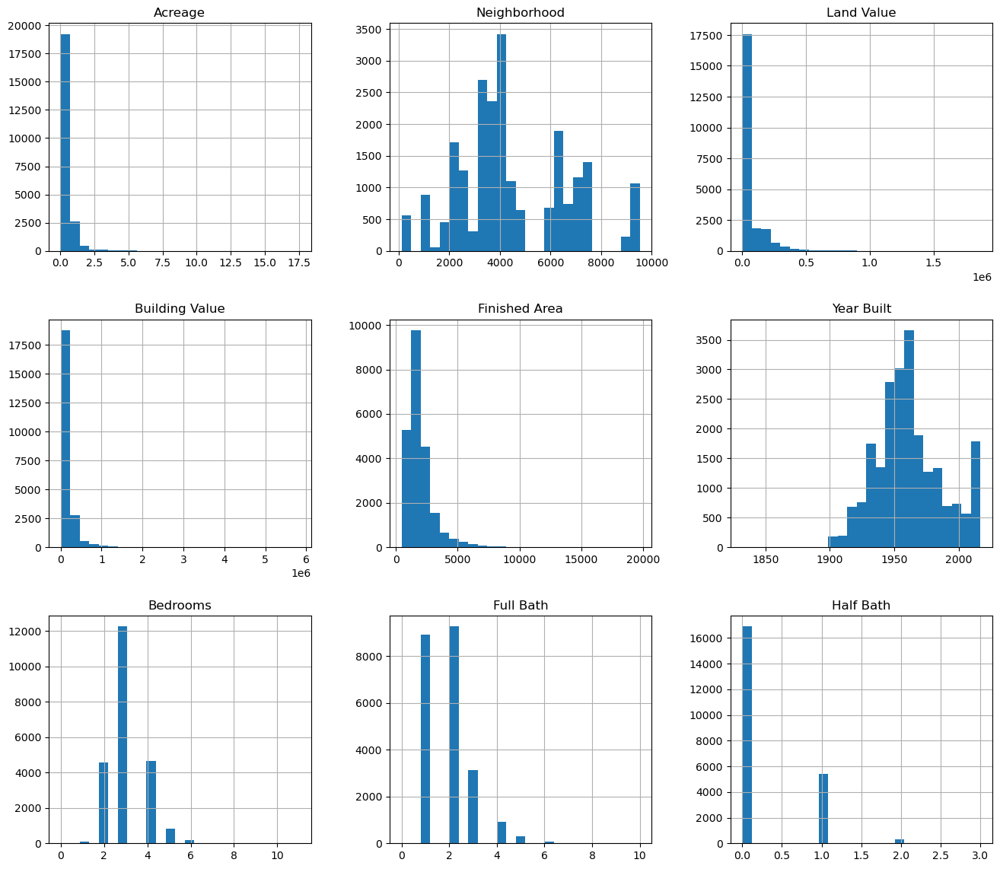
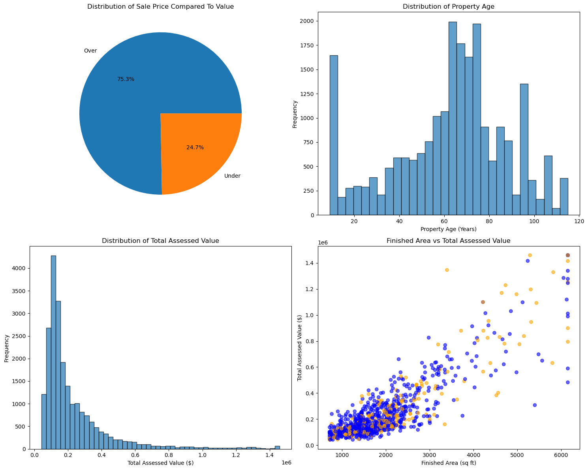
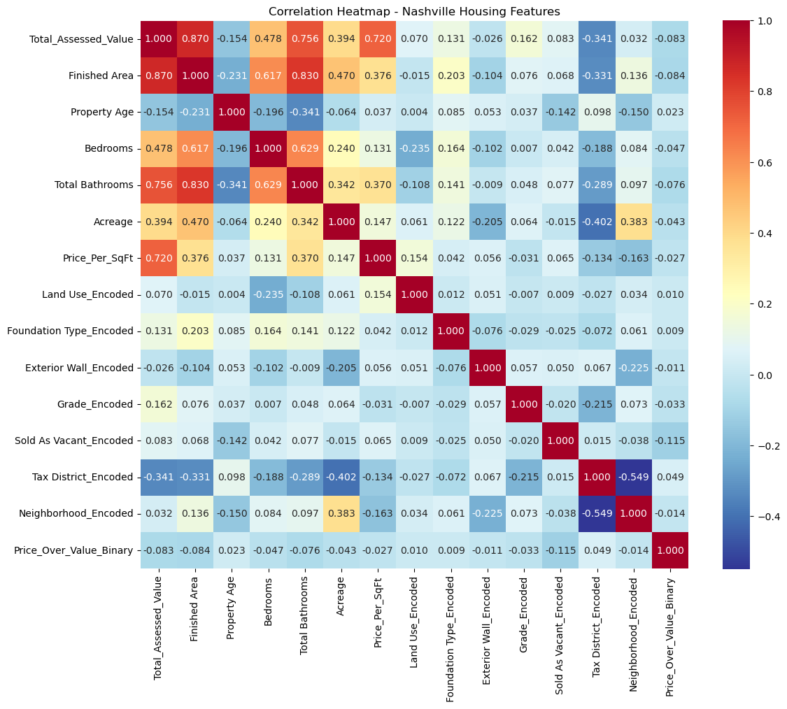
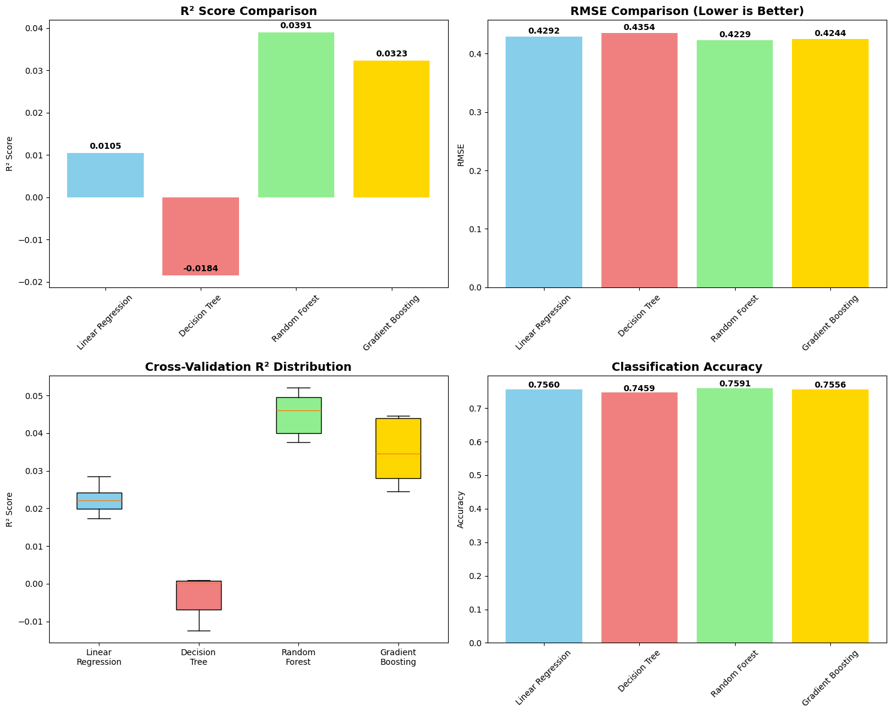

```python
# import nneded packages for the project
import pandas as pd
import numpy as np
import matplotlib.pyplot as plt
import seaborn as sns
from sklearn.model_selection import train_test_split, cross_val_score
import statsmodels.api as sm
from sklearn.linear_model import LinearRegression
from sklearn.tree import DecisionTreeRegressor
from sklearn.ensemble import RandomForestRegressor
from sklearn.ensemble import GradientBoostingRegressor
from sklearn.metrics import mean_squared_error, mean_absolute_error, r2_score
from sklearn.metrics import classification_report, confusion_matrix, accuracy_score, precision_score, recall_score, f1_score
from sklearn.preprocessing import StandardScaler, LabelEncoder
from scipy import stats
import warnings
warnings.filterwarnings('ignore')
```


```python
# read in the provided CSV
df = pd.read_csv(r"C:\Users\jhack\ALY6020\Week Four\week 4 - Nashville_housing_data.csv")
```


```python
# check structure of the data
df.info()
```

    <class 'pandas.core.frame.DataFrame'>
    RangeIndex: 22651 entries, 0 to 22650
    Data columns (total 26 columns):
     #   Column                             Non-Null Count  Dtype  
    ---  ------                             --------------  -----  
     0   Unnamed: 0                         22651 non-null  int64  
     1   Parcel ID                          22651 non-null  object 
     2   Land Use                           22651 non-null  object 
     3   Property Address                   22649 non-null  object 
     4   Suite/ Condo   #                   0 non-null      float64
     5   Property City                      22649 non-null  object 
     6   Sale Date                          22651 non-null  object 
     7   Legal Reference                    22651 non-null  object 
     8   Sold As Vacant                     22651 non-null  object 
     9   Multiple Parcels Involved in Sale  22651 non-null  object 
     10  City                               22651 non-null  object 
     11  State                              22651 non-null  object 
     12  Acreage                            22651 non-null  float64
     13  Tax District                       22651 non-null  object 
     14  Neighborhood                       22651 non-null  int64  
     15  Land Value                         22651 non-null  int64  
     16  Building Value                     22651 non-null  int64  
     17  Finished Area                      22650 non-null  float64
     18  Foundation Type                    22650 non-null  object 
     19  Year Built                         22651 non-null  int64  
     20  Exterior Wall                      22651 non-null  object 
     21  Grade                              22651 non-null  object 
     22  Bedrooms                           22648 non-null  float64
     23  Full Bath                          22650 non-null  float64
     24  Half Bath                          22543 non-null  float64
     25  Sale Price Compared To Value       22651 non-null  object 
    dtypes: float64(6), int64(5), object(15)
    memory usage: 4.5+ MB
    


```python
# chcekc for null values
df.isnull().sum()
```


    Unnamed: 0                               0
    Parcel ID                                0
    Land Use                                 0
    Property Address                         2
    Suite/ Condo   #                     22651
    Property City                            2
    Sale Date                                0
    Legal Reference                          0
    Sold As Vacant                           0
    Multiple Parcels Involved in Sale        0
    City                                     0
    State                                    0
    Acreage                                  0
    Tax District                             0
    Neighborhood                             0
    Land Value                               0
    Building Value                           0
    Finished Area                            1
    Foundation Type                          1
    Year Built                               0
    Exterior Wall                            0
    Grade                                    0
    Bedrooms                                 3
    Full Bath                                1
    Half Bath                              108
    Sale Price Compared To Value             0
    dtype: int64


```python
# explore City vs Property City
df['City'].unique()
```


    array(['NASHVILLE', 'ANTIOCH', 'BRENTWOOD', 'MADISON', 'OLD HICKORY',
           'HERMITAGE', 'GOODLETTSVILLE', 'JOELTON', 'WHITES CREEK',
           'MOUNT JULIET'], dtype=object)


```python
df['Property City'].unique()
```


    array(['NASHVILLE', 'ANTIOCH', 'BRENTWOOD', 'MADISON', 'OLD HICKORY',
           'HERMITAGE', 'GOODLETTSVILLE', 'JOELTON', 'WHITES CREEK',
           'MOUNT JULIET', nan], dtype=object)


```python
are_identical = (df['City'] == df['Property City']).all()
print(f"Columns are identical: {are_identical}")
```

    Columns are identical: False
    


```python
differences = df[df['City'] != df['Property City']]
print(f"Number of differing rows: {len(differences)}")
if len(differences) > 0:
    print("Different values:")
    print(differences[['City', 'Property City']])
```

    Number of differing rows: 3
    Different values:
                City Property City
    13063  NASHVILLE     BRENTWOOD
    17529  NASHVILLE           NaN
    17696  NASHVILLE           NaN
    


```python
# remove unncessary columns - propety city is same as city except for 3 instances 
df = df.drop(['Property City', 'Unnamed: 0', 'Suite/ Condo   #', 'State'],axis = 1)
```


```python
# check on distribution of null half baths
df['Half Bath'].value_counts(dropna=False)
```


    Half Bath
    0.0    16804
    1.0     5409
    2.0      307
    NaN      108
    3.0       23
    Name: count, dtype: int64


```python
# highly likely these should be 0
df['Half Bath'] = df['Half Bath'].fillna(0)
```


```python
df['Half Bath'].value_counts(dropna=False)
```


    Half Bath
    0.0    16912
    1.0     5409
    2.0      307
    3.0       23
    Name: count, dtype: int64


```python
# check remainang nulls
df.isnull().sum()
```


    Parcel ID                            0
    Land Use                             0
    Property Address                     2
    Sale Date                            0
    Legal Reference                      0
    Sold As Vacant                       0
    Multiple Parcels Involved in Sale    0
    City                                 0
    Acreage                              0
    Tax District                         0
    Neighborhood                         0
    Land Value                           0
    Building Value                       0
    Finished Area                        1
    Foundation Type                      1
    Year Built                           0
    Exterior Wall                        0
    Grade                                0
    Bedrooms                             3
    Full Bath                            1
    Half Bath                            0
    Sale Price Compared To Value         0
    dtype: int64


```python
# drop remaining null values
df=df.dropna()
```


```python
df.head()
```


<div>
<style scoped>
    .dataframe tbody tr th:only-of-type {
        vertical-align: middle;
    }

    .dataframe tbody tr th {
        vertical-align: top;
    }

    .dataframe thead th {
        text-align: right;
    }
</style>
<table border="1" class="dataframe">
  <thead>
    <tr style="text-align: right;">
      <th></th>
      <th>Parcel ID</th>
      <th>Land Use</th>
      <th>Property Address</th>
      <th>Sale Date</th>
      <th>Legal Reference</th>
      <th>Sold As Vacant</th>
      <th>Multiple Parcels Involved in Sale</th>
      <th>City</th>
      <th>Acreage</th>
      <th>Tax District</th>
      <th>...</th>
      <th>Building Value</th>
      <th>Finished Area</th>
      <th>Foundation Type</th>
      <th>Year Built</th>
      <th>Exterior Wall</th>
      <th>Grade</th>
      <th>Bedrooms</th>
      <th>Full Bath</th>
      <th>Half Bath</th>
      <th>Sale Price Compared To Value</th>
    </tr>
  </thead>
  <tbody>
    <tr>
      <th>0</th>
      <td>105 11 0 080.00</td>
      <td>SINGLE FAMILY</td>
      <td>1802  STEWART PL</td>
      <td>1/11/2013</td>
      <td>20130118-0006337</td>
      <td>No</td>
      <td>No</td>
      <td>NASHVILLE</td>
      <td>0.17</td>
      <td>URBAN SERVICES DISTRICT</td>
      <td>...</td>
      <td>134400</td>
      <td>1149.00000</td>
      <td>PT BSMT</td>
      <td>1941</td>
      <td>BRICK</td>
      <td>C</td>
      <td>2.0</td>
      <td>1.0</td>
      <td>0.0</td>
      <td>Over</td>
    </tr>
    <tr>
      <th>1</th>
      <td>118 03 0 130.00</td>
      <td>SINGLE FAMILY</td>
      <td>2761  ROSEDALE PL</td>
      <td>1/18/2013</td>
      <td>20130124-0008033</td>
      <td>No</td>
      <td>No</td>
      <td>NASHVILLE</td>
      <td>0.11</td>
      <td>CITY OF BERRY HILL</td>
      <td>...</td>
      <td>157800</td>
      <td>2090.82495</td>
      <td>SLAB</td>
      <td>2000</td>
      <td>BRICK/FRAME</td>
      <td>C</td>
      <td>3.0</td>
      <td>2.0</td>
      <td>1.0</td>
      <td>Over</td>
    </tr>
    <tr>
      <th>2</th>
      <td>119 01 0 479.00</td>
      <td>SINGLE FAMILY</td>
      <td>224  PEACHTREE ST</td>
      <td>1/18/2013</td>
      <td>20130128-0008863</td>
      <td>No</td>
      <td>No</td>
      <td>NASHVILLE</td>
      <td>0.17</td>
      <td>URBAN SERVICES DISTRICT</td>
      <td>...</td>
      <td>243700</td>
      <td>2145.60001</td>
      <td>FULL BSMT</td>
      <td>1948</td>
      <td>BRICK/FRAME</td>
      <td>B</td>
      <td>4.0</td>
      <td>2.0</td>
      <td>0.0</td>
      <td>Under</td>
    </tr>
    <tr>
      <th>3</th>
      <td>119 05 0 186.00</td>
      <td>SINGLE FAMILY</td>
      <td>316  LUTIE ST</td>
      <td>1/23/2013</td>
      <td>20130131-0009929</td>
      <td>No</td>
      <td>No</td>
      <td>NASHVILLE</td>
      <td>0.34</td>
      <td>URBAN SERVICES DISTRICT</td>
      <td>...</td>
      <td>138100</td>
      <td>1969.00000</td>
      <td>CRAWL</td>
      <td>1910</td>
      <td>FRAME</td>
      <td>C</td>
      <td>2.0</td>
      <td>1.0</td>
      <td>0.0</td>
      <td>Under</td>
    </tr>
    <tr>
      <th>4</th>
      <td>119 05 0 387.00</td>
      <td>SINGLE FAMILY</td>
      <td>2626  FOSTER AVE</td>
      <td>1/4/2013</td>
      <td>20130118-0006110</td>
      <td>No</td>
      <td>No</td>
      <td>NASHVILLE</td>
      <td>0.17</td>
      <td>URBAN SERVICES DISTRICT</td>
      <td>...</td>
      <td>86100</td>
      <td>1037.00000</td>
      <td>CRAWL</td>
      <td>1945</td>
      <td>FRAME</td>
      <td>C</td>
      <td>2.0</td>
      <td>1.0</td>
      <td>0.0</td>
      <td>Under</td>
    </tr>
  </tbody>
</table>
<p>5 rows × 22 columns</p>
</div>


```python
# distrutiuon of variables 
df.hist(figsize=(16,14),bins=25)
```


    array([[<Axes: title={'center': 'Acreage'}>,
            <Axes: title={'center': 'Neighborhood'}>,
            <Axes: title={'center': 'Land Value'}>],
           [<Axes: title={'center': 'Building Value'}>,
            <Axes: title={'center': 'Finished Area'}>,
            <Axes: title={'center': 'Year Built'}>],
           [<Axes: title={'center': 'Bedrooms'}>,
            <Axes: title={'center': 'Full Bath'}>,
            <Axes: title={'center': 'Half Bath'}>]], dtype=object)


    

    


```python
# make neiborhood categorical 
df = df.assign(Neighborhood=df['Neighborhood'].astype('category'))
```


```python
# add binary variable for sale price comparted to value
df['Price_Over_Value_Binary'] = (df['Sale Price Compared To Value'] == 'Over').astype(int)
```


```python
# Outlier analysis 
numerical_cols = ['Land Value', 'Building Value', 'Total_Assessed_Value', 
                 'Finished Area', 'Acreage', 'Bedrooms', 'Full Bath', 'Half Bath', 'Year Built']
```


```python
def detect_outliers_iqr(df, column):
    Q1 = df[column].quantile(0.25)
    Q3 = df[column].quantile(0.75)
    IQR = Q3 - Q1
    lower_bound = Q1 - 1.5 * IQR
    upper_bound = Q3 + 1.5 * IQR
    outliers = df[(df[column] < lower_bound) | (df[column] > upper_bound)]
    return outliers, lower_bound, upper_bound
```


```python
outlier_summary = {}
for col in ['Land Value', 'Building Value', 'Total_Assessed_Value', 'Finished Area', 'Year Built']:
    if col in df.columns:
        outliers, lower, upper = detect_outliers_iqr(df, col)
        outlier_summary[col] = {
            'count': len(outliers),
            'percentage': (len(outliers) / len(df)) * 100,
            'lower_bound': lower,
            'upper_bound': upper
        }
        print(f"{col}:")
        print(f"  Outliers: {len(outliers)} ({(len(outliers) / len(df)) * 100:.2f}%)")
        print(f"  Bounds: [{lower:.0f}, {upper:.0f}]")
```

    Land Value:
      Outliers: 4189 (18.50%)
      Bounds: [-35450, 117750]
    Building Value:
      Outliers: 1913 (8.45%)
      Bounds: [-68550, 342250]
    Finished Area:
      Outliers: 1389 (6.13%)
      Bounds: [-193, 3656]
    Year Built:
      Outliers: 168 (0.74%)
      Bounds: [1902, 2022]
    


```python
# cap rather than remove outliers
def cap_outliers(df, column, lower_percentile=1, upper_percentile=99):
    lower_bound = df[column].quantile(lower_percentile/100)
    upper_bound = df[column].quantile(upper_percentile/100)
    original_count = len(df[(df[column] < lower_bound) | (df[column] > upper_bound)])
    df[column] = df[column].clip(lower=lower_bound, upper=upper_bound)
    return original_count
```


```python
outlier_cols = ['Land Value', 'Building Value', 'Finished Area', 'Acreage', 'Year Built']
for col in outlier_cols:
    if col in df.columns:
        capped_count = cap_outliers(df, col)
        print(f"  - Capped {capped_count} extreme outliers in {col}")
```

      - Capped 446 extreme outliers in Land Value
      - Capped 451 extreme outliers in Building Value
      - Capped 440 extreme outliers in Finished Area
      - Capped 357 extreme outliers in Acreage
      - Capped 227 extreme outliers in Year Built
    


```python
## Feature enginering 
# total value 
df['Total_Assessed_Value'] = df['Land Value'] + df['Building Value']
```


```python
# addtional calculated variables 
df['Property Age'] = 2025 - df['Year Built']
df['Price_Per_SqFt'] = df['Total_Assessed_Value'] / df['Finished Area']
df['Total Bathrooms'] = df['Full Bath'] + (df['Half Bath'] * 0.5) 
```


```python
df['Price_Per_SqFt'].replace([np.inf, -np.inf], np.nan, inplace=True)
df['Price_Per_SqFt'].fillna(df['Price_Per_SqFt'].median(), inplace=True)
```


```python
# drop unnecesary variables
df = df.drop(['Land Value', 'Building Value', 'Year Built', 'Full Bath', 'Half Bath'],axis = 1)
```


```python
# visualize variables compared value 
plt.style.use('default')
fig, axes = plt.subplots(2, 2, figsize=(15, 12))
target_col = 'Sale Price Compared To Value'
# Plot 1: Target variable distribution
axes[0,0].pie(df[target_col].value_counts().values, 
              labels=df[target_col].value_counts().index,
              autopct='%1.1f%%')
axes[0,0].set_title('Distribution of Sale Price Compared To Value')

# Plot 2: Property age distribution
axes[0,1].hist(df['Property Age'], bins=30, edgecolor='black', alpha=0.7)
axes[0,1].set_title('Distribution of Property Age')
axes[0,1].set_xlabel('Property Age (Years)')
axes[0,1].set_ylabel('Frequency')

# Plot 3: Total Assessed Value distribution
axes[1,0].hist(df['Total_Assessed_Value'], bins=50, edgecolor='black', alpha=0.7)
axes[1,0].set_title('Distribution of Total Assessed Value')
axes[1,0].set_xlabel('Total Assessed Value ($)')
axes[1,0].set_ylabel('Frequency')

# Plot 4: Relationship between key features
scatter_data = df.sample(n=min(1000, len(df)))  # Sample for readability
colors = ['blue' if x == 'Over' else 'orange' for x in scatter_data[target_col]]
axes[1,1].scatter(scatter_data['Finished Area'], scatter_data['Total_Assessed_Value'], 
                  c=colors, alpha=0.6)
axes[1,1].set_title('Finished Area vs Total Assessed Value')
axes[1,1].set_xlabel('Finished Area (sq ft)')
axes[1,1].set_ylabel('Total Assessed Value ($)')

plt.tight_layout()
plt.show()
```


    

    


```python
# encode categorical variables
categorical_cols = ['Land Use', 'Foundation Type', 'Exterior Wall', 'Grade', 
                   'Sold As Vacant', 'Tax District', 'Neighborhood']

label_encoders = {}
for col in categorical_cols:
    if col in df.columns:
        le = LabelEncoder()
        df[f'{col}_Encoded'] = le.fit_transform(df[col].astype(str))
        label_encoders[col] = le
        print(f"  - Encoded {col}")
```

      - Encoded Land Use
      - Encoded Foundation Type
      - Encoded Exterior Wall
      - Encoded Grade
      - Encoded Sold As Vacant
      - Encoded Tax District
      - Encoded Neighborhood
    


```python
df.info()
```

    <class 'pandas.core.frame.DataFrame'>
    Index: 22643 entries, 0 to 22650
    Data columns (total 29 columns):
     #   Column                             Non-Null Count  Dtype   
    ---  ------                             --------------  -----   
     0   Parcel ID                          22643 non-null  object  
     1   Land Use                           22643 non-null  object  
     2   Property Address                   22643 non-null  object  
     3   Sale Date                          22643 non-null  object  
     4   Legal Reference                    22643 non-null  object  
     5   Sold As Vacant                     22643 non-null  object  
     6   Multiple Parcels Involved in Sale  22643 non-null  object  
     7   City                               22643 non-null  object  
     8   Acreage                            22643 non-null  float64 
     9   Tax District                       22643 non-null  object  
     10  Neighborhood                       22643 non-null  category
     11  Finished Area                      22643 non-null  float64 
     12  Foundation Type                    22643 non-null  object  
     13  Exterior Wall                      22643 non-null  object  
     14  Grade                              22643 non-null  object  
     15  Bedrooms                           22643 non-null  float64 
     16  Sale Price Compared To Value       22643 non-null  object  
     17  Price_Over_Value_Binary            22643 non-null  int32   
     18  Total_Assessed_Value               22643 non-null  int64   
     19  Property Age                       22643 non-null  int64   
     20  Price_Per_SqFt                     22643 non-null  float64 
     21  Total Bathrooms                    22643 non-null  float64 
     22  Land Use_Encoded                   22643 non-null  int32   
     23  Foundation Type_Encoded            22643 non-null  int32   
     24  Exterior Wall_Encoded              22643 non-null  int32   
     25  Grade_Encoded                      22643 non-null  int32   
     26  Sold As Vacant_Encoded             22643 non-null  int32   
     27  Tax District_Encoded               22643 non-null  int32   
     28  Neighborhood_Encoded               22643 non-null  int32   
    dtypes: category(1), float64(5), int32(8), int64(2), object(13)
    memory usage: 4.4+ MB
    


```python
# correlations
numeric_features = ['Total_Assessed_Value', 
                   'Finished Area', 'Property Age', 'Bedrooms', 'Total Bathrooms', 
                   'Acreage', 'Price_Per_SqFt']
encoded_features = ['Land Use_Encoded', 'Foundation Type_Encoded', 'Exterior Wall_Encoded',
                   'Grade_Encoded', 'Sold As Vacant_Encoded', 'Tax District_Encoded', 'Neighborhood_Encoded']
```


```python
all_features = numeric_features + encoded_features + ['Price_Over_Value_Binary']
correlation_matrix = df[all_features].corr()
```


```python
#heat map 
plt.figure(figsize=(12,10))
sns.heatmap(correlation_matrix, 
            annot=True, 
            cmap='RdYlBu_r',
            square=True,
            fmt='.3f')
plt.title('Correlation Heatmap - Nashville Housing Features')
plt.tight_layout()
plt.show()
```


    

    


```python
target_correlations = df[all_features].corr()['Price_Over_Value_Binary'].sort_values(ascending=False)
print("Correlations with Price Over Value (including encoded features):")
print(target_correlations)
```

    Correlations with Price Over Value (including encoded features):
    Price_Over_Value_Binary    1.000000
    Tax District_Encoded       0.048725
    Property Age               0.023075
    Land Use_Encoded           0.010242
    Foundation Type_Encoded    0.008866
    Exterior Wall_Encoded     -0.011373
    Neighborhood_Encoded      -0.014245
    Price_Per_SqFt            -0.026847
    Grade_Encoded             -0.032576
    Acreage                   -0.042789
    Bedrooms                  -0.046924
    Total Bathrooms           -0.076006
    Total_Assessed_Value      -0.082677
    Finished Area             -0.083564
    Sold As Vacant_Encoded    -0.114614
    Name: Price_Over_Value_Binary, dtype: float64
    


```python
df.info()
```

    <class 'pandas.core.frame.DataFrame'>
    Index: 22643 entries, 0 to 22650
    Data columns (total 29 columns):
     #   Column                             Non-Null Count  Dtype   
    ---  ------                             --------------  -----   
     0   Parcel ID                          22643 non-null  object  
     1   Land Use                           22643 non-null  object  
     2   Property Address                   22643 non-null  object  
     3   Sale Date                          22643 non-null  object  
     4   Legal Reference                    22643 non-null  object  
     5   Sold As Vacant                     22643 non-null  object  
     6   Multiple Parcels Involved in Sale  22643 non-null  object  
     7   City                               22643 non-null  object  
     8   Acreage                            22643 non-null  float64 
     9   Tax District                       22643 non-null  object  
     10  Neighborhood                       22643 non-null  category
     11  Finished Area                      22643 non-null  float64 
     12  Foundation Type                    22643 non-null  object  
     13  Exterior Wall                      22643 non-null  object  
     14  Grade                              22643 non-null  object  
     15  Bedrooms                           22643 non-null  float64 
     16  Sale Price Compared To Value       22643 non-null  object  
     17  Price_Over_Value_Binary            22643 non-null  int32   
     18  Total_Assessed_Value               22643 non-null  int64   
     19  Property Age                       22643 non-null  int64   
     20  Price_Per_SqFt                     22643 non-null  float64 
     21  Total Bathrooms                    22643 non-null  float64 
     22  Land Use_Encoded                   22643 non-null  int32   
     23  Foundation Type_Encoded            22643 non-null  int32   
     24  Exterior Wall_Encoded              22643 non-null  int32   
     25  Grade_Encoded                      22643 non-null  int32   
     26  Sold As Vacant_Encoded             22643 non-null  int32   
     27  Tax District_Encoded               22643 non-null  int32   
     28  Neighborhood_Encoded               22643 non-null  int32   
    dtypes: category(1), float64(5), int32(8), int64(2), object(13)
    memory usage: 4.4+ MB
    


```python
feature_columns = [
    'Finished Area', 'Property Age', 
    'Bedrooms', 'Total Bathrooms', 'Acreage', 'Price_Per_SqFt',
    'Land Use_Encoded', 'Foundation Type_Encoded', 'Exterior Wall_Encoded',
    'Grade_Encoded', 'Sold As Vacant_Encoded', 'Tax District_Encoded', 'Neighborhood_Encoded'
]
```


```python
X = df[feature_columns]
y = df['Price_Over_Value_Binary'] 
```


```python
X_train, X_test, y_train, y_test = train_test_split(X, y, test_size=0.2, random_state=42, stratify=y)

print(f"Training set shape: {X_train.shape}")
print(f"Test set shape: {X_test.shape}")
print(f"Target distribution in training set: \n{y_train.value_counts(normalize=True)}")
```

    Training set shape: (18114, 13)
    Test set shape: (4529, 13)
    Target distribution in training set: 
    Price_Over_Value_Binary
    1    0.752788
    0    0.247212
    Name: proportion, dtype: float64
    


```python
# Scale features (important for linear regression)
scaler = StandardScaler()
X_train_scaled = scaler.fit_transform(X_train)
X_test_scaled = scaler.transform(X_test)
```


```python
# Build Linear Regression model
lr_model = LinearRegression()
lr_model.fit(X_train_scaled, y_train)
```


<style>#sk-container-id-1 {
  /* Definition of color scheme common for light and dark mode */
  --sklearn-color-text: black;
  --sklearn-color-line: gray;
  /* Definition of color scheme for unfitted estimators */
  --sklearn-color-unfitted-level-0: #fff5e6;
  --sklearn-color-unfitted-level-1: #f6e4d2;
  --sklearn-color-unfitted-level-2: #ffe0b3;
  --sklearn-color-unfitted-level-3: chocolate;
  /* Definition of color scheme for fitted estimators */
  --sklearn-color-fitted-level-0: #f0f8ff;
  --sklearn-color-fitted-level-1: #d4ebff;
  --sklearn-color-fitted-level-2: #b3dbfd;
  --sklearn-color-fitted-level-3: cornflowerblue;

  /* Specific color for light theme */
  --sklearn-color-text-on-default-background: var(--sg-text-color, var(--theme-code-foreground, var(--jp-content-font-color1, black)));
  --sklearn-color-background: var(--sg-background-color, var(--theme-background, var(--jp-layout-color0, white)));
  --sklearn-color-border-box: var(--sg-text-color, var(--theme-code-foreground, var(--jp-content-font-color1, black)));
  --sklearn-color-icon: #696969;

  @media (prefers-color-scheme: dark) {
    /* Redefinition of color scheme for dark theme */
    --sklearn-color-text-on-default-background: var(--sg-text-color, var(--theme-code-foreground, var(--jp-content-font-color1, white)));
    --sklearn-color-background: var(--sg-background-color, var(--theme-background, var(--jp-layout-color0, #111)));
    --sklearn-color-border-box: var(--sg-text-color, var(--theme-code-foreground, var(--jp-content-font-color1, white)));
    --sklearn-color-icon: #878787;
  }
}

#sk-container-id-1 {
  color: var(--sklearn-color-text);
}

#sk-container-id-1 pre {
  padding: 0;
}

#sk-container-id-1 input.sk-hidden--visually {
  border: 0;
  clip: rect(1px 1px 1px 1px);
  clip: rect(1px, 1px, 1px, 1px);
  height: 1px;
  margin: -1px;
  overflow: hidden;
  padding: 0;
  position: absolute;
  width: 1px;
}

#sk-container-id-1 div.sk-dashed-wrapped {
  border: 1px dashed var(--sklearn-color-line);
  margin: 0 0.4em 0.5em 0.4em;
  box-sizing: border-box;
  padding-bottom: 0.4em;
  background-color: var(--sklearn-color-background);
}

#sk-container-id-1 div.sk-container {
  /* jupyter's `normalize.less` sets `[hidden] { display: none; }`
     but bootstrap.min.css set `[hidden] { display: none !important; }`
     so we also need the `!important` here to be able to override the
     default hidden behavior on the sphinx rendered scikit-learn.org.
     See: https://github.com/scikit-learn/scikit-learn/issues/21755 */
  display: inline-block !important;
  position: relative;
}

#sk-container-id-1 div.sk-text-repr-fallback {
  display: none;
}

div.sk-parallel-item,
div.sk-serial,
div.sk-item {
  /* draw centered vertical line to link estimators */
  background-image: linear-gradient(var(--sklearn-color-text-on-default-background), var(--sklearn-color-text-on-default-background));
  background-size: 2px 100%;
  background-repeat: no-repeat;
  background-position: center center;
}

/* Parallel-specific style estimator block */

#sk-container-id-1 div.sk-parallel-item::after {
  content: "";
  width: 100%;
  border-bottom: 2px solid var(--sklearn-color-text-on-default-background);
  flex-grow: 1;
}

#sk-container-id-1 div.sk-parallel {
  display: flex;
  align-items: stretch;
  justify-content: center;
  background-color: var(--sklearn-color-background);
  position: relative;
}

#sk-container-id-1 div.sk-parallel-item {
  display: flex;
  flex-direction: column;
}

#sk-container-id-1 div.sk-parallel-item:first-child::after {
  align-self: flex-end;
  width: 50%;
}

#sk-container-id-1 div.sk-parallel-item:last-child::after {
  align-self: flex-start;
  width: 50%;
}

#sk-container-id-1 div.sk-parallel-item:only-child::after {
  width: 0;
}

/* Serial-specific style estimator block */

#sk-container-id-1 div.sk-serial {
  display: flex;
  flex-direction: column;
  align-items: center;
  background-color: var(--sklearn-color-background);
  padding-right: 1em;
  padding-left: 1em;
}


/* Toggleable style: style used for estimator/Pipeline/ColumnTransformer box that is
clickable and can be expanded/collapsed.
- Pipeline and ColumnTransformer use this feature and define the default style
- Estimators will overwrite some part of the style using the `sk-estimator` class
*/

/* Pipeline and ColumnTransformer style (default) */

#sk-container-id-1 div.sk-toggleable {
  /* Default theme specific background. It is overwritten whether we have a
  specific estimator or a Pipeline/ColumnTransformer */
  background-color: var(--sklearn-color-background);
}

/* Toggleable label */
#sk-container-id-1 label.sk-toggleable__label {
  cursor: pointer;
  display: block;
  width: 100%;
  margin-bottom: 0;
  padding: 0.5em;
  box-sizing: border-box;
  text-align: center;
}

#sk-container-id-1 label.sk-toggleable__label-arrow:before {
  /* Arrow on the left of the label */
  content: "▸";
  float: left;
  margin-right: 0.25em;
  color: var(--sklearn-color-icon);
}

#sk-container-id-1 label.sk-toggleable__label-arrow:hover:before {
  color: var(--sklearn-color-text);
}

/* Toggleable content - dropdown */

#sk-container-id-1 div.sk-toggleable__content {
  max-height: 0;
  max-width: 0;
  overflow: hidden;
  text-align: left;
  /* unfitted */
  background-color: var(--sklearn-color-unfitted-level-0);
}

#sk-container-id-1 div.sk-toggleable__content.fitted {
  /* fitted */
  background-color: var(--sklearn-color-fitted-level-0);
}

#sk-container-id-1 div.sk-toggleable__content pre {
  margin: 0.2em;
  border-radius: 0.25em;
  color: var(--sklearn-color-text);
  /* unfitted */
  background-color: var(--sklearn-color-unfitted-level-0);
}

#sk-container-id-1 div.sk-toggleable__content.fitted pre {
  /* unfitted */
  background-color: var(--sklearn-color-fitted-level-0);
}

#sk-container-id-1 input.sk-toggleable__control:checked~div.sk-toggleable__content {
  /* Expand drop-down */
  max-height: 200px;
  max-width: 100%;
  overflow: auto;
}

#sk-container-id-1 input.sk-toggleable__control:checked~label.sk-toggleable__label-arrow:before {
  content: "▾";
}

/* Pipeline/ColumnTransformer-specific style */

#sk-container-id-1 div.sk-label input.sk-toggleable__control:checked~label.sk-toggleable__label {
  color: var(--sklearn-color-text);
  background-color: var(--sklearn-color-unfitted-level-2);
}

#sk-container-id-1 div.sk-label.fitted input.sk-toggleable__control:checked~label.sk-toggleable__label {
  background-color: var(--sklearn-color-fitted-level-2);
}

/* Estimator-specific style */

/* Colorize estimator box */
#sk-container-id-1 div.sk-estimator input.sk-toggleable__control:checked~label.sk-toggleable__label {
  /* unfitted */
  background-color: var(--sklearn-color-unfitted-level-2);
}

#sk-container-id-1 div.sk-estimator.fitted input.sk-toggleable__control:checked~label.sk-toggleable__label {
  /* fitted */
  background-color: var(--sklearn-color-fitted-level-2);
}

#sk-container-id-1 div.sk-label label.sk-toggleable__label,
#sk-container-id-1 div.sk-label label {
  /* The background is the default theme color */
  color: var(--sklearn-color-text-on-default-background);
}

/* On hover, darken the color of the background */
#sk-container-id-1 div.sk-label:hover label.sk-toggleable__label {
  color: var(--sklearn-color-text);
  background-color: var(--sklearn-color-unfitted-level-2);
}

/* Label box, darken color on hover, fitted */
#sk-container-id-1 div.sk-label.fitted:hover label.sk-toggleable__label.fitted {
  color: var(--sklearn-color-text);
  background-color: var(--sklearn-color-fitted-level-2);
}

/* Estimator label */

#sk-container-id-1 div.sk-label label {
  font-family: monospace;
  font-weight: bold;
  display: inline-block;
  line-height: 1.2em;
}

#sk-container-id-1 div.sk-label-container {
  text-align: center;
}

/* Estimator-specific */
#sk-container-id-1 div.sk-estimator {
  font-family: monospace;
  border: 1px dotted var(--sklearn-color-border-box);
  border-radius: 0.25em;
  box-sizing: border-box;
  margin-bottom: 0.5em;
  /* unfitted */
  background-color: var(--sklearn-color-unfitted-level-0);
}

#sk-container-id-1 div.sk-estimator.fitted {
  /* fitted */
  background-color: var(--sklearn-color-fitted-level-0);
}

/* on hover */
#sk-container-id-1 div.sk-estimator:hover {
  /* unfitted */
  background-color: var(--sklearn-color-unfitted-level-2);
}

#sk-container-id-1 div.sk-estimator.fitted:hover {
  /* fitted */
  background-color: var(--sklearn-color-fitted-level-2);
}

/* Specification for estimator info (e.g. "i" and "?") */

/* Common style for "i" and "?" */

.sk-estimator-doc-link,
a:link.sk-estimator-doc-link,
a:visited.sk-estimator-doc-link {
  float: right;
  font-size: smaller;
  line-height: 1em;
  font-family: monospace;
  background-color: var(--sklearn-color-background);
  border-radius: 1em;
  height: 1em;
  width: 1em;
  text-decoration: none !important;
  margin-left: 1ex;
  /* unfitted */
  border: var(--sklearn-color-unfitted-level-1) 1pt solid;
  color: var(--sklearn-color-unfitted-level-1);
}

.sk-estimator-doc-link.fitted,
a:link.sk-estimator-doc-link.fitted,
a:visited.sk-estimator-doc-link.fitted {
  /* fitted */
  border: var(--sklearn-color-fitted-level-1) 1pt solid;
  color: var(--sklearn-color-fitted-level-1);
}

/* On hover */
div.sk-estimator:hover .sk-estimator-doc-link:hover,
.sk-estimator-doc-link:hover,
div.sk-label-container:hover .sk-estimator-doc-link:hover,
.sk-estimator-doc-link:hover {
  /* unfitted */
  background-color: var(--sklearn-color-unfitted-level-3);
  color: var(--sklearn-color-background);
  text-decoration: none;
}

div.sk-estimator.fitted:hover .sk-estimator-doc-link.fitted:hover,
.sk-estimator-doc-link.fitted:hover,
div.sk-label-container:hover .sk-estimator-doc-link.fitted:hover,
.sk-estimator-doc-link.fitted:hover {
  /* fitted */
  background-color: var(--sklearn-color-fitted-level-3);
  color: var(--sklearn-color-background);
  text-decoration: none;
}

/* Span, style for the box shown on hovering the info icon */
.sk-estimator-doc-link span {
  display: none;
  z-index: 9999;
  position: relative;
  font-weight: normal;
  right: .2ex;
  padding: .5ex;
  margin: .5ex;
  width: min-content;
  min-width: 20ex;
  max-width: 50ex;
  color: var(--sklearn-color-text);
  box-shadow: 2pt 2pt 4pt #999;
  /* unfitted */
  background: var(--sklearn-color-unfitted-level-0);
  border: .5pt solid var(--sklearn-color-unfitted-level-3);
}

.sk-estimator-doc-link.fitted span {
  /* fitted */
  background: var(--sklearn-color-fitted-level-0);
  border: var(--sklearn-color-fitted-level-3);
}

.sk-estimator-doc-link:hover span {
  display: block;
}

/* "?"-specific style due to the `<a>` HTML tag */

#sk-container-id-1 a.estimator_doc_link {
  float: right;
  font-size: 1rem;
  line-height: 1em;
  font-family: monospace;
  background-color: var(--sklearn-color-background);
  border-radius: 1rem;
  height: 1rem;
  width: 1rem;
  text-decoration: none;
  /* unfitted */
  color: var(--sklearn-color-unfitted-level-1);
  border: var(--sklearn-color-unfitted-level-1) 1pt solid;
}

#sk-container-id-1 a.estimator_doc_link.fitted {
  /* fitted */
  border: var(--sklearn-color-fitted-level-1) 1pt solid;
  color: var(--sklearn-color-fitted-level-1);
}

/* On hover */
#sk-container-id-1 a.estimator_doc_link:hover {
  /* unfitted */
  background-color: var(--sklearn-color-unfitted-level-3);
  color: var(--sklearn-color-background);
  text-decoration: none;
}

#sk-container-id-1 a.estimator_doc_link.fitted:hover {
  /* fitted */
  background-color: var(--sklearn-color-fitted-level-3);
}
</style><div id="sk-container-id-1" class="sk-top-container"><div class="sk-text-repr-fallback"><pre>LinearRegression()</pre><b>In a Jupyter environment, please rerun this cell to show the HTML representation or trust the notebook. <br />On GitHub, the HTML representation is unable to render, please try loading this page with nbviewer.org.</b></div><div class="sk-container" hidden><div class="sk-item"><div class="sk-estimator fitted sk-toggleable"><input class="sk-toggleable__control sk-hidden--visually" id="sk-estimator-id-1" type="checkbox" checked><label for="sk-estimator-id-1" class="sk-toggleable__label fitted sk-toggleable__label-arrow fitted">&nbsp;&nbsp;LinearRegression<a class="sk-estimator-doc-link fitted" rel="noreferrer" target="_blank" href="https://scikit-learn.org/1.5/modules/generated/sklearn.linear_model.LinearRegression.html">?<span>Documentation for LinearRegression</span></a><span class="sk-estimator-doc-link fitted">i<span>Fitted</span></span></label><div class="sk-toggleable__content fitted"><pre>LinearRegression()</pre></div> </div></div></div></div>


```python
y_pred_lr = lr_model.predict(X_test_scaled)
```


```python
# Calculate metrics
lr_mse = mean_squared_error(y_test, y_pred_lr)
lr_mae = mean_absolute_error(y_test, y_pred_lr)
lr_r2 = r2_score(y_test, y_pred_lr)
lr_rmse = np.sqrt(lr_mse)
```


```python
print(f"Linear Regression Results:")
print(f"  R² Score: {lr_r2:.4f}")
print(f"  Mean Squared Error: {lr_mse:.4f}")
print(f"  Root Mean Squared Error: {lr_rmse:.4f}")
print(f"  Mean Absolute Error: {lr_mae:.4f}")
```

    Linear Regression Results:
      R² Score: 0.0105
      Mean Squared Error: 0.1842
      Root Mean Squared Error: 0.4292
      Mean Absolute Error: 0.3654
    


```python
# Feature importance (coefficients)
feature_importance_lr = pd.DataFrame({
    'Feature': feature_columns,
    'Coefficient': lr_model.coef_
}).sort_values('Coefficient', key=abs, ascending=False)

print(f"\nTop 5 Most Important Features (Linear Regression):")
print(feature_importance_lr.head())
```

    
    Top 5 Most Important Features (Linear Regression):
                       Feature  Coefficient
    10  Sold As Vacant_Encoded    -0.049338
    0            Finished Area    -0.030844
    11    Tax District_Encoded     0.014020
    3          Total Bathrooms    -0.013863
    2                 Bedrooms     0.009775
    


```python
# Decision Tree 
dt_model = DecisionTreeRegressor(random_state=42, max_depth=10, min_samples_split=20)
dt_model.fit(X_train, y_train)
```


<style>#sk-container-id-2 {
  /* Definition of color scheme common for light and dark mode */
  --sklearn-color-text: black;
  --sklearn-color-line: gray;
  /* Definition of color scheme for unfitted estimators */
  --sklearn-color-unfitted-level-0: #fff5e6;
  --sklearn-color-unfitted-level-1: #f6e4d2;
  --sklearn-color-unfitted-level-2: #ffe0b3;
  --sklearn-color-unfitted-level-3: chocolate;
  /* Definition of color scheme for fitted estimators */
  --sklearn-color-fitted-level-0: #f0f8ff;
  --sklearn-color-fitted-level-1: #d4ebff;
  --sklearn-color-fitted-level-2: #b3dbfd;
  --sklearn-color-fitted-level-3: cornflowerblue;

  /* Specific color for light theme */
  --sklearn-color-text-on-default-background: var(--sg-text-color, var(--theme-code-foreground, var(--jp-content-font-color1, black)));
  --sklearn-color-background: var(--sg-background-color, var(--theme-background, var(--jp-layout-color0, white)));
  --sklearn-color-border-box: var(--sg-text-color, var(--theme-code-foreground, var(--jp-content-font-color1, black)));
  --sklearn-color-icon: #696969;

  @media (prefers-color-scheme: dark) {
    /* Redefinition of color scheme for dark theme */
    --sklearn-color-text-on-default-background: var(--sg-text-color, var(--theme-code-foreground, var(--jp-content-font-color1, white)));
    --sklearn-color-background: var(--sg-background-color, var(--theme-background, var(--jp-layout-color0, #111)));
    --sklearn-color-border-box: var(--sg-text-color, var(--theme-code-foreground, var(--jp-content-font-color1, white)));
    --sklearn-color-icon: #878787;
  }
}

#sk-container-id-2 {
  color: var(--sklearn-color-text);
}

#sk-container-id-2 pre {
  padding: 0;
}

#sk-container-id-2 input.sk-hidden--visually {
  border: 0;
  clip: rect(1px 1px 1px 1px);
  clip: rect(1px, 1px, 1px, 1px);
  height: 1px;
  margin: -1px;
  overflow: hidden;
  padding: 0;
  position: absolute;
  width: 1px;
}

#sk-container-id-2 div.sk-dashed-wrapped {
  border: 1px dashed var(--sklearn-color-line);
  margin: 0 0.4em 0.5em 0.4em;
  box-sizing: border-box;
  padding-bottom: 0.4em;
  background-color: var(--sklearn-color-background);
}

#sk-container-id-2 div.sk-container {
  /* jupyter's `normalize.less` sets `[hidden] { display: none; }`
     but bootstrap.min.css set `[hidden] { display: none !important; }`
     so we also need the `!important` here to be able to override the
     default hidden behavior on the sphinx rendered scikit-learn.org.
     See: https://github.com/scikit-learn/scikit-learn/issues/21755 */
  display: inline-block !important;
  position: relative;
}

#sk-container-id-2 div.sk-text-repr-fallback {
  display: none;
}

div.sk-parallel-item,
div.sk-serial,
div.sk-item {
  /* draw centered vertical line to link estimators */
  background-image: linear-gradient(var(--sklearn-color-text-on-default-background), var(--sklearn-color-text-on-default-background));
  background-size: 2px 100%;
  background-repeat: no-repeat;
  background-position: center center;
}

/* Parallel-specific style estimator block */

#sk-container-id-2 div.sk-parallel-item::after {
  content: "";
  width: 100%;
  border-bottom: 2px solid var(--sklearn-color-text-on-default-background);
  flex-grow: 1;
}

#sk-container-id-2 div.sk-parallel {
  display: flex;
  align-items: stretch;
  justify-content: center;
  background-color: var(--sklearn-color-background);
  position: relative;
}

#sk-container-id-2 div.sk-parallel-item {
  display: flex;
  flex-direction: column;
}

#sk-container-id-2 div.sk-parallel-item:first-child::after {
  align-self: flex-end;
  width: 50%;
}

#sk-container-id-2 div.sk-parallel-item:last-child::after {
  align-self: flex-start;
  width: 50%;
}

#sk-container-id-2 div.sk-parallel-item:only-child::after {
  width: 0;
}

/* Serial-specific style estimator block */

#sk-container-id-2 div.sk-serial {
  display: flex;
  flex-direction: column;
  align-items: center;
  background-color: var(--sklearn-color-background);
  padding-right: 1em;
  padding-left: 1em;
}


/* Toggleable style: style used for estimator/Pipeline/ColumnTransformer box that is
clickable and can be expanded/collapsed.
- Pipeline and ColumnTransformer use this feature and define the default style
- Estimators will overwrite some part of the style using the `sk-estimator` class
*/

/* Pipeline and ColumnTransformer style (default) */

#sk-container-id-2 div.sk-toggleable {
  /* Default theme specific background. It is overwritten whether we have a
  specific estimator or a Pipeline/ColumnTransformer */
  background-color: var(--sklearn-color-background);
}

/* Toggleable label */
#sk-container-id-2 label.sk-toggleable__label {
  cursor: pointer;
  display: block;
  width: 100%;
  margin-bottom: 0;
  padding: 0.5em;
  box-sizing: border-box;
  text-align: center;
}

#sk-container-id-2 label.sk-toggleable__label-arrow:before {
  /* Arrow on the left of the label */
  content: "▸";
  float: left;
  margin-right: 0.25em;
  color: var(--sklearn-color-icon);
}

#sk-container-id-2 label.sk-toggleable__label-arrow:hover:before {
  color: var(--sklearn-color-text);
}

/* Toggleable content - dropdown */

#sk-container-id-2 div.sk-toggleable__content {
  max-height: 0;
  max-width: 0;
  overflow: hidden;
  text-align: left;
  /* unfitted */
  background-color: var(--sklearn-color-unfitted-level-0);
}

#sk-container-id-2 div.sk-toggleable__content.fitted {
  /* fitted */
  background-color: var(--sklearn-color-fitted-level-0);
}

#sk-container-id-2 div.sk-toggleable__content pre {
  margin: 0.2em;
  border-radius: 0.25em;
  color: var(--sklearn-color-text);
  /* unfitted */
  background-color: var(--sklearn-color-unfitted-level-0);
}

#sk-container-id-2 div.sk-toggleable__content.fitted pre {
  /* unfitted */
  background-color: var(--sklearn-color-fitted-level-0);
}

#sk-container-id-2 input.sk-toggleable__control:checked~div.sk-toggleable__content {
  /* Expand drop-down */
  max-height: 200px;
  max-width: 100%;
  overflow: auto;
}

#sk-container-id-2 input.sk-toggleable__control:checked~label.sk-toggleable__label-arrow:before {
  content: "▾";
}

/* Pipeline/ColumnTransformer-specific style */

#sk-container-id-2 div.sk-label input.sk-toggleable__control:checked~label.sk-toggleable__label {
  color: var(--sklearn-color-text);
  background-color: var(--sklearn-color-unfitted-level-2);
}

#sk-container-id-2 div.sk-label.fitted input.sk-toggleable__control:checked~label.sk-toggleable__label {
  background-color: var(--sklearn-color-fitted-level-2);
}

/* Estimator-specific style */

/* Colorize estimator box */
#sk-container-id-2 div.sk-estimator input.sk-toggleable__control:checked~label.sk-toggleable__label {
  /* unfitted */
  background-color: var(--sklearn-color-unfitted-level-2);
}

#sk-container-id-2 div.sk-estimator.fitted input.sk-toggleable__control:checked~label.sk-toggleable__label {
  /* fitted */
  background-color: var(--sklearn-color-fitted-level-2);
}

#sk-container-id-2 div.sk-label label.sk-toggleable__label,
#sk-container-id-2 div.sk-label label {
  /* The background is the default theme color */
  color: var(--sklearn-color-text-on-default-background);
}

/* On hover, darken the color of the background */
#sk-container-id-2 div.sk-label:hover label.sk-toggleable__label {
  color: var(--sklearn-color-text);
  background-color: var(--sklearn-color-unfitted-level-2);
}

/* Label box, darken color on hover, fitted */
#sk-container-id-2 div.sk-label.fitted:hover label.sk-toggleable__label.fitted {
  color: var(--sklearn-color-text);
  background-color: var(--sklearn-color-fitted-level-2);
}

/* Estimator label */

#sk-container-id-2 div.sk-label label {
  font-family: monospace;
  font-weight: bold;
  display: inline-block;
  line-height: 1.2em;
}

#sk-container-id-2 div.sk-label-container {
  text-align: center;
}

/* Estimator-specific */
#sk-container-id-2 div.sk-estimator {
  font-family: monospace;
  border: 1px dotted var(--sklearn-color-border-box);
  border-radius: 0.25em;
  box-sizing: border-box;
  margin-bottom: 0.5em;
  /* unfitted */
  background-color: var(--sklearn-color-unfitted-level-0);
}

#sk-container-id-2 div.sk-estimator.fitted {
  /* fitted */
  background-color: var(--sklearn-color-fitted-level-0);
}

/* on hover */
#sk-container-id-2 div.sk-estimator:hover {
  /* unfitted */
  background-color: var(--sklearn-color-unfitted-level-2);
}

#sk-container-id-2 div.sk-estimator.fitted:hover {
  /* fitted */
  background-color: var(--sklearn-color-fitted-level-2);
}

/* Specification for estimator info (e.g. "i" and "?") */

/* Common style for "i" and "?" */

.sk-estimator-doc-link,
a:link.sk-estimator-doc-link,
a:visited.sk-estimator-doc-link {
  float: right;
  font-size: smaller;
  line-height: 1em;
  font-family: monospace;
  background-color: var(--sklearn-color-background);
  border-radius: 1em;
  height: 1em;
  width: 1em;
  text-decoration: none !important;
  margin-left: 1ex;
  /* unfitted */
  border: var(--sklearn-color-unfitted-level-1) 1pt solid;
  color: var(--sklearn-color-unfitted-level-1);
}

.sk-estimator-doc-link.fitted,
a:link.sk-estimator-doc-link.fitted,
a:visited.sk-estimator-doc-link.fitted {
  /* fitted */
  border: var(--sklearn-color-fitted-level-1) 1pt solid;
  color: var(--sklearn-color-fitted-level-1);
}

/* On hover */
div.sk-estimator:hover .sk-estimator-doc-link:hover,
.sk-estimator-doc-link:hover,
div.sk-label-container:hover .sk-estimator-doc-link:hover,
.sk-estimator-doc-link:hover {
  /* unfitted */
  background-color: var(--sklearn-color-unfitted-level-3);
  color: var(--sklearn-color-background);
  text-decoration: none;
}

div.sk-estimator.fitted:hover .sk-estimator-doc-link.fitted:hover,
.sk-estimator-doc-link.fitted:hover,
div.sk-label-container:hover .sk-estimator-doc-link.fitted:hover,
.sk-estimator-doc-link.fitted:hover {
  /* fitted */
  background-color: var(--sklearn-color-fitted-level-3);
  color: var(--sklearn-color-background);
  text-decoration: none;
}

/* Span, style for the box shown on hovering the info icon */
.sk-estimator-doc-link span {
  display: none;
  z-index: 9999;
  position: relative;
  font-weight: normal;
  right: .2ex;
  padding: .5ex;
  margin: .5ex;
  width: min-content;
  min-width: 20ex;
  max-width: 50ex;
  color: var(--sklearn-color-text);
  box-shadow: 2pt 2pt 4pt #999;
  /* unfitted */
  background: var(--sklearn-color-unfitted-level-0);
  border: .5pt solid var(--sklearn-color-unfitted-level-3);
}

.sk-estimator-doc-link.fitted span {
  /* fitted */
  background: var(--sklearn-color-fitted-level-0);
  border: var(--sklearn-color-fitted-level-3);
}

.sk-estimator-doc-link:hover span {
  display: block;
}

/* "?"-specific style due to the `<a>` HTML tag */

#sk-container-id-2 a.estimator_doc_link {
  float: right;
  font-size: 1rem;
  line-height: 1em;
  font-family: monospace;
  background-color: var(--sklearn-color-background);
  border-radius: 1rem;
  height: 1rem;
  width: 1rem;
  text-decoration: none;
  /* unfitted */
  color: var(--sklearn-color-unfitted-level-1);
  border: var(--sklearn-color-unfitted-level-1) 1pt solid;
}

#sk-container-id-2 a.estimator_doc_link.fitted {
  /* fitted */
  border: var(--sklearn-color-fitted-level-1) 1pt solid;
  color: var(--sklearn-color-fitted-level-1);
}

/* On hover */
#sk-container-id-2 a.estimator_doc_link:hover {
  /* unfitted */
  background-color: var(--sklearn-color-unfitted-level-3);
  color: var(--sklearn-color-background);
  text-decoration: none;
}

#sk-container-id-2 a.estimator_doc_link.fitted:hover {
  /* fitted */
  background-color: var(--sklearn-color-fitted-level-3);
}
</style><div id="sk-container-id-2" class="sk-top-container"><div class="sk-text-repr-fallback"><pre>DecisionTreeRegressor(max_depth=10, min_samples_split=20, random_state=42)</pre><b>In a Jupyter environment, please rerun this cell to show the HTML representation or trust the notebook. <br />On GitHub, the HTML representation is unable to render, please try loading this page with nbviewer.org.</b></div><div class="sk-container" hidden><div class="sk-item"><div class="sk-estimator fitted sk-toggleable"><input class="sk-toggleable__control sk-hidden--visually" id="sk-estimator-id-2" type="checkbox" checked><label for="sk-estimator-id-2" class="sk-toggleable__label fitted sk-toggleable__label-arrow fitted">&nbsp;&nbsp;DecisionTreeRegressor<a class="sk-estimator-doc-link fitted" rel="noreferrer" target="_blank" href="https://scikit-learn.org/1.5/modules/generated/sklearn.tree.DecisionTreeRegressor.html">?<span>Documentation for DecisionTreeRegressor</span></a><span class="sk-estimator-doc-link fitted">i<span>Fitted</span></span></label><div class="sk-toggleable__content fitted"><pre>DecisionTreeRegressor(max_depth=10, min_samples_split=20, random_state=42)</pre></div> </div></div></div></div>


```python
y_pred_dt = dt_model.predict(X_test)
```


```python
# Calculate metrics
dt_mse = mean_squared_error(y_test, y_pred_dt)
dt_mae = mean_absolute_error(y_test, y_pred_dt)
dt_r2 = r2_score(y_test, y_pred_dt)
dt_rmse = np.sqrt(dt_mse)

print(f"Decision Tree Results:")
print(f"  R² Score: {dt_r2:.4f}")
print(f"  Mean Squared Error: {dt_mse:.4f}")
print(f"  Root Mean Squared Error: {dt_rmse:.4f}")
print(f"  Mean Absolute Error: {dt_mae:.4f}")
```

    Decision Tree Results:
      R² Score: -0.0184
      Mean Squared Error: 0.1896
      Root Mean Squared Error: 0.4354
      Mean Absolute Error: 0.3560
    


```python
# Feature importance
feature_importance_dt = pd.DataFrame({
    'Feature': feature_columns,
    'Importance': dt_model.feature_importances_
}).sort_values('Importance', ascending=False)

print(f"\nTop 5 Most Important Features (Decision Tree):")
print(feature_importance_dt.head())
```

    
    Top 5 Most Important Features (Decision Tree):
                       Feature  Importance
    0            Finished Area    0.207563
    5           Price_Per_SqFt    0.182778
    1             Property Age    0.141552
    10  Sold As Vacant_Encoded    0.139951
    12    Neighborhood_Encoded    0.112864
    


```python
# Build Random Forest model
rf_model = RandomForestRegressor(n_estimators=100, random_state=42, max_depth=10, min_samples_split=20)
rf_model.fit(X_train, y_train)

# Make predictions
y_pred_rf = rf_model.predict(X_test)
```


```python
# Calculate metrics
rf_mse = mean_squared_error(y_test, y_pred_rf)
rf_mae = mean_absolute_error(y_test, y_pred_rf)
rf_r2 = r2_score(y_test, y_pred_rf)
rf_rmse = np.sqrt(rf_mse)

print(f"Random Forest Results:")
print(f"  R² Score: {rf_r2:.4f}")
print(f"  Mean Squared Error: {rf_mse:.4f}")
print(f"  Root Mean Squared Error: {rf_rmse:.4f}")
print(f"  Mean Absolute Error: {rf_mae:.4f}")
```

    Random Forest Results:
      R² Score: 0.0391
      Mean Squared Error: 0.1789
      Root Mean Squared Error: 0.4229
      Mean Absolute Error: 0.3551
    


```python
# Feature importance
feature_importance_rf = pd.DataFrame({
    'Feature': feature_columns,
    'Importance': rf_model.feature_importances_
}).sort_values('Importance', ascending=False)

print(f"\nTop 5 Most Important Features (Random Forest):")
print(feature_importance_rf.head())
```

    
    Top 5 Most Important Features (Random Forest):
                       Feature  Importance
    0            Finished Area    0.180901
    5           Price_Per_SqFt    0.165345
    1             Property Age    0.158139
    12    Neighborhood_Encoded    0.120976
    10  Sold As Vacant_Encoded    0.114223
    


```python
# Build Gradient Boosting model
gb_model = GradientBoostingRegressor(n_estimators=100, random_state=42, max_depth=6, learning_rate=0.1)
gb_model.fit(X_train, y_train)

# Make predictions
y_pred_gb = gb_model.predict(X_test)
```


```python
# Calculate metrics
gb_mse = mean_squared_error(y_test, y_pred_gb)
gb_mae = mean_absolute_error(y_test, y_pred_gb)
gb_r2 = r2_score(y_test, y_pred_gb)
gb_rmse = np.sqrt(gb_mse)

print(f"Gradient Boosting Results:")
print(f"  R² Score: {gb_r2:.4f}")
print(f"  Mean Squared Error: {gb_mse:.4f}")
print(f"  Root Mean Squared Error: {gb_rmse:.4f}")
print(f"  Mean Absolute Error: {gb_rmse:.4f}")
```

    Gradient Boosting Results:
      R² Score: 0.0323
      Mean Squared Error: 0.1801
      Root Mean Squared Error: 0.4244
      Mean Absolute Error: 0.4244
    


```python
# Feature importance
feature_importance_rf = pd.DataFrame({
    'Feature': feature_columns,
    'Importance': gb_model.feature_importances_
}).sort_values('Importance', ascending=False)

print(f"\nTop 5 Most Important Features (Gradient Booting):")
print(feature_importance_rf.head())
```

    
    Top 5 Most Important Features (Gradient Booting):
                     Feature  Importance
    5         Price_Per_SqFt    0.216596
    0          Finished Area    0.176343
    12  Neighborhood_Encoded    0.135025
    1           Property Age    0.134024
    4                Acreage    0.104770
    


```python
results_comparison = pd.DataFrame({
    'Model': ['Linear Regression', 'Decision Tree', 'Random Forest', 'Gradient Boosting'],
    'R² Score': [lr_r2, dt_r2, rf_r2, gb_r2],
    'RMSE': [lr_rmse, dt_rmse, rf_rmse, gb_rmse],
    'MAE': [lr_mae, dt_mae, rf_mae, gb_mae],
    'MSE': [lr_mse, dt_mse, rf_mse, gb_mse]
})

print("=" * 80)
print("COMPREHENSIVE MODEL COMPARISON")
print("=" * 80)
print(results_comparison.round(4))
```

    ================================================================================
    COMPREHENSIVE MODEL COMPARISON
    ================================================================================
                   Model  R² Score    RMSE     MAE     MSE
    0  Linear Regression    0.0105  0.4292  0.3654  0.1842
    1      Decision Tree   -0.0184  0.4354  0.3560  0.1896
    2      Random Forest    0.0391  0.4229  0.3551  0.1789
    3  Gradient Boosting    0.0323  0.4244  0.3531  0.1801
    


```python
models = {
    'Linear Regression': lr_model,
    'Decision Tree': dt_model, 
    'Random Forest': rf_model,
    'Gradient Boosting': gb_model
}
```


```python
cv_results = {}
for name, model in models.items():
    if name == 'Linear Regression':
        cv_scores = cross_val_score(model, X_train_scaled, y_train, cv=5, scoring='r2')
    else:
        cv_scores = cross_val_score(model, X_train, y_train, cv=5, scoring='r2')
    
    cv_results[name] = cv_scores
    print(f"{name}:")
    print(f"  Mean CV R²: {cv_scores.mean():.4f} (+/- {cv_scores.std() * 2:.4f})")
```

    Linear Regression:
      Mean CV R²: 0.0225 (+/- 0.0077)
    Decision Tree:
      Mean CV R²: -0.0035 (+/- 0.0107)
    Random Forest:
      Mean CV R²: 0.0450 (+/- 0.0110)
    Gradient Boosting:
      Mean CV R²: 0.0351 (+/- 0.0163)
    


```python
def convert_to_binary(predictions, threshold=0.5):
    """Convert continuous predictions to binary (0 or 1)"""
    return (predictions > threshold).astype(int)

# Convert predictions to binary for classification metrics
y_pred_lr_binary = convert_to_binary(y_pred_lr)
y_pred_dt_binary = convert_to_binary(y_pred_dt)
y_pred_rf_binary = convert_to_binary(y_pred_rf)
y_pred_gb_binary = convert_to_binary(y_pred_gb)

predictions_dict = {
    'Linear Regression': y_pred_lr_binary,
    'Decision Tree': y_pred_dt_binary,
    'Random Forest': y_pred_rf_binary,
    'Gradient Boosting': y_pred_gb_binary
}

classification_results = []
for name, pred in predictions_dict.items():
    accuracy = accuracy_score(y_test, pred)
    precision = precision_score(y_test, pred, zero_division=0)
    recall = recall_score(y_test, pred, zero_division=0)
    f1 = f1_score(y_test, pred, zero_division=0)
    
    classification_results.append({
        'Model': name,
        'Accuracy': accuracy,
        'Precision': precision,
        'Recall': recall,
        'F1-Score': f1
    })

classification_df = pd.DataFrame(classification_results)
print(classification_df.round(4))
```

                   Model  Accuracy  Precision  Recall  F1-Score
    0  Linear Regression    0.7560     0.7560  0.9979    0.8603
    1      Decision Tree    0.7459     0.7616  0.9642    0.8510
    2      Random Forest    0.7591     0.7612  0.9909    0.8610
    3  Gradient Boosting    0.7556     0.7619  0.9821    0.8581
    


```python
# Combine all feature importances
all_importances = pd.DataFrame({
    'Feature': feature_columns,
    'Linear_Reg_Coef': np.abs(lr_model.coef_),  # Use absolute values for comparison
    'Decision_Tree': dt_model.feature_importances_,
    'Random_Forest': rf_model.feature_importances_,
    'Gradient_Boosting': gb_model.feature_importances_
})
```


```python
# Rank features by each model
for col in ['Linear_Reg_Coef', 'Decision_Tree', 'Random_Forest', 'Gradient_Boosting']:
    all_importances[f'{col}_Rank'] = all_importances[col].rank(ascending=False)

print(all_importances.sort_values('Random_Forest', ascending=False).head(10))
```

                       Feature  Linear_Reg_Coef  Decision_Tree  Random_Forest  \
    0            Finished Area         0.030844       0.207563       0.180901   
    5           Price_Per_SqFt         0.007019       0.182778       0.165345   
    1             Property Age         0.006164       0.141552       0.158139   
    12    Neighborhood_Encoded         0.002310       0.112864       0.120976   
    10  Sold As Vacant_Encoded         0.049338       0.139951       0.114223   
    4                  Acreage         0.002512       0.073440       0.104375   
    3          Total Bathrooms         0.013863       0.044766       0.050229   
    8    Exterior Wall_Encoded         0.005114       0.041603       0.023573   
    2                 Bedrooms         0.009775       0.015880       0.020606   
    9            Grade_Encoded         0.006722       0.021345       0.020022   
    
        Gradient_Boosting  Linear_Reg_Coef_Rank  Decision_Tree_Rank  \
    0            0.176343                   2.0                 1.0   
    5            0.216596                   8.0                 2.0   
    1            0.134024                  10.0                 3.0   
    12           0.135025                  13.0                 5.0   
    10           0.065665                   1.0                 4.0   
    4            0.104770                  12.0                 6.0   
    3            0.045051                   4.0                 7.0   
    8            0.024184                  11.0                 8.0   
    2            0.025782                   5.0                10.0   
    9            0.020130                   9.0                 9.0   
    
        Random_Forest_Rank  Gradient_Boosting_Rank  
    0                  1.0                     2.0  
    5                  2.0                     1.0  
    1                  3.0                     4.0  
    12                 4.0                     3.0  
    10                 5.0                     6.0  
    4                  6.0                     5.0  
    3                  7.0                     7.0  
    8                  8.0                     9.0  
    2                  9.0                     8.0  
    9                 10.0                    11.0  
    


```python
# Visualization of model performance
fig, axes = plt.subplots(2, 2, figsize=(15, 12))
plt.style.use('default')

# 1. R² Comparison
models_names = results_comparison['Model']
r2_scores = results_comparison['R² Score']

axes[0,0].bar(models_names, r2_scores, color=['skyblue', 'lightcoral', 'lightgreen', 'gold'])
axes[0,0].set_title('R² Score Comparison', fontsize=14, fontweight='bold')
axes[0,0].set_ylabel('R² Score')
axes[0,0].tick_params(axis='x', rotation=45)
for i, v in enumerate(r2_scores):
    axes[0,0].text(i, v + 0.001, f'{v:.4f}', ha='center', fontweight='bold')

# 2. RMSE Comparison
rmse_scores = results_comparison['RMSE']
axes[0,1].bar(models_names, rmse_scores, color=['skyblue', 'lightcoral', 'lightgreen', 'gold'])
axes[0,1].set_title('RMSE Comparison (Lower is Better)', fontsize=14, fontweight='bold')
axes[0,1].set_ylabel('RMSE')
axes[0,1].tick_params(axis='x', rotation=45)
for i, v in enumerate(rmse_scores):
    axes[0,1].text(i, v + 0.005, f'{v:.4f}', ha='center', fontweight='bold')

# 3. Cross-validation box plot
cv_data = [cv_results[name] for name in models_names]
bp = axes[1,0].boxplot(cv_data, labels=[name.replace(' ', '\n') for name in models_names], patch_artist=True)
colors = ['skyblue', 'lightcoral', 'lightgreen', 'gold']
for patch, color in zip(bp['boxes'], colors):
    patch.set_facecolor(color)
axes[1,0].set_title('Cross-Validation R² Distribution', fontsize=14, fontweight='bold')
axes[1,0].set_ylabel('R² Score')

# 4. Classification Accuracy
accuracy_scores = classification_df['Accuracy']
axes[1,1].bar(models_names, accuracy_scores, color=['skyblue', 'lightcoral', 'lightgreen', 'gold'])
axes[1,1].set_title('Classification Accuracy', fontsize=14, fontweight='bold')
axes[1,1].set_ylabel('Accuracy')
axes[1,1].tick_params(axis='x', rotation=45)
for i, v in enumerate(accuracy_scores):
    axes[1,1].text(i, v + 0.005, f'{v:.4f}', ha='center', fontweight='bold')

plt.tight_layout()

```


    

    


```python
# Calculate baseline accuracy (majority class)
baseline_accuracy = max(y_test.value_counts()) / len(y_test)
print(f"Baseline Accuracy (Majority Class): {baseline_accuracy:.4f}")
```

    Baseline Accuracy (Majority Class): 0.7527
    


```python
# Best performing model analysis
best_r2_model = results_comparison.loc[results_comparison['R² Score'].idxmax(), 'Model']
best_accuracy_model = classification_df.loc[classification_df['Accuracy'].idxmax(), 'Model']

print(f"\nBest R² Score: {best_r2_model}")
print(f"Best Classification Accuracy: {best_accuracy_model}")
```

    
    Best R² Score: Random Forest
    Best Classification Accuracy: Random Forest
    


```python
# Confusion matrix for best model
print(f"\nCONFUSION MATRIX - Random Forest Model:")
cm = confusion_matrix(y_test, y_pred_rf_binary)
print(cm)
print(f"\nInterpretation:")
print(f"• True Negatives (Under-valued correctly predicted): {cm[0,0]}")
print(f"• False Positives (Under-valued predicted as Over-valued): {cm[0,1]}")
print(f"• False Negatives (Over-valued predicted as Under-valued): {cm[1,0]}")  
print(f"• True Positives (Over-valued correctly predicted): {cm[1,1]}")
```

    
    CONFUSION MATRIX - Random Forest Model:
    [[  60 1060]
     [  31 3378]]
    
    Interpretation:
    • True Negatives (Under-valued correctly predicted): 60
    • False Positives (Under-valued predicted as Over-valued): 1060
    • False Negatives (Over-valued predicted as Under-valued): 31
    • True Positives (Over-valued correctly predicted): 3378
    


```python
# Calculate potential business impact
total_properties = len(y_test)
undervalued_properties = (y_test == 0).sum()
correctly_identified_undervalued = cm[0,0]

print(f"\nBUSINESS IMPACT ANALYSIS:")
print(f"• Total test properties: {total_properties}")
print(f"• Actually undervalued properties: {undervalued_properties}")
print(f"• Correctly identified undervalued: {correctly_identified_undervalued}")
print(f"• Success rate for finding deals: {correctly_identified_undervalued/undervalued_properties:.1%}")
```

    
    BUSINESS IMPACT ANALYSIS:
    • Total test properties: 4529
    • Actually undervalued properties: 1120
    • Correctly identified undervalued: 60
    • Success rate for finding deals: 5.4%
    
