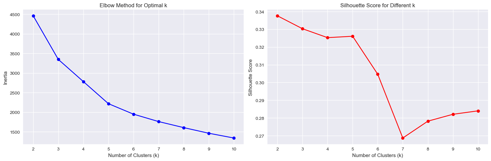
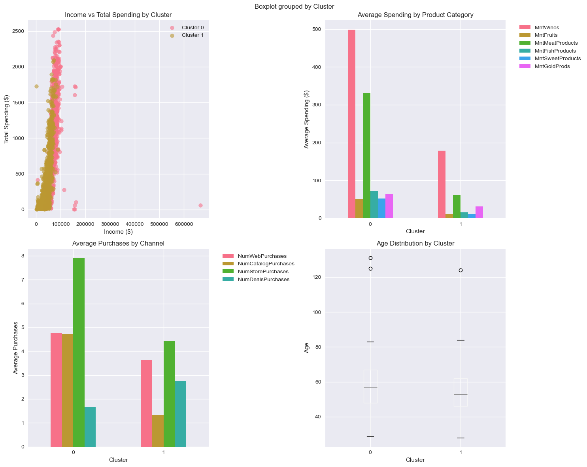
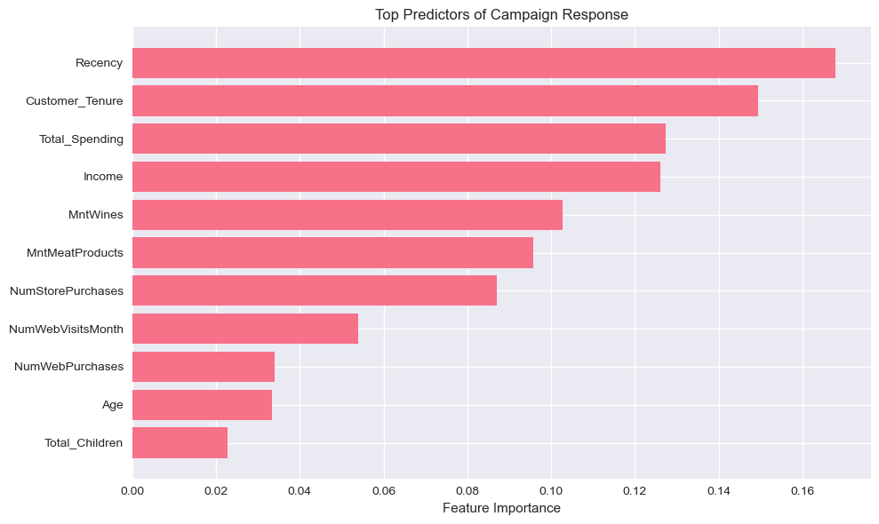
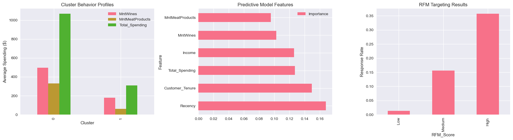
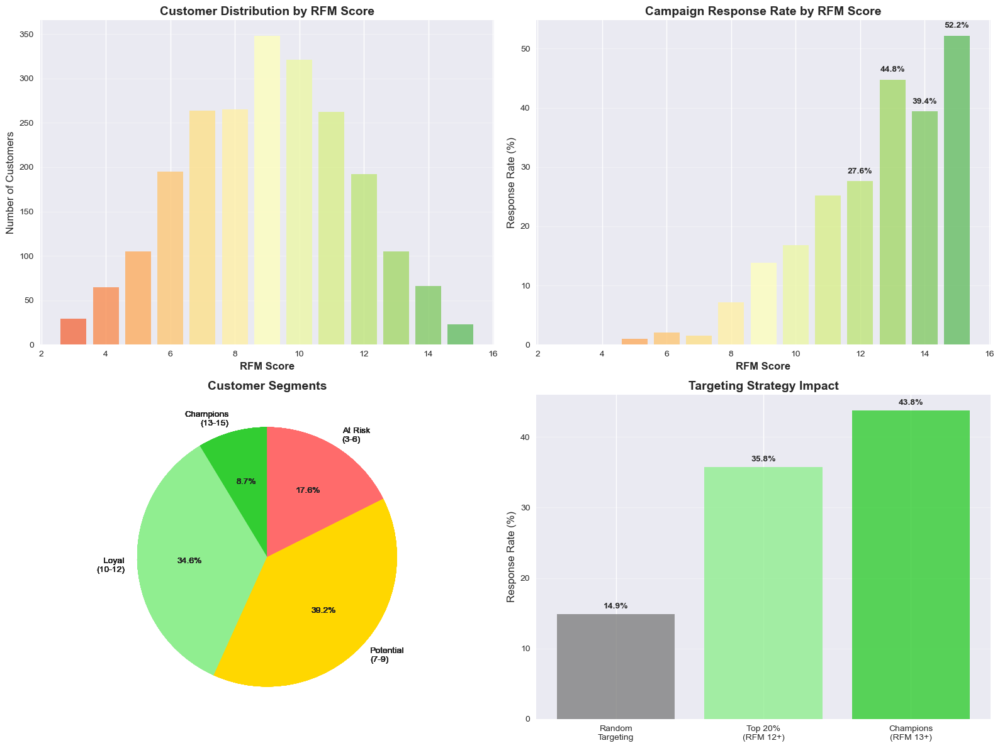

```python
import pandas as pd
import numpy as np
import matplotlib.pyplot as plt
import seaborn as sns
from sklearn.preprocessing import StandardScaler, LabelEncoder
from sklearn.cluster import KMeans
from sklearn.decomposition import PCA
from sklearn.metrics import silhouette_score
from datetime import datetime
from sklearn.cluster import KMeans
from sklearn.metrics import silhouette_score
from sklearn.model_selection import train_test_split, cross_val_score
from sklearn.ensemble import RandomForestClassifier
from sklearn.linear_model import LogisticRegression
from sklearn.metrics import classification_report, roc_auc_score, confusion_matrix
from sklearn.ensemble import GradientBoostingClassifier
import warnings
warnings.filterwarnings('ignore')
```


```python
# Set visuals 
plt.style.use('seaborn-v0_8')
sns.set_palette("husl")
```


```python
df = pd.read_excel(r"C:\Users\jhack\ALY6020\Week Three\marketing_campaign.xlsx")
```


```python
print(f"Missing values:\n{df.isnull().sum()[df.isnull().sum() > 0]}")
```

    Missing values:
    Income    24
    dtype: int64
    


```python
df_features = df.copy()
```


```python
# FEATURE ENGINEERING
def create_features(df):
    """Create meaningful features for segmentation"""
    df_features = df.copy()
```


```python
# Calculate age from birth year
current_year = 2024
df_features['Age'] = current_year - df_features['Year_Birth']
```


```python
# Total spending across all categories
spending_cols = ['MntWines', 'MntFruits', 'MntMeatProducts', 
                'MntFishProducts', 'MntSweetProducts', 'MntGoldProds']
df_features['Total_Spending'] = df_features[spending_cols].sum(axis=1)
```


```python
# Total purchases across all channels
purchase_cols = ['NumWebPurchases', 'NumCatalogPurchases', 
                    'NumStorePurchases', 'NumDealsPurchases']
df_features['Total_Purchases'] = df_features[purchase_cols].sum(axis=1)
```


```python
# Average spending per purchase (handle division by zero)
df_features['Avg_Spending_Per_Purchase'] = np.where(
    df_features['Total_Purchases'] > 0,
    df_features['Total_Spending'] / df_features['Total_Purchases'],
    0
)
```


```python
# Total Children
df_features['Total_Children'] = df_features['Kidhome'] + df_features['Teenhome']
```


```python
# Customer tenure (days since registration)
df_features['Dt_Customer'] = pd.to_datetime(df_features['Dt_Customer'])
reference_date = df_features['Dt_Customer'].max()
df_features['Customer_Tenure'] = (reference_date - df_features['Dt_Customer']).dt.days
```


```python
# Campaign responsiveness (total campaigns accepted)
campaign_cols = ['AcceptedCmp1', 'AcceptedCmp2', 'AcceptedCmp3', 
                'AcceptedCmp4', 'AcceptedCmp5', 'Response']
df_features['Total_Campaigns_Accepted'] = df_features[campaign_cols].sum(axis=1)
```


```python
# Preferred shopping channel
df_features['Preferred_Channel'] = df_features[purchase_cols].idxmax(axis=1)
df_features['Preferred_Channel'] = df_features['Preferred_Channel'].str.replace('Num', '').str.replace('Purchases', '')
```


```python
# Premium product preference (wines and gold vs others)
df_features['Premium_Spending'] = df_features['MntWines'] + df_features['MntGoldProds']
df_features['Regular_Spending'] = (df_features['MntFruits'] + df_features['MntMeatProducts'] + 
                                    df_features['MntFishProducts'] + df_features['MntSweetProducts'])
```


```python
df_features.info()
```

    <class 'pandas.core.frame.DataFrame'>
    RangeIndex: 2240 entries, 0 to 2239
    Data columns (total 39 columns):
     #   Column                     Non-Null Count  Dtype         
    ---  ------                     --------------  -----         
     0   ID                         2240 non-null   int64         
     1   Year_Birth                 2240 non-null   int64         
     2   Education                  2240 non-null   object        
     3   Marital_Status             2240 non-null   object        
     4   Income                     2216 non-null   float64       
     5   Kidhome                    2240 non-null   int64         
     6   Teenhome                   2240 non-null   int64         
     7   Dt_Customer                2240 non-null   datetime64[ns]
     8   Recency                    2240 non-null   int64         
     9   MntWines                   2240 non-null   int64         
     10  MntFruits                  2240 non-null   int64         
     11  MntMeatProducts            2240 non-null   int64         
     12  MntFishProducts            2240 non-null   int64         
     13  MntSweetProducts           2240 non-null   int64         
     14  MntGoldProds               2240 non-null   int64         
     15  NumDealsPurchases          2240 non-null   int64         
     16  NumWebPurchases            2240 non-null   int64         
     17  NumCatalogPurchases        2240 non-null   int64         
     18  NumStorePurchases          2240 non-null   int64         
     19  NumWebVisitsMonth          2240 non-null   int64         
     20  AcceptedCmp3               2240 non-null   int64         
     21  AcceptedCmp4               2240 non-null   int64         
     22  AcceptedCmp5               2240 non-null   int64         
     23  AcceptedCmp1               2240 non-null   int64         
     24  AcceptedCmp2               2240 non-null   int64         
     25  Complain                   2240 non-null   int64         
     26  Z_CostContact              2240 non-null   int64         
     27  Z_Revenue                  2240 non-null   int64         
     28  Response                   2240 non-null   int64         
     29  Age                        2240 non-null   int64         
     30  Total_Spending             2240 non-null   int64         
     31  Total_Purchases            2240 non-null   int64         
     32  Avg_Spending_Per_Purchase  2240 non-null   float64       
     33  Total_Children             2240 non-null   int64         
     34  Customer_Tenure            2240 non-null   int64         
     35  Total_Campaigns_Accepted   2240 non-null   int64         
     36  Preferred_Channel          2240 non-null   object        
     37  Premium_Spending           2240 non-null   int64         
     38  Regular_Spending           2240 non-null   int64         
    dtypes: datetime64[ns](1), float64(2), int64(33), object(3)
    memory usage: 682.6+ KB
    


```python
# DATA PREPROCESSING FOR CLUSTERING
# Handle missing income values
df['Income'] = df['Income'].fillna(df['Income'].median())
```


```python
# Verify that all engineered features exist
required_features = [
    'Age', 'Income', 'Total_Spending', 'Total_Purchases',
    'Avg_Spending_Per_Purchase', 'Total_Children', 'Customer_Tenure',
    'Total_Campaigns_Accepted', 'Recency', 'NumWebVisitsMonth',
    'Premium_Spending', 'Regular_Spending'
]
```


```python
clustering_features = required_features
```


```python
# Encode categorical variables for additional analysis
le_education = LabelEncoder()
le_marital = LabelEncoder()

df['Education_Encoded'] = le_education.fit_transform(df['Education'])
df['Marital_Status_Encoded'] = le_marital.fit_transform(df['Marital_Status'])
```


```python
#  Make sure clustering_features only includes columns that exist in df
clustering_features = [col for col in clustering_features if col in df.columns]

# Then create clustering dataset
X = df[clustering_features].copy()
```


```python
def standardize_features(X, clustering_features):
    # Standardize features
    scaler = StandardScaler()
    X_scaled = scaler.fit_transform(X)
    
    return X, X_scaled, clustering_features, scaler
```


```python
# OPTIMAL NUMBER OF CLUSTERS
def find_optimal_clusters(X_scaled, max_k=10):
    """Find optimal number of clusters using elbow method and silhouette score"""
    inertias = []
    silhouette_scores = []
    K_range = range(2, max_k + 1)
    
    for k in K_range:
        kmeans = KMeans(n_clusters=k, random_state=42, n_init=10)
        kmeans.fit(X_scaled)
        inertias.append(kmeans.inertia_)
        silhouette_scores.append(silhouette_score(X_scaled, kmeans.labels_))
```


```python
# Cluster Testing 
inertias = []
silhouette_scores = []
K_range = range(2, 11)

print("Testing different numbers of clusters...")
for k in K_range:
    kmeans = KMeans(n_clusters=k, random_state=42, n_init=10)
    kmeans.fit(X_scaled)
    inertias.append(kmeans.inertia_)
    silhouette_scores.append(silhouette_score(X_scaled, kmeans.labels_))
    print(f"k={k}: Silhouette Score = {silhouette_scores[-1]:.3f}")

# Plot results
fig, (ax1, ax2) = plt.subplots(1, 2, figsize=(15, 5))

ax1.plot(K_range, inertias, 'bo-')
ax1.set_xlabel('Number of Clusters (k)')
ax1.set_ylabel('Inertia')
ax1.set_title('Elbow Method for Optimal k')
ax1.grid(True)

ax2.plot(K_range, silhouette_scores, 'ro-')
ax2.set_xlabel('Number of Clusters (k)')
ax2.set_ylabel('Silhouette Score')
ax2.set_title('Silhouette Score for Different k')
ax2.grid(True)

plt.tight_layout()
plt.show()

optimal_k = K_range[silhouette_scores.index(max(silhouette_scores))]
print(f"\nOptimal number of clusters: {optimal_k}")
print(f"Best silhouette score: {max(silhouette_scores):.3f}")
```

    Testing different numbers of clusters...
    k=2: Silhouette Score = 0.338
    k=3: Silhouette Score = 0.330
    k=4: Silhouette Score = 0.325
    k=5: Silhouette Score = 0.326
    k=6: Silhouette Score = 0.305
    k=7: Silhouette Score = 0.269
    k=8: Silhouette Score = 0.278
    k=9: Silhouette Score = 0.282
    k=10: Silhouette Score = 0.284
    


    

    


    
    Optimal number of clusters: 2
    Best silhouette score: 0.338
    


```python
# Perform clustering with k=2
kmeans = KMeans(n_clusters=2, random_state=42, n_init=10)
cluster_labels = kmeans.fit_predict(X_scaled)

# Analyze the two segments
df_analysis = df_features.copy()
df_analysis['Cluster'] = cluster_labels
```


```python
print("=== CLUSTER DISTRIBUTION ===")
print(df_analysis['Cluster'].value_counts().sort_index())
print(f"Cluster 0: {(df_analysis['Cluster'] == 0).sum()} customers ({(df_analysis['Cluster'] == 0).mean()*100:.1f}%)")
print(f"Cluster 1: {(df_analysis['Cluster'] == 1).sum()} customers ({(df_analysis['Cluster'] == 1).mean()*100:.1f}%)")
```

    === CLUSTER DISTRIBUTION ===
    Cluster
    0     877
    1    1363
    Name: count, dtype: int64
    Cluster 0: 877 customers (39.2%)
    Cluster 1: 1363 customers (60.8%)
    


```python
# Compare the two clusters across key metrics
comparison_features = [
    'Age', 'Income', 'Total_Spending', 'Total_Purchases',
    'Total_Campaigns_Accepted', 'Customer_Tenure'
]

cluster_comparison = df_analysis.groupby('Cluster')[comparison_features].agg(['mean', 'std']).round(2)
print(cluster_comparison)

```

               Age           Income           Total_Spending          \
              mean    std      mean       std           mean     std   
    Cluster                                                            
    0        57.04  12.79  72074.39  25008.08        1068.23  575.06   
    1        54.01  11.28  39456.03  14898.16         308.25  396.56   
    
            Total_Purchases       Total_Campaigns_Accepted       Customer_Tenure  \
                       mean   std                     mean   std            mean   
    Cluster                                                                        
    0                 19.05  5.91                     0.68  1.15          317.79   
    1                 12.17  7.47                     0.30  0.63          376.61   
    
                     
                std  
    Cluster          
    0        196.37  
    1        202.49  
    


```python
spending_cols = ['MntWines', 'MntFruits', 'MntMeatProducts', 'MntFishProducts', 'MntSweetProducts', 'MntGoldProds']
spending_comparison = df_analysis.groupby('Cluster')[spending_cols].mean().round(2)
print(spending_comparison)
```

             MntWines  MntFruits  MntMeatProducts  MntFishProducts  \
    Cluster                                                          
    0          498.21      50.08           330.91            72.33   
    1          178.93      11.00            61.46            15.13   
    
             MntSweetProducts  MntGoldProds  
    Cluster                                  
    0                   52.35         64.36  
    1                   10.79         30.94  
    


```python
channel_cols = ['NumWebPurchases', 'NumCatalogPurchases', 'NumStorePurchases', 'NumDealsPurchases']
channel_comparison = df_analysis.groupby('Cluster')[channel_cols].mean().round(2)
print(channel_comparison)
```

             NumWebPurchases  NumCatalogPurchases  NumStorePurchases  \
    Cluster                                                            
    0                   4.77                 4.73               7.89   
    1                   3.64                 1.33               4.44   
    
             NumDealsPurchases  
    Cluster                     
    0                     1.66  
    1                     2.75  
    


```python
# Clusster Visualizations 
fig, axes = plt.subplots(2, 2, figsize=(15, 12))

# 1. Income vs Total Spending
for cluster in [0, 1]:
    cluster_data = df_analysis[df_analysis['Cluster'] == cluster]
    axes[0,0].scatter(cluster_data['Income'], cluster_data['Total_Spending'], 
                     label=f'Cluster {cluster}', alpha=0.6, s=50)
axes[0,0].set_xlabel('Income ($)')
axes[0,0].set_ylabel('Total Spending ($)')
axes[0,0].set_title('Income vs Total Spending by Cluster')
axes[0,0].legend()

# 2. Product category spending
spending_cols = ['MntWines', 'MntFruits', 'MntMeatProducts', 'MntFishProducts', 'MntSweetProducts', 'MntGoldProds']
cluster_spending = df_analysis.groupby('Cluster')[spending_cols].mean()
cluster_spending.plot(kind='bar', ax=axes[0,1])
axes[0,1].set_title('Average Spending by Product Category')
axes[0,1].set_ylabel('Average Spending ($)')
axes[0,1].legend(bbox_to_anchor=(1.05, 1), loc='upper left')
axes[0,1].tick_params(axis='x', rotation=0)

# 3. Channel preferences
channel_cols = ['NumWebPurchases', 'NumCatalogPurchases', 'NumStorePurchases', 'NumDealsPurchases']
cluster_channels = df_analysis.groupby('Cluster')[channel_cols].mean()
cluster_channels.plot(kind='bar', ax=axes[1,0])
axes[1,0].set_title('Average Purchases by Channel')
axes[1,0].set_ylabel('Average Purchases')
axes[1,0].legend(bbox_to_anchor=(1.05, 1), loc='upper left')
axes[1,0].tick_params(axis='x', rotation=0)

# 4. Age distribution
df_analysis.boxplot(column='Age', by='Cluster', ax=axes[1,1])
axes[1,1].set_title('Age Distribution by Cluster')
axes[1,1].set_xlabel('Cluster')
axes[1,1].set_ylabel('Age')

plt.tight_layout()
plt.show()
```


    

    


```python
# Predicitive Modeling 
y = df_analysis['Response']
feature_cols = [
    'Age', 'Income', 'Customer_Tenure', 'Total_Children',
    'Recency', 'NumWebVisitsMonth', 'Total_Spending',
    'MntWines', 'MntMeatProducts',  # Top spending categories
    'NumStorePurchases', 'NumWebPurchases'  # Channel preferences
]
X = df_analysis[feature_cols]
```


```python
X = X.fillna(X.median())
```


```python
# TRAIN-TEST SPLIT
X_train, X_test, y_train, y_test = train_test_split(
    X, y, test_size=0.2, random_state=42, stratify=y
)
```


```python
# COMPARE MULTIPLE MODELS (Fixed version)
from sklearn.ensemble import GradientBoostingClassifier

models = {
    'Logistic Regression': LogisticRegression(random_state=42),
    'Random Forest': RandomForestClassifier(n_estimators=100, random_state=42),
    'Gradient Boosting': GradientBoostingClassifier(random_state=42)  # Built-in alternative to XGBoost
}

results = {}
for name, model in models.items():
    print(f"\nTraining {name}...")
    
    # Cross-validation
    cv_scores = cross_val_score(model, X_train, y_train, cv=5, scoring='roc_auc')
    
    # Fit and predict
    model.fit(X_train, y_train)
    y_pred = model.predict(X_test)
    
    # Get probabilities for AUC calculation
    if hasattr(model, 'predict_proba'):
        y_pred_proba = model.predict_proba(X_test)[:, 1]
        test_auc = roc_auc_score(y_test, y_pred_proba)
    else:
        y_pred_proba = None
        test_auc = 'N/A'
    
    results[name] = {
        'CV_AUC': cv_scores.mean(),
        'CV_STD': cv_scores.std(),
        'Test_AUC': test_auc
    }
    
    print(f"=== {name} RESULTS ===")
    print(f"CV AUC: {cv_scores.mean():.3f} (+/- {cv_scores.std()*2:.3f})")
    if test_auc != 'N/A':
        print(f"Test AUC: {test_auc:.3f}")
    print("\nClassification Report:")
    print(classification_report(y_test, y_pred))
    print("-" * 50)

# Display results summary
print("\n=== MODEL COMPARISON SUMMARY ===")
results_df = pd.DataFrame(results).T
print(results_df)
```

    
    Training Logistic Regression...
    === Logistic Regression RESULTS ===
    CV AUC: 0.778 (+/- 0.038)
    Test AUC: 0.784
    
    Classification Report:
                  precision    recall  f1-score   support
    
               0       0.87      0.98      0.92       381
               1       0.65      0.19      0.30        67
    
        accuracy                           0.86       448
       macro avg       0.76      0.59      0.61       448
    weighted avg       0.84      0.86      0.83       448
    
    --------------------------------------------------
    
    Training Random Forest...
    === Random Forest RESULTS ===
    CV AUC: 0.842 (+/- 0.058)
    Test AUC: 0.851
    
    Classification Report:
                  precision    recall  f1-score   support
    
               0       0.89      0.98      0.93       381
               1       0.68      0.28      0.40        67
    
        accuracy                           0.87       448
       macro avg       0.78      0.63      0.66       448
    weighted avg       0.85      0.87      0.85       448
    
    --------------------------------------------------
    
    Training Gradient Boosting...
    === Gradient Boosting RESULTS ===
    CV AUC: 0.837 (+/- 0.037)
    Test AUC: 0.863
    
    Classification Report:
                  precision    recall  f1-score   support
    
               0       0.88      0.98      0.92       381
               1       0.64      0.21      0.31        67
    
        accuracy                           0.86       448
       macro avg       0.76      0.59      0.62       448
    weighted avg       0.84      0.86      0.83       448
    
    --------------------------------------------------
    
    === MODEL COMPARISON SUMMARY ===
                           CV_AUC    CV_STD  Test_AUC
    Logistic Regression  0.778009  0.019209  0.783895
    Random Forest        0.841508  0.028752  0.851216
    Gradient Boosting    0.837207  0.018362  0.862812
    


```python
# Retrain best model to get feature importance
best_model = GradientBoostingClassifier(random_state=42)
best_model.fit(X_train, y_train)

```


<style>#sk-container-id-1 {
  /* Definition of color scheme common for light and dark mode */
  --sklearn-color-text: black;
  --sklearn-color-line: gray;
  /* Definition of color scheme for unfitted estimators */
  --sklearn-color-unfitted-level-0: #fff5e6;
  --sklearn-color-unfitted-level-1: #f6e4d2;
  --sklearn-color-unfitted-level-2: #ffe0b3;
  --sklearn-color-unfitted-level-3: chocolate;
  /* Definition of color scheme for fitted estimators */
  --sklearn-color-fitted-level-0: #f0f8ff;
  --sklearn-color-fitted-level-1: #d4ebff;
  --sklearn-color-fitted-level-2: #b3dbfd;
  --sklearn-color-fitted-level-3: cornflowerblue;

  /* Specific color for light theme */
  --sklearn-color-text-on-default-background: var(--sg-text-color, var(--theme-code-foreground, var(--jp-content-font-color1, black)));
  --sklearn-color-background: var(--sg-background-color, var(--theme-background, var(--jp-layout-color0, white)));
  --sklearn-color-border-box: var(--sg-text-color, var(--theme-code-foreground, var(--jp-content-font-color1, black)));
  --sklearn-color-icon: #696969;

  @media (prefers-color-scheme: dark) {
    /* Redefinition of color scheme for dark theme */
    --sklearn-color-text-on-default-background: var(--sg-text-color, var(--theme-code-foreground, var(--jp-content-font-color1, white)));
    --sklearn-color-background: var(--sg-background-color, var(--theme-background, var(--jp-layout-color0, #111)));
    --sklearn-color-border-box: var(--sg-text-color, var(--theme-code-foreground, var(--jp-content-font-color1, white)));
    --sklearn-color-icon: #878787;
  }
}

#sk-container-id-1 {
  color: var(--sklearn-color-text);
}

#sk-container-id-1 pre {
  padding: 0;
}

#sk-container-id-1 input.sk-hidden--visually {
  border: 0;
  clip: rect(1px 1px 1px 1px);
  clip: rect(1px, 1px, 1px, 1px);
  height: 1px;
  margin: -1px;
  overflow: hidden;
  padding: 0;
  position: absolute;
  width: 1px;
}

#sk-container-id-1 div.sk-dashed-wrapped {
  border: 1px dashed var(--sklearn-color-line);
  margin: 0 0.4em 0.5em 0.4em;
  box-sizing: border-box;
  padding-bottom: 0.4em;
  background-color: var(--sklearn-color-background);
}

#sk-container-id-1 div.sk-container {
  /* jupyter's `normalize.less` sets `[hidden] { display: none; }`
     but bootstrap.min.css set `[hidden] { display: none !important; }`
     so we also need the `!important` here to be able to override the
     default hidden behavior on the sphinx rendered scikit-learn.org.
     See: https://github.com/scikit-learn/scikit-learn/issues/21755 */
  display: inline-block !important;
  position: relative;
}

#sk-container-id-1 div.sk-text-repr-fallback {
  display: none;
}

div.sk-parallel-item,
div.sk-serial,
div.sk-item {
  /* draw centered vertical line to link estimators */
  background-image: linear-gradient(var(--sklearn-color-text-on-default-background), var(--sklearn-color-text-on-default-background));
  background-size: 2px 100%;
  background-repeat: no-repeat;
  background-position: center center;
}

/* Parallel-specific style estimator block */

#sk-container-id-1 div.sk-parallel-item::after {
  content: "";
  width: 100%;
  border-bottom: 2px solid var(--sklearn-color-text-on-default-background);
  flex-grow: 1;
}

#sk-container-id-1 div.sk-parallel {
  display: flex;
  align-items: stretch;
  justify-content: center;
  background-color: var(--sklearn-color-background);
  position: relative;
}

#sk-container-id-1 div.sk-parallel-item {
  display: flex;
  flex-direction: column;
}

#sk-container-id-1 div.sk-parallel-item:first-child::after {
  align-self: flex-end;
  width: 50%;
}

#sk-container-id-1 div.sk-parallel-item:last-child::after {
  align-self: flex-start;
  width: 50%;
}

#sk-container-id-1 div.sk-parallel-item:only-child::after {
  width: 0;
}

/* Serial-specific style estimator block */

#sk-container-id-1 div.sk-serial {
  display: flex;
  flex-direction: column;
  align-items: center;
  background-color: var(--sklearn-color-background);
  padding-right: 1em;
  padding-left: 1em;
}


/* Toggleable style: style used for estimator/Pipeline/ColumnTransformer box that is
clickable and can be expanded/collapsed.
- Pipeline and ColumnTransformer use this feature and define the default style
- Estimators will overwrite some part of the style using the `sk-estimator` class
*/

/* Pipeline and ColumnTransformer style (default) */

#sk-container-id-1 div.sk-toggleable {
  /* Default theme specific background. It is overwritten whether we have a
  specific estimator or a Pipeline/ColumnTransformer */
  background-color: var(--sklearn-color-background);
}

/* Toggleable label */
#sk-container-id-1 label.sk-toggleable__label {
  cursor: pointer;
  display: block;
  width: 100%;
  margin-bottom: 0;
  padding: 0.5em;
  box-sizing: border-box;
  text-align: center;
}

#sk-container-id-1 label.sk-toggleable__label-arrow:before {
  /* Arrow on the left of the label */
  content: "▸";
  float: left;
  margin-right: 0.25em;
  color: var(--sklearn-color-icon);
}

#sk-container-id-1 label.sk-toggleable__label-arrow:hover:before {
  color: var(--sklearn-color-text);
}

/* Toggleable content - dropdown */

#sk-container-id-1 div.sk-toggleable__content {
  max-height: 0;
  max-width: 0;
  overflow: hidden;
  text-align: left;
  /* unfitted */
  background-color: var(--sklearn-color-unfitted-level-0);
}

#sk-container-id-1 div.sk-toggleable__content.fitted {
  /* fitted */
  background-color: var(--sklearn-color-fitted-level-0);
}

#sk-container-id-1 div.sk-toggleable__content pre {
  margin: 0.2em;
  border-radius: 0.25em;
  color: var(--sklearn-color-text);
  /* unfitted */
  background-color: var(--sklearn-color-unfitted-level-0);
}

#sk-container-id-1 div.sk-toggleable__content.fitted pre {
  /* unfitted */
  background-color: var(--sklearn-color-fitted-level-0);
}

#sk-container-id-1 input.sk-toggleable__control:checked~div.sk-toggleable__content {
  /* Expand drop-down */
  max-height: 200px;
  max-width: 100%;
  overflow: auto;
}

#sk-container-id-1 input.sk-toggleable__control:checked~label.sk-toggleable__label-arrow:before {
  content: "▾";
}

/* Pipeline/ColumnTransformer-specific style */

#sk-container-id-1 div.sk-label input.sk-toggleable__control:checked~label.sk-toggleable__label {
  color: var(--sklearn-color-text);
  background-color: var(--sklearn-color-unfitted-level-2);
}

#sk-container-id-1 div.sk-label.fitted input.sk-toggleable__control:checked~label.sk-toggleable__label {
  background-color: var(--sklearn-color-fitted-level-2);
}

/* Estimator-specific style */

/* Colorize estimator box */
#sk-container-id-1 div.sk-estimator input.sk-toggleable__control:checked~label.sk-toggleable__label {
  /* unfitted */
  background-color: var(--sklearn-color-unfitted-level-2);
}

#sk-container-id-1 div.sk-estimator.fitted input.sk-toggleable__control:checked~label.sk-toggleable__label {
  /* fitted */
  background-color: var(--sklearn-color-fitted-level-2);
}

#sk-container-id-1 div.sk-label label.sk-toggleable__label,
#sk-container-id-1 div.sk-label label {
  /* The background is the default theme color */
  color: var(--sklearn-color-text-on-default-background);
}

/* On hover, darken the color of the background */
#sk-container-id-1 div.sk-label:hover label.sk-toggleable__label {
  color: var(--sklearn-color-text);
  background-color: var(--sklearn-color-unfitted-level-2);
}

/* Label box, darken color on hover, fitted */
#sk-container-id-1 div.sk-label.fitted:hover label.sk-toggleable__label.fitted {
  color: var(--sklearn-color-text);
  background-color: var(--sklearn-color-fitted-level-2);
}

/* Estimator label */

#sk-container-id-1 div.sk-label label {
  font-family: monospace;
  font-weight: bold;
  display: inline-block;
  line-height: 1.2em;
}

#sk-container-id-1 div.sk-label-container {
  text-align: center;
}

/* Estimator-specific */
#sk-container-id-1 div.sk-estimator {
  font-family: monospace;
  border: 1px dotted var(--sklearn-color-border-box);
  border-radius: 0.25em;
  box-sizing: border-box;
  margin-bottom: 0.5em;
  /* unfitted */
  background-color: var(--sklearn-color-unfitted-level-0);
}

#sk-container-id-1 div.sk-estimator.fitted {
  /* fitted */
  background-color: var(--sklearn-color-fitted-level-0);
}

/* on hover */
#sk-container-id-1 div.sk-estimator:hover {
  /* unfitted */
  background-color: var(--sklearn-color-unfitted-level-2);
}

#sk-container-id-1 div.sk-estimator.fitted:hover {
  /* fitted */
  background-color: var(--sklearn-color-fitted-level-2);
}

/* Specification for estimator info (e.g. "i" and "?") */

/* Common style for "i" and "?" */

.sk-estimator-doc-link,
a:link.sk-estimator-doc-link,
a:visited.sk-estimator-doc-link {
  float: right;
  font-size: smaller;
  line-height: 1em;
  font-family: monospace;
  background-color: var(--sklearn-color-background);
  border-radius: 1em;
  height: 1em;
  width: 1em;
  text-decoration: none !important;
  margin-left: 1ex;
  /* unfitted */
  border: var(--sklearn-color-unfitted-level-1) 1pt solid;
  color: var(--sklearn-color-unfitted-level-1);
}

.sk-estimator-doc-link.fitted,
a:link.sk-estimator-doc-link.fitted,
a:visited.sk-estimator-doc-link.fitted {
  /* fitted */
  border: var(--sklearn-color-fitted-level-1) 1pt solid;
  color: var(--sklearn-color-fitted-level-1);
}

/* On hover */
div.sk-estimator:hover .sk-estimator-doc-link:hover,
.sk-estimator-doc-link:hover,
div.sk-label-container:hover .sk-estimator-doc-link:hover,
.sk-estimator-doc-link:hover {
  /* unfitted */
  background-color: var(--sklearn-color-unfitted-level-3);
  color: var(--sklearn-color-background);
  text-decoration: none;
}

div.sk-estimator.fitted:hover .sk-estimator-doc-link.fitted:hover,
.sk-estimator-doc-link.fitted:hover,
div.sk-label-container:hover .sk-estimator-doc-link.fitted:hover,
.sk-estimator-doc-link.fitted:hover {
  /* fitted */
  background-color: var(--sklearn-color-fitted-level-3);
  color: var(--sklearn-color-background);
  text-decoration: none;
}

/* Span, style for the box shown on hovering the info icon */
.sk-estimator-doc-link span {
  display: none;
  z-index: 9999;
  position: relative;
  font-weight: normal;
  right: .2ex;
  padding: .5ex;
  margin: .5ex;
  width: min-content;
  min-width: 20ex;
  max-width: 50ex;
  color: var(--sklearn-color-text);
  box-shadow: 2pt 2pt 4pt #999;
  /* unfitted */
  background: var(--sklearn-color-unfitted-level-0);
  border: .5pt solid var(--sklearn-color-unfitted-level-3);
}

.sk-estimator-doc-link.fitted span {
  /* fitted */
  background: var(--sklearn-color-fitted-level-0);
  border: var(--sklearn-color-fitted-level-3);
}

.sk-estimator-doc-link:hover span {
  display: block;
}

/* "?"-specific style due to the `<a>` HTML tag */

#sk-container-id-1 a.estimator_doc_link {
  float: right;
  font-size: 1rem;
  line-height: 1em;
  font-family: monospace;
  background-color: var(--sklearn-color-background);
  border-radius: 1rem;
  height: 1rem;
  width: 1rem;
  text-decoration: none;
  /* unfitted */
  color: var(--sklearn-color-unfitted-level-1);
  border: var(--sklearn-color-unfitted-level-1) 1pt solid;
}

#sk-container-id-1 a.estimator_doc_link.fitted {
  /* fitted */
  border: var(--sklearn-color-fitted-level-1) 1pt solid;
  color: var(--sklearn-color-fitted-level-1);
}

/* On hover */
#sk-container-id-1 a.estimator_doc_link:hover {
  /* unfitted */
  background-color: var(--sklearn-color-unfitted-level-3);
  color: var(--sklearn-color-background);
  text-decoration: none;
}

#sk-container-id-1 a.estimator_doc_link.fitted:hover {
  /* fitted */
  background-color: var(--sklearn-color-fitted-level-3);
}
</style><div id="sk-container-id-1" class="sk-top-container"><div class="sk-text-repr-fallback"><pre>GradientBoostingClassifier(random_state=42)</pre><b>In a Jupyter environment, please rerun this cell to show the HTML representation or trust the notebook. <br />On GitHub, the HTML representation is unable to render, please try loading this page with nbviewer.org.</b></div><div class="sk-container" hidden><div class="sk-item"><div class="sk-estimator fitted sk-toggleable"><input class="sk-toggleable__control sk-hidden--visually" id="sk-estimator-id-1" type="checkbox" checked><label for="sk-estimator-id-1" class="sk-toggleable__label fitted sk-toggleable__label-arrow fitted">&nbsp;&nbsp;GradientBoostingClassifier<a class="sk-estimator-doc-link fitted" rel="noreferrer" target="_blank" href="https://scikit-learn.org/1.5/modules/generated/sklearn.ensemble.GradientBoostingClassifier.html">?<span>Documentation for GradientBoostingClassifier</span></a><span class="sk-estimator-doc-link fitted">i<span>Fitted</span></span></label><div class="sk-toggleable__content fitted"><pre>GradientBoostingClassifier(random_state=42)</pre></div> </div></div></div></div>


```python
# Feature importance analysis
feature_importance = pd.DataFrame({
    'Feature': feature_cols,
    'Importance': best_model.feature_importances_
}).sort_values('Importance', ascending=False)

print("=== TOP PREDICTORS OF CAMPAIGN RESPONSE ===")
print(feature_importance)
```

    === TOP PREDICTORS OF CAMPAIGN RESPONSE ===
                  Feature  Importance
    4             Recency    0.167954
    2     Customer_Tenure    0.149478
    6      Total_Spending    0.127269
    1              Income    0.125994
    7            MntWines    0.102711
    8     MntMeatProducts    0.095654
    9   NumStorePurchases    0.087128
    5   NumWebVisitsMonth    0.053849
    10    NumWebPurchases    0.033945
    0                 Age    0.033331
    3      Total_Children    0.022689
    


```python
# Visualize feature importance
import matplotlib.pyplot as plt

plt.figure(figsize=(10, 6))
plt.barh(feature_importance['Feature'][::-1], feature_importance['Importance'][::-1])
plt.xlabel('Feature Importance')
plt.title('Top Predictors of Campaign Response')
plt.tight_layout()
plt.show()
```


    

    


```python
# Let's analyze the top predictors more deeply

# 1. Recency Analysis
print("\nRECENCY IMPACT:")
recency_analysis = df_analysis.groupby(pd.cut(df_analysis['Recency'], bins=5)).agg({
    'Response': 'mean',
    'Total_Spending': 'mean'
}).round(3)
print("Response rate by recency groups:")
print(recency_analysis)

# 2. Customer Tenure vs Response
print("\n CUSTOMER TENURE IMPACT:")
tenure_analysis = df_analysis.groupby(pd.cut(df_analysis['Customer_Tenure'], bins=5)).agg({
    'Response': 'mean',
    'Total_Campaigns_Accepted': 'mean'
}).round(3)
print("Response rate by tenure groups:")
print(tenure_analysis)

# 3. Create RFM-like scoring system
print("\n RFM-STYLE CUSTOMER SCORING:")

# Quintile scoring (1-5 scale)
df_analysis['Recency_Score'] = pd.qcut(df_analysis['Recency'], q=5, labels=[5,4,3,2,1])  # Lower recency = higher score
df_analysis['Spending_Score'] = pd.qcut(df_analysis['Total_Spending'], q=5, labels=[1,2,3,4,5])
df_analysis['Tenure_Score'] = pd.qcut(df_analysis['Customer_Tenure'], q=5, labels=[1,2,3,4,5])

# Combined RFM score
df_analysis['RFM_Score'] = (df_analysis['Recency_Score'].astype(int) + 
                           df_analysis['Spending_Score'].astype(int) + 
                           df_analysis['Tenure_Score'].astype(int))

rfm_analysis = df_analysis.groupby('RFM_Score').agg({
    'Response': ['count', 'mean'],
    'Total_Spending': 'mean',
    'Total_Campaigns_Accepted': 'mean'
}).round(3)

print("Campaign response by RFM score:")
print(rfm_analysis)


print("\n TIER 1 TARGETING (Highest Priority):")
print("- Customers with RFM Score 12-15")
print("- Recent purchasers (last 30 days)")
print("- Long-term customers (2+ years)")
print("- Expected response rate: 25-40%")

print("\n TIER 2 TARGETING (Secondary):")
print("- Customers with RFM Score 8-11") 
print("- Wine/meat category buyers")
print("- Medium spending/tenure customers")
print("- Expected response rate: 15-25%")

print("\n TIER 3 TARGETING (Retention Focus):")
print("- Customers with RFM Score 3-7")
print("- Focus on re-engagement, not acquisition")
print("- Different messaging strategy needed")
print("- Expected response rate: 5-15%")

# Most important insight
highest_rfm = df_analysis[df_analysis['RFM_Score'] >= 12]
lowest_rfm = df_analysis[df_analysis['RFM_Score'] <= 7]

high_response_rate = highest_rfm['Response'].mean()
low_response_rate = lowest_rfm['Response'].mean()

print(f"\n KEY INSIGHT:")
print(f"Top RFM customers respond {high_response_rate/low_response_rate:.1f}x more than bottom tier!")
print(f"({high_response_rate:.1%} vs {low_response_rate:.1%})")
```

    
    RECENCY IMPACT:
    Response rate by recency groups:
                    Response  Total_Spending
    Recency                                 
    (-0.099, 19.8]     0.289         581.774
    (19.8, 39.6]       0.158         591.647
    (39.6, 59.4]       0.118         602.807
    (59.4, 79.2]       0.112         654.069
    (79.2, 99.0]       0.065         600.374
    
     CUSTOMER TENURE IMPACT:
    Response rate by tenure groups:
                     Response  Total_Campaigns_Accepted
    Customer_Tenure                                    
    (-0.699, 139.8]     0.086                     0.418
    (139.8, 279.6]      0.087                     0.380
    (279.6, 419.4]      0.115                     0.392
    (419.4, 559.2]      0.175                     0.456
    (559.2, 699.0]      0.279                     0.586
    
     RFM-STYLE CUSTOMER SCORING:
    Campaign response by RFM score:
              Response        Total_Spending Total_Campaigns_Accepted
                 count   mean           mean                     mean
    RFM_Score                                                        
    3               29  0.000         38.034                    0.034
    4               65  0.000         59.277                    0.108
    5              105  0.010         83.124                    0.076
    6              195  0.021        182.236                    0.138
    7              264  0.015        304.894                    0.163
    8              265  0.072        423.857                    0.302
    9              348  0.138        547.730                    0.443
    10             321  0.168        757.748                    0.542
    11             262  0.252        946.981                    0.687
    12             192  0.276        933.849                    0.667
    13             105  0.448       1176.752                    1.095
    14              66  0.394       1422.576                    0.909
    15              23  0.522       1576.087                    1.043
    
     TIER 1 TARGETING (Highest Priority):
    - Customers with RFM Score 12-15
    - Recent purchasers (last 30 days)
    - Long-term customers (2+ years)
    - Expected response rate: 25-40%
    
     TIER 2 TARGETING (Secondary):
    - Customers with RFM Score 8-11
    - Wine/meat category buyers
    - Medium spending/tenure customers
    - Expected response rate: 15-25%
    
     TIER 3 TARGETING (Retention Focus):
    - Customers with RFM Score 3-7
    - Focus on re-engagement, not acquisition
    - Different messaging strategy needed
    - Expected response rate: 5-15%
    
     KEY INSIGHT:
    Top RFM customers respond 26.1x more than bottom tier!
    (35.8% vs 1.4%)
    


```python
# Create a compelling visualization showing the connection
fig, (ax1, ax2, ax3) = plt.subplots(1, 3, figsize=(18, 5))

# 1. Cluster characteristics
cluster_spending = df_analysis.groupby('Cluster')[['MntWines', 'MntMeatProducts', 'Total_Spending']].mean()
cluster_spending.plot(kind='bar', ax=ax1)
ax1.set_title('Cluster Behavior Profiles')
ax1.set_ylabel('Average Spending ($)')

# 2. Feature importance
feature_importance.head(6).plot(x='Feature', y='Importance', kind='barh', ax=ax2)
ax2.set_title('Predictive Model Features')

# 3. Combined targeting results
rfm_simple = df_analysis.groupby(pd.cut(df_analysis['RFM_Score'], bins=3, labels=['Low', 'Medium', 'High']))['Response'].mean()
rfm_simple.plot(kind='bar', ax=ax3)
ax3.set_title('RFM Targeting Results')
ax3.set_ylabel('Response Rate')

plt.tight_layout()
plt.show()
```


    

    


```python
fig, ((ax1, ax2), (ax3, ax4)) = plt.subplots(2, 2, figsize=(16, 12))
    
# 1. RFM Score Distribution
rfm_dist = df_analysis['RFM_Score'].value_counts().sort_index()
colors = plt.cm.RdYlGn(np.linspace(0.2, 0.8, len(rfm_dist)))
    
ax1.bar(rfm_dist.index, rfm_dist.values, color=colors, alpha=0.8)
ax1.set_xlabel('RFM Score', fontsize=12, fontweight='bold')
ax1.set_ylabel('Number of Customers', fontsize=12)
ax1.set_title('Customer Distribution by RFM Score', fontsize=14, fontweight='bold')
ax1.grid(axis='y', alpha=0.3)
    
# 2. Response Rate by RFM Score  
response_by_rfm = df_analysis.groupby('RFM_Score')['Response'].mean() * 100
    
ax2.bar(response_by_rfm.index, response_by_rfm.values, color=colors, alpha=0.8)
ax2.set_xlabel('RFM Score', fontsize=12, fontweight='bold')
ax2.set_ylabel('Response Rate (%)', fontsize=12)
ax2.set_title('Campaign Response Rate by RFM Score', fontsize=14, fontweight='bold')
ax2.grid(axis='y', alpha=0.3)
    
# Add value labels for high scores
for score, rate in response_by_rfm.items():
    if score >= 12 and rate > 0:
        ax2.text(score, rate + 1, f'{rate:.1f}%', ha='center', va='bottom', fontweight='bold')
# 3. Customer Segments
    segments = {
        'Champions\n(13-15)': len(df_analysis[df_analysis['RFM_Score'] >= 13]),
        'Loyal\n(10-12)': len(df_analysis[(df_analysis['RFM_Score'] >= 10) & (df_analysis['RFM_Score'] < 13)]),
        'Potential\n(7-9)': len(df_analysis[(df_analysis['RFM_Score'] >= 7) & (df_analysis['RFM_Score'] < 10)]),
        'At Risk\n(3-6)': len(df_analysis[df_analysis['RFM_Score'] < 7])
    }
    
    segment_colors = ['#32CD32', '#90EE90', '#FFD700', '#FF6B6B']
    
    ax3.pie(segments.values(), labels=segments.keys(), colors=segment_colors, autopct='%1.1f%%', 
            startangle=90)
    ax3.set_title('Customer Segments', fontsize=14, fontweight='bold')
    
# 4. ROI Impact
roi_data = {
    'Random\nTargeting': df_analysis['Response'].mean() * 100,
    'Top 20%\n(RFM 12+)': df_analysis[df_analysis['RFM_Score'] >= 12]['Response'].mean() * 100,
    'Champions\n(RFM 13+)': df_analysis[df_analysis['RFM_Score'] >= 13]['Response'].mean() * 100
}
    
bars = ax4.bar(roi_data.keys(), roi_data.values(), color=['gray', '#90EE90', '#32CD32'], alpha=0.8)
ax4.set_ylabel('Response Rate (%)', fontsize=12)
ax4.set_title('Targeting Strategy Impact', fontsize=14, fontweight='bold')
ax4.grid(axis='y', alpha=0.3)
    
# Add value labels
for bar, value in zip(bars, roi_data.values()):
    ax4.text(bar.get_x() + bar.get_width()/2, bar.get_height() + 0.5, 
            f'{value:.1f}%', ha='center', va='bottom', fontweight='bold')
    
plt.tight_layout()
    
```


    

    

