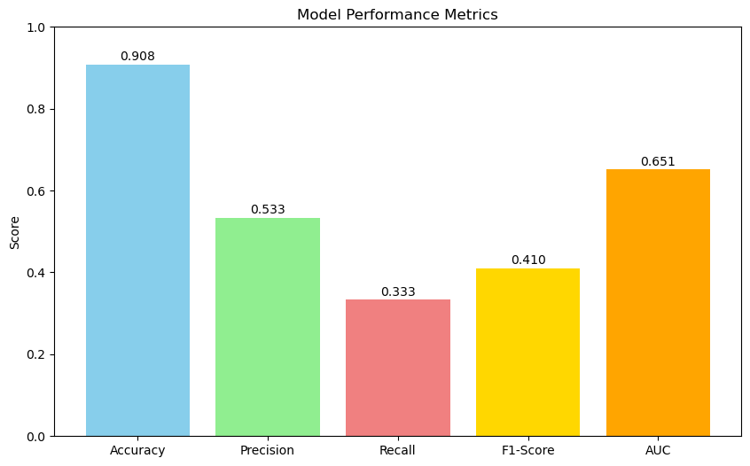

```python
import numpy as np
import pandas as pd
import seaborn as sns
import matplotlib.pyplot as plt
import matplotlib.image as pltimg
import statsmodels.api as smf
from sklearn import datasets
from sklearn import svm
from sklearn.linear_model import LogisticRegression
from sklearn.model_selection import train_test_split
from sklearn.metrics import classification_report, confusion_matrix, accuracy_score, precision_score, recall_score, f1_score, roc_auc_score
from sklearn.metrics import ConfusionMatrixDisplay
from sklearn import metrics
```


```python
# read in data
df = pd.read_excel("Bank_Personal_Loan_Modelling.xlsx", sheet_name='Data')
```


```python
df.head()
```


<div>
<style scoped>
    .dataframe tbody tr th:only-of-type {
        vertical-align: middle;
    }

    .dataframe tbody tr th {
        vertical-align: top;
    }

    .dataframe thead th {
        text-align: right;
    }
</style>
<table border="1" class="dataframe">
  <thead>
    <tr style="text-align: right;">
      <th></th>
      <th>ID</th>
      <th>Age</th>
      <th>Experience</th>
      <th>Income</th>
      <th>ZIP Code</th>
      <th>Family</th>
      <th>CCAvg</th>
      <th>Education</th>
      <th>Mortgage</th>
      <th>Personal Loan</th>
      <th>Securities Account</th>
      <th>CD Account</th>
      <th>Online</th>
      <th>CreditCard</th>
    </tr>
  </thead>
  <tbody>
    <tr>
      <th>0</th>
      <td>1</td>
      <td>25</td>
      <td>1</td>
      <td>49</td>
      <td>91107</td>
      <td>4</td>
      <td>1.6</td>
      <td>1</td>
      <td>0</td>
      <td>0</td>
      <td>1</td>
      <td>0</td>
      <td>0</td>
      <td>0</td>
    </tr>
    <tr>
      <th>1</th>
      <td>2</td>
      <td>45</td>
      <td>19</td>
      <td>34</td>
      <td>90089</td>
      <td>3</td>
      <td>1.5</td>
      <td>1</td>
      <td>0</td>
      <td>0</td>
      <td>1</td>
      <td>0</td>
      <td>0</td>
      <td>0</td>
    </tr>
    <tr>
      <th>2</th>
      <td>3</td>
      <td>39</td>
      <td>15</td>
      <td>11</td>
      <td>94720</td>
      <td>1</td>
      <td>1.0</td>
      <td>1</td>
      <td>0</td>
      <td>0</td>
      <td>0</td>
      <td>0</td>
      <td>0</td>
      <td>0</td>
    </tr>
    <tr>
      <th>3</th>
      <td>4</td>
      <td>35</td>
      <td>9</td>
      <td>100</td>
      <td>94112</td>
      <td>1</td>
      <td>2.7</td>
      <td>2</td>
      <td>0</td>
      <td>0</td>
      <td>0</td>
      <td>0</td>
      <td>0</td>
      <td>0</td>
    </tr>
    <tr>
      <th>4</th>
      <td>5</td>
      <td>35</td>
      <td>8</td>
      <td>45</td>
      <td>91330</td>
      <td>4</td>
      <td>1.0</td>
      <td>2</td>
      <td>0</td>
      <td>0</td>
      <td>0</td>
      <td>0</td>
      <td>0</td>
      <td>1</td>
    </tr>
  </tbody>
</table>
</div>


```python
# data summary 
df.describe().transpose()
```


<div>
<style scoped>
    .dataframe tbody tr th:only-of-type {
        vertical-align: middle;
    }

    .dataframe tbody tr th {
        vertical-align: top;
    }

    .dataframe thead th {
        text-align: right;
    }
</style>
<table border="1" class="dataframe">
  <thead>
    <tr style="text-align: right;">
      <th></th>
      <th>count</th>
      <th>mean</th>
      <th>std</th>
      <th>min</th>
      <th>25%</th>
      <th>50%</th>
      <th>75%</th>
      <th>max</th>
    </tr>
  </thead>
  <tbody>
    <tr>
      <th>ID</th>
      <td>5000.0</td>
      <td>2500.500000</td>
      <td>1443.520003</td>
      <td>1.0</td>
      <td>1250.75</td>
      <td>2500.5</td>
      <td>3750.25</td>
      <td>5000.0</td>
    </tr>
    <tr>
      <th>Age</th>
      <td>5000.0</td>
      <td>45.338400</td>
      <td>11.463166</td>
      <td>23.0</td>
      <td>35.00</td>
      <td>45.0</td>
      <td>55.00</td>
      <td>67.0</td>
    </tr>
    <tr>
      <th>Experience</th>
      <td>5000.0</td>
      <td>20.104600</td>
      <td>11.467954</td>
      <td>-3.0</td>
      <td>10.00</td>
      <td>20.0</td>
      <td>30.00</td>
      <td>43.0</td>
    </tr>
    <tr>
      <th>Income</th>
      <td>5000.0</td>
      <td>73.774200</td>
      <td>46.033729</td>
      <td>8.0</td>
      <td>39.00</td>
      <td>64.0</td>
      <td>98.00</td>
      <td>224.0</td>
    </tr>
    <tr>
      <th>ZIP Code</th>
      <td>5000.0</td>
      <td>93152.503000</td>
      <td>2121.852197</td>
      <td>9307.0</td>
      <td>91911.00</td>
      <td>93437.0</td>
      <td>94608.00</td>
      <td>96651.0</td>
    </tr>
    <tr>
      <th>Family</th>
      <td>5000.0</td>
      <td>2.396400</td>
      <td>1.147663</td>
      <td>1.0</td>
      <td>1.00</td>
      <td>2.0</td>
      <td>3.00</td>
      <td>4.0</td>
    </tr>
    <tr>
      <th>CCAvg</th>
      <td>5000.0</td>
      <td>1.937913</td>
      <td>1.747666</td>
      <td>0.0</td>
      <td>0.70</td>
      <td>1.5</td>
      <td>2.50</td>
      <td>10.0</td>
    </tr>
    <tr>
      <th>Education</th>
      <td>5000.0</td>
      <td>1.881000</td>
      <td>0.839869</td>
      <td>1.0</td>
      <td>1.00</td>
      <td>2.0</td>
      <td>3.00</td>
      <td>3.0</td>
    </tr>
    <tr>
      <th>Mortgage</th>
      <td>5000.0</td>
      <td>56.498800</td>
      <td>101.713802</td>
      <td>0.0</td>
      <td>0.00</td>
      <td>0.0</td>
      <td>101.00</td>
      <td>635.0</td>
    </tr>
    <tr>
      <th>Personal Loan</th>
      <td>5000.0</td>
      <td>0.096000</td>
      <td>0.294621</td>
      <td>0.0</td>
      <td>0.00</td>
      <td>0.0</td>
      <td>0.00</td>
      <td>1.0</td>
    </tr>
    <tr>
      <th>Securities Account</th>
      <td>5000.0</td>
      <td>0.104400</td>
      <td>0.305809</td>
      <td>0.0</td>
      <td>0.00</td>
      <td>0.0</td>
      <td>0.00</td>
      <td>1.0</td>
    </tr>
    <tr>
      <th>CD Account</th>
      <td>5000.0</td>
      <td>0.060400</td>
      <td>0.238250</td>
      <td>0.0</td>
      <td>0.00</td>
      <td>0.0</td>
      <td>0.00</td>
      <td>1.0</td>
    </tr>
    <tr>
      <th>Online</th>
      <td>5000.0</td>
      <td>0.596800</td>
      <td>0.490589</td>
      <td>0.0</td>
      <td>0.00</td>
      <td>1.0</td>
      <td>1.00</td>
      <td>1.0</td>
    </tr>
    <tr>
      <th>CreditCard</th>
      <td>5000.0</td>
      <td>0.294000</td>
      <td>0.455637</td>
      <td>0.0</td>
      <td>0.00</td>
      <td>0.0</td>
      <td>1.00</td>
      <td>1.0</td>
    </tr>
  </tbody>
</table>
</div>


```python
df.isnull().sum()
```


    ID                    0
    Age                   0
    Experience            0
    Income                0
    ZIP Code              0
    Family                0
    CCAvg                 0
    Education             0
    Mortgage              0
    Personal Loan         0
    Securities Account    0
    CD Account            0
    Online                0
    CreditCard            0
    dtype: int64


```python
sns.countplot(data=df, x="Personal Loan", hue="Personal Loan", palette=['orange', 'purple'], legend=False)
plt.show()

sns.countplot(data=df, x="Education", hue="Education", palette='colorblind', legend=False)
plt.show()

sns.countplot(data=df, x="CreditCard", hue="CreditCard", palette=['orange', 'purple'], legend=False)
plt.show()

sns.countplot(data=df, x="Family", hue="Family", palette='colorblind', legend=False)
plt.show()

sns.countplot(data=df, x="CD Account", hue="CD Account", palette=['orange', 'purple'], legend=False)
plt.show()

sns.countplot(data=df, x="Online", hue="Online", palette=['orange', 'purple'], legend=False)
plt.show()
```


    

    


    

    


    

    


    

    


    

    


    

    


```python
plt.figure(figsize=(10, 6))
sns.histplot(data=df, x='Experience', bins=20, color='lightblue', kde=True)
plt.title('Experience Distribution')
plt.show()
```


    

    


```python
plt.figure(figsize=(10, 6))
sns.histplot(data=df, x='Mortgage', bins=20, color='lightblue', kde=True)
plt.title('Mortgage Distribution')
plt.show()
```


    

    


```python
plt.figure(figsize=(10, 6))
sns.histplot(data=df, x='Age', bins=20, color='lightblue', kde=True)
plt.title('Age Distribution')
plt.show()
```


    

    


```python
plt.figure(figsize=(10, 6))
sns.histplot(data=df, x='Income', bins=20, color='lightblue', kde=True)
plt.title('Income Distribution')
plt.show()
```


    

    


```python
plt.figure(figsize=(10, 6))
sns.histplot(data=df, x='CCAvg', bins=20, color='lightblue', kde=True)
plt.title('CC Spend Distribution')
plt.show()
```


    

    


```python
df = df.drop(columns = ['ID'])
```


```python
corr=df.corr()
plt.figure(figsize=(10,10))
sns.heatmap(corr, annot=True)
plt.show()
```


    

    


```python
# regression 
y=df['Personal Loan']
x=df.drop(columns=['Personal Loan'])
x_train,x_test,y_train,y_test=train_test_split(x, y, test_size=0.2)
model = LogisticRegression(solver='liblinear', random_state=0).fit(x_train, y_train)
print("Accuracy:", model.score(x_train, y_train))
```

    Accuracy: 0.90775
    


```python
y_pred=model.predict(x_test)
```


```python
cm=confusion_matrix(y_test, y_pred)
print("Confusion Matrix")
print(cm)
ConfusionMatrixDisplay(confusion_matrix=cm).plot()

```

    Confusion Matrix
    [[876  28]
     [ 64  32]]
    


    <sklearn.metrics._plot.confusion_matrix.ConfusionMatrixDisplay at 0x2bb07903b30>


    

    


```python
cr=classification_report(y_test, y_pred)
print("Classification Report:")
print(cr)
```

    Classification Report:
                  precision    recall  f1-score   support
    
               0       0.93      0.97      0.95       904
               1       0.53      0.33      0.41        96
    
        accuracy                           0.91      1000
       macro avg       0.73      0.65      0.68      1000
    weighted avg       0.89      0.91      0.90      1000
    
    


```python
feature_names = x_train.columns
coefficients = model.coef_[0]
coef_df = pd.DataFrame({
    'Feature': feature_names,
    'Coefficient': coefficients,
    'Abs_Coefficient': abs(coefficients)
}).sort_values('Abs_Coefficient', ascending=False)

print("Feature Coefficients (sorted by importance):")
print(coef_df)
```

    Feature Coefficients (sorted by importance):
                   Feature  Coefficient  Abs_Coefficient
    2               Income     0.036802         0.036802
    6            Education     0.016004         0.016004
    4               Family     0.014061         0.014061
    0                  Age     0.008797         0.008797
    1           Experience     0.007826         0.007826
    5                CCAvg     0.005413         0.005413
    9           CD Account     0.004226         0.004226
    7             Mortgage     0.000762         0.000762
    8   Securities Account     0.000743         0.000743
    3             ZIP Code    -0.000073         0.000073
    10              Online    -0.000038         0.000038
    11          CreditCard     0.000037         0.000037
    


```python
metrics = {
    'Accuracy': accuracy_score(y_test, y_pred),
    'Precision': precision_score(y_test, y_pred),
    'Recall': recall_score(y_test, y_pred),
    'F1-Score': f1_score(y_test, y_pred),
    'AUC': roc_auc_score(y_test, y_pred)
}

plt.figure(figsize=(10, 6))
plt.bar(metrics.keys(), metrics.values(), color=['skyblue', 'lightgreen', 'lightcoral', 'gold', 'orange'])
plt.ylabel('Score')
plt.title('Model Performance Metrics')
plt.ylim(0, 1)
for i, (k, v) in enumerate(metrics.items()):
    plt.text(i, v + 0.01, f'{v:.3f}', ha='center')
plt.show()

```


    

    

