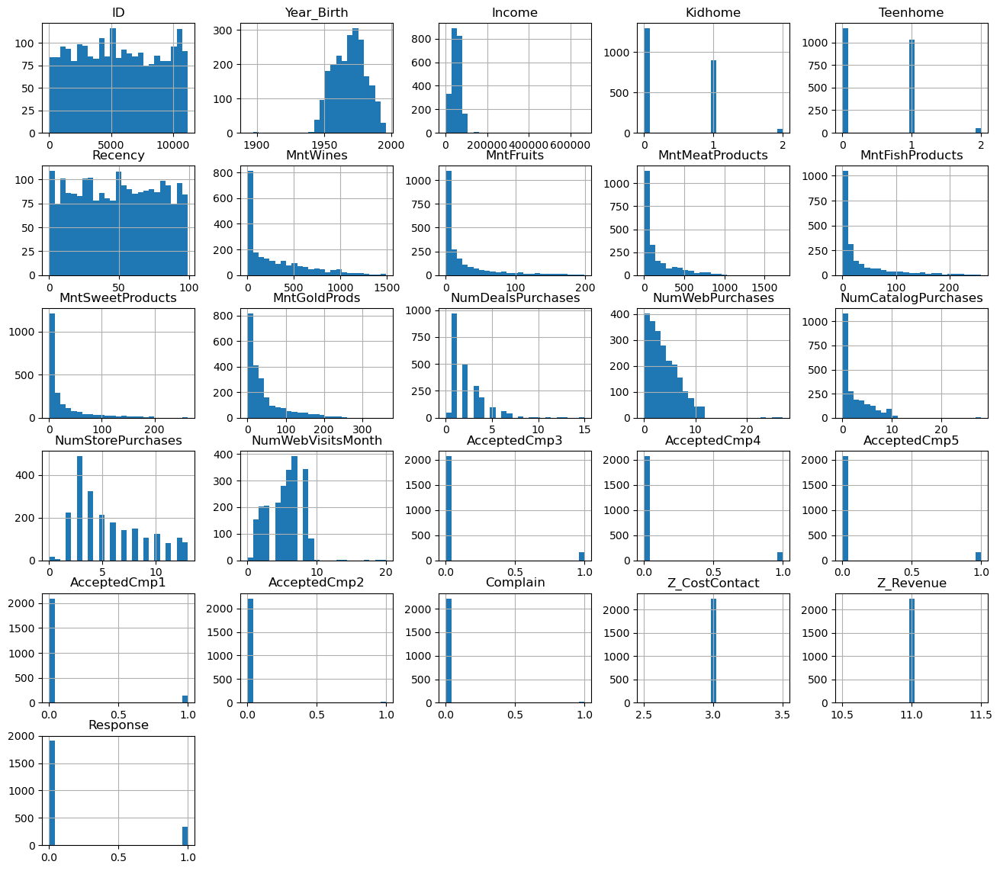
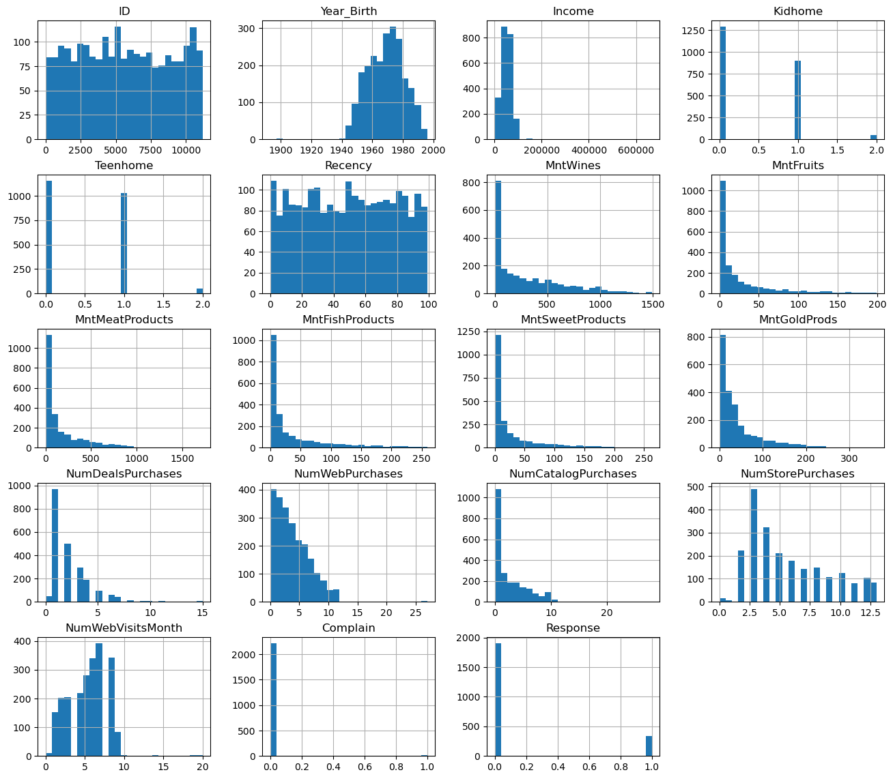
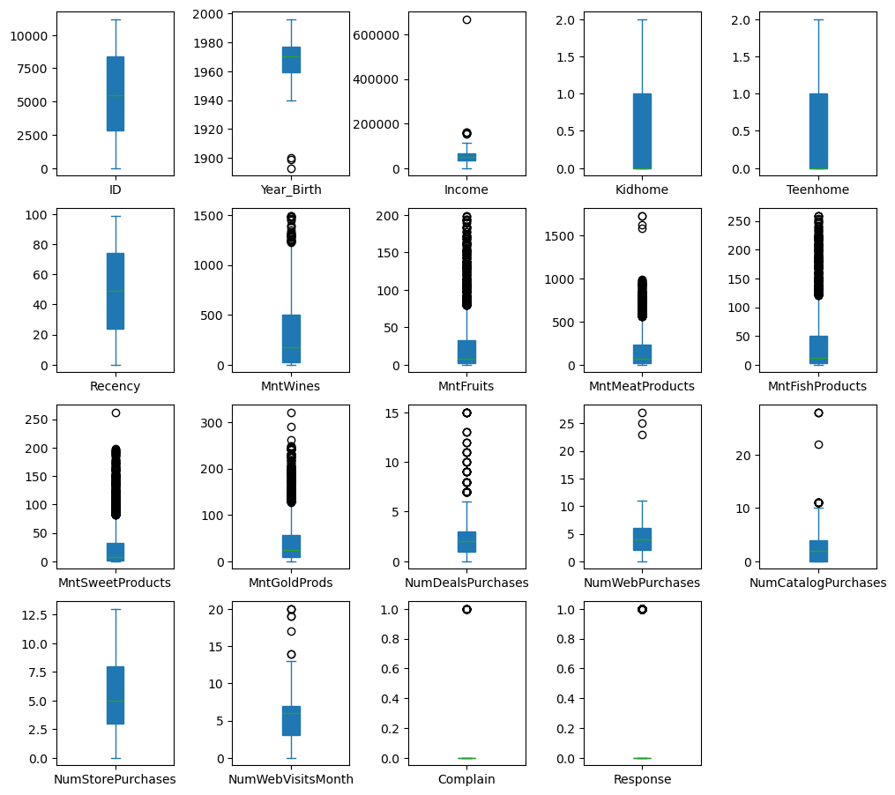
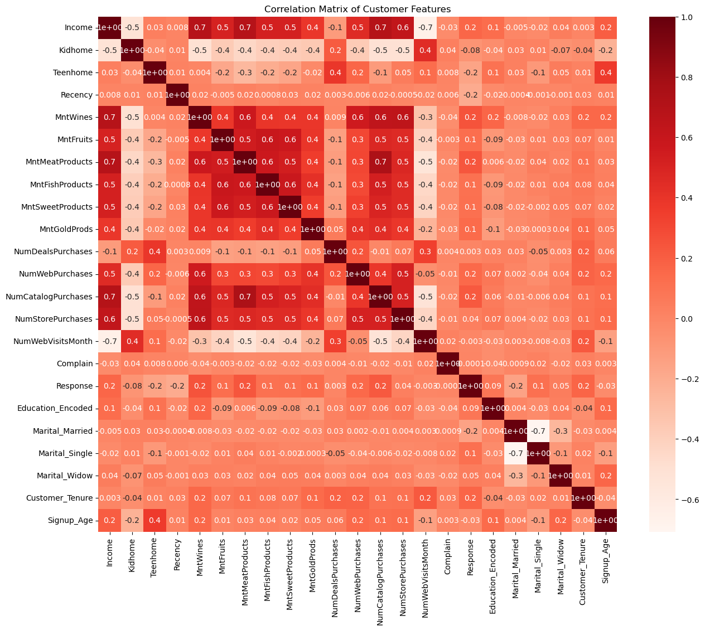
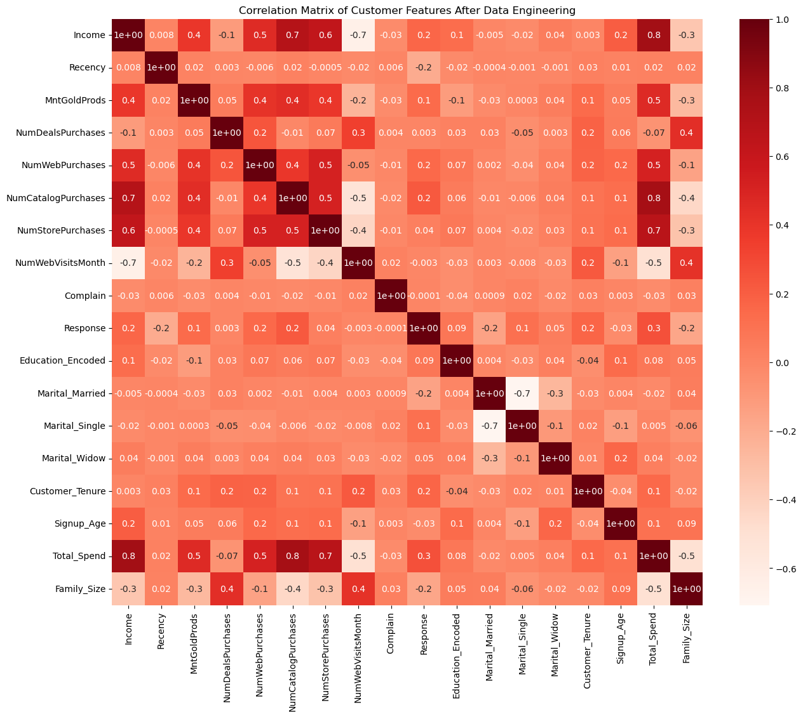
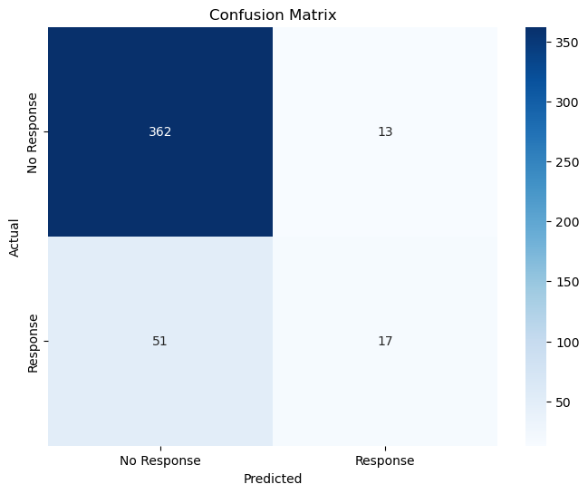
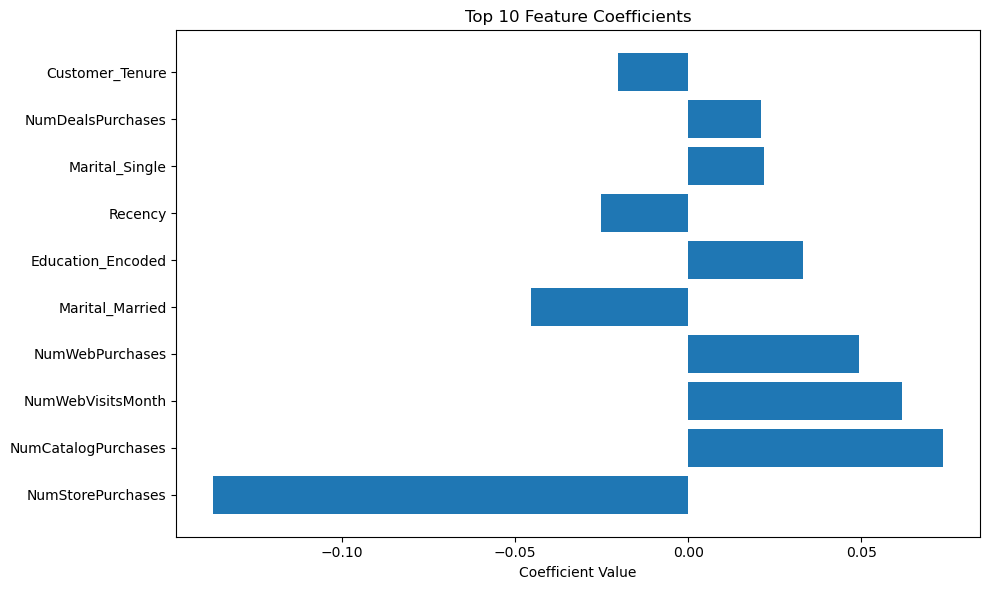
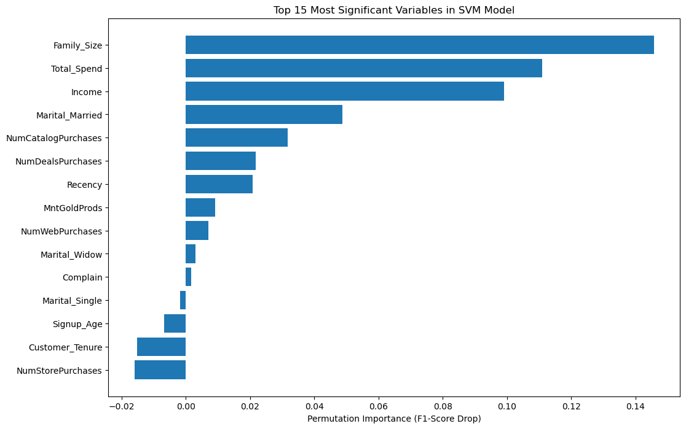

```python
import pandas as pd
import numpy as np
import matplotlib.pyplot as plt
import seaborn as sns 
from sklearn.svm import SVC
from sklearn.model_selection import train_test_split
import statsmodels.api as sm
from sklearn.linear_model import LogisticRegression
from sklearn.metrics import confusion_matrix,classification_report, accuracy_score, roc_auc_score, precision_score, recall_score, f1_score
from sklearn.preprocessing import StandardScaler
import sklearn as metrics
from sklearn import svm
from sklearn.preprocessing import OneHotEncoder
from datetime import datetime
```


```python
df = pd.read_excel("marketing_campaign.xlsx")
```


```python
df.nunique()
```


    ID                     2240
    Year_Birth               59
    Education                 5
    Marital_Status            8
    Income                 1974
    Kidhome                   3
    Teenhome                  3
    Dt_Customer             663
    Recency                 100
    MntWines                776
    MntFruits               158
    MntMeatProducts         558
    MntFishProducts         182
    MntSweetProducts        177
    MntGoldProds            213
    NumDealsPurchases        15
    NumWebPurchases          15
    NumCatalogPurchases      14
    NumStorePurchases        14
    NumWebVisitsMonth        16
    AcceptedCmp3              2
    AcceptedCmp4              2
    AcceptedCmp5              2
    AcceptedCmp1              2
    AcceptedCmp2              2
    Complain                  2
    Z_CostContact             1
    Z_Revenue                 1
    Response                  2
    dtype: int64


```python
df.isnull().sum()
```


    ID                      0
    Year_Birth              0
    Education               0
    Marital_Status          0
    Income                 24
    Kidhome                 0
    Teenhome                0
    Dt_Customer             0
    Recency                 0
    MntWines                0
    MntFruits               0
    MntMeatProducts         0
    MntFishProducts         0
    MntSweetProducts        0
    MntGoldProds            0
    NumDealsPurchases       0
    NumWebPurchases         0
    NumCatalogPurchases     0
    NumStorePurchases       0
    NumWebVisitsMonth       0
    AcceptedCmp3            0
    AcceptedCmp4            0
    AcceptedCmp5            0
    AcceptedCmp1            0
    AcceptedCmp2            0
    Complain                0
    Z_CostContact           0
    Z_Revenue               0
    Response                0
    dtype: int64


```python
df.hist(figsize=(16,14),bins=25)
```


    array([[<Axes: title={'center': 'ID'}>,
            <Axes: title={'center': 'Year_Birth'}>,
            <Axes: title={'center': 'Income'}>,
            <Axes: title={'center': 'Kidhome'}>,
            <Axes: title={'center': 'Teenhome'}>],
           [<Axes: title={'center': 'Recency'}>,
            <Axes: title={'center': 'MntWines'}>,
            <Axes: title={'center': 'MntFruits'}>,
            <Axes: title={'center': 'MntMeatProducts'}>,
            <Axes: title={'center': 'MntFishProducts'}>],
           [<Axes: title={'center': 'MntSweetProducts'}>,
            <Axes: title={'center': 'MntGoldProds'}>,
            <Axes: title={'center': 'NumDealsPurchases'}>,
            <Axes: title={'center': 'NumWebPurchases'}>,
            <Axes: title={'center': 'NumCatalogPurchases'}>],
           [<Axes: title={'center': 'NumStorePurchases'}>,
            <Axes: title={'center': 'NumWebVisitsMonth'}>,
            <Axes: title={'center': 'AcceptedCmp3'}>,
            <Axes: title={'center': 'AcceptedCmp4'}>,
            <Axes: title={'center': 'AcceptedCmp5'}>],
           [<Axes: title={'center': 'AcceptedCmp1'}>,
            <Axes: title={'center': 'AcceptedCmp2'}>,
            <Axes: title={'center': 'Complain'}>,
            <Axes: title={'center': 'Z_CostContact'}>,
            <Axes: title={'center': 'Z_Revenue'}>],
           [<Axes: title={'center': 'Response'}>, <Axes: >, <Axes: >,
            <Axes: >, <Axes: >]], dtype=object)


    

    


```python
df = df.drop(columns = ['AcceptedCmp3', 'AcceptedCmp4', 'AcceptedCmp5', 'AcceptedCmp1', 'AcceptedCmp2', 'Z_CostContact', 'Z_Revenue'])
```


```python
df.hist(figsize=(16,14),bins=25)
```


    array([[<Axes: title={'center': 'ID'}>,
            <Axes: title={'center': 'Year_Birth'}>,
            <Axes: title={'center': 'Income'}>,
            <Axes: title={'center': 'Kidhome'}>],
           [<Axes: title={'center': 'Teenhome'}>,
            <Axes: title={'center': 'Recency'}>,
            <Axes: title={'center': 'MntWines'}>,
            <Axes: title={'center': 'MntFruits'}>],
           [<Axes: title={'center': 'MntMeatProducts'}>,
            <Axes: title={'center': 'MntFishProducts'}>,
            <Axes: title={'center': 'MntSweetProducts'}>,
            <Axes: title={'center': 'MntGoldProds'}>],
           [<Axes: title={'center': 'NumDealsPurchases'}>,
            <Axes: title={'center': 'NumWebPurchases'}>,
            <Axes: title={'center': 'NumCatalogPurchases'}>,
            <Axes: title={'center': 'NumStorePurchases'}>],
           [<Axes: title={'center': 'NumWebVisitsMonth'}>,
            <Axes: title={'center': 'Complain'}>,
            <Axes: title={'center': 'Response'}>, <Axes: >]], dtype=object)


    

    


```python
df = df.dropna(subset=['Income'])
```


```python
df.plot(subplots=True,layout=(5,5), kind='box', figsize=(12,14), patch_artist=True)
plt.subplots_adjust(wspace=0.5)
```


    

    


```python
unique_early_years = df[df['Year_Birth'] < 1940]['Year_Birth'].unique()
print(sorted(unique_early_years))
```

    [1893, 1899, 1900]
    


```python
df = df[df['Year_Birth'] > 1900]
```


```python
wealthy = df[df['Income'] > 200000 ]['Income'].unique()
print(sorted(wealthy))
```

    [666666.0]
    


```python
df = df[df['Income'] <= 200000]
```


```python
col = ['Education','Marital_Status']
for col in col:
    print(df[col].unique())
```

    ['Graduation' 'PhD' 'Master' 'Basic' '2n Cycle']
    ['Single' 'Together' 'Married' 'Divorced' 'Widow' 'Alone' 'Absurd' 'YOLO']
    


```python
df['Education'] = df['Education'].replace('2n Cycle','Master')
df['Marital_Status'] = df['Marital_Status'].replace('Alone','Single')
df['Marital_Status'] = df['Marital_Status'].replace('YOLO','Single')
df['Marital_Status'] = df['Marital_Status'].replace('Absurd','Single')
df['Marital_Status'] = df['Marital_Status'].replace('Together','Married')
```


```python
col = ['Education','Marital_Status']
for col in col:
    print(df[col].unique())
```

    ['Graduation' 'PhD' 'Master' 'Basic']
    ['Single' 'Married' 'Divorced' 'Widow']
    


```python
education_mapping = {
    'Basic': 1,
    'Graduation': 2,
    'Master': 3,
    'PhD': 4
}
df['Education_Encoded'] = df['Education'].map(education_mapping)
```


```python
marital_dummies = pd.get_dummies(df['Marital_Status'], prefix='Marital', drop_first=True) # divorced is the reference 
df = pd.concat([df, marital_dummies], axis=1)
```


```python
df['Dt_Customer'] = pd.to_datetime(df['Dt_Customer'])
df['Customer_Tenure'] = ((datetime.now() - df['Dt_Customer']).dt.days / 365.25).astype(int)
```


```python
ty = datetime.now().year
df['Signup_Age'] = df['Dt_Customer'].dt.year - df['Year_Birth']
```


```python
df = df.drop(columns = ['Education', 'Marital_Status', 'Dt_Customer', 'ID', 'Year_Birth'])
```


```python
df.info()
```

    <class 'pandas.core.frame.DataFrame'>
    Index: 2212 entries, 0 to 2239
    Data columns (total 23 columns):
     #   Column               Non-Null Count  Dtype  
    ---  ------               --------------  -----  
     0   Income               2212 non-null   float64
     1   Kidhome              2212 non-null   int64  
     2   Teenhome             2212 non-null   int64  
     3   Recency              2212 non-null   int64  
     4   MntWines             2212 non-null   int64  
     5   MntFruits            2212 non-null   int64  
     6   MntMeatProducts      2212 non-null   int64  
     7   MntFishProducts      2212 non-null   int64  
     8   MntSweetProducts     2212 non-null   int64  
     9   MntGoldProds         2212 non-null   int64  
     10  NumDealsPurchases    2212 non-null   int64  
     11  NumWebPurchases      2212 non-null   int64  
     12  NumCatalogPurchases  2212 non-null   int64  
     13  NumStorePurchases    2212 non-null   int64  
     14  NumWebVisitsMonth    2212 non-null   int64  
     15  Complain             2212 non-null   int64  
     16  Response             2212 non-null   int64  
     17  Education_Encoded    2212 non-null   int64  
     18  Marital_Married      2212 non-null   bool   
     19  Marital_Single       2212 non-null   bool   
     20  Marital_Widow        2212 non-null   bool   
     21  Customer_Tenure      2212 non-null   int32  
     22  Signup_Age           2212 non-null   int64  
    dtypes: bool(3), float64(1), int32(1), int64(18)
    memory usage: 360.7 KB
    


```python
plt.figure(figsize=(15,12))
sns.heatmap(df.corr(),cmap=plt.cm.Reds,annot=True,fmt=".1")
plt.title("Correlation Matrix of Customer Features")
plt.show()
```


    

    


```python
df['Total_Spend'] = df['MntWines'] + df['MntFruits'] + df['MntMeatProducts'] + df['MntFishProducts'] + df['MntSweetProducts']
df['Family_Size'] = df['Kidhome'] + df['Teenhome']
```


```python
df = df.drop(columns = ['MntWines', 'MntFruits', 'MntMeatProducts', 'MntFishProducts', 'MntSweetProducts', 'Kidhome', 'Teenhome'])
```


```python
df.info()
```

    <class 'pandas.core.frame.DataFrame'>
    Index: 2212 entries, 0 to 2239
    Data columns (total 18 columns):
     #   Column               Non-Null Count  Dtype  
    ---  ------               --------------  -----  
     0   Income               2212 non-null   float64
     1   Recency              2212 non-null   int64  
     2   MntGoldProds         2212 non-null   int64  
     3   NumDealsPurchases    2212 non-null   int64  
     4   NumWebPurchases      2212 non-null   int64  
     5   NumCatalogPurchases  2212 non-null   int64  
     6   NumStorePurchases    2212 non-null   int64  
     7   NumWebVisitsMonth    2212 non-null   int64  
     8   Complain             2212 non-null   int64  
     9   Response             2212 non-null   int64  
     10  Education_Encoded    2212 non-null   int64  
     11  Marital_Married      2212 non-null   bool   
     12  Marital_Single       2212 non-null   bool   
     13  Marital_Widow        2212 non-null   bool   
     14  Customer_Tenure      2212 non-null   int32  
     15  Signup_Age           2212 non-null   int64  
     16  Total_Spend          2212 non-null   int64  
     17  Family_Size          2212 non-null   int64  
    dtypes: bool(3), float64(1), int32(1), int64(13)
    memory usage: 274.3 KB
    


```python
plt.figure(figsize=(15,12))
sns.heatmap(df.corr(),cmap=plt.cm.Reds,annot=True,fmt=".1")
plt.title("Correlation Matrix of Customer Features After Data Engineering")
plt.show()
```


    

    


```python
# regression model 
y=df['Response']
x=df.drop(columns=['Response'])
x_train,x_test,y_train,y_test=train_test_split(x, y, test_size=0.20, random_state=56)
model = LogisticRegression(solver='liblinear', random_state=0).fit(x_train, y_train)
```


```python
print(model.score(x_train, y_train))
```

    0.8547201808931599
    


```python
y_pred = model.predict(x_test)
y_pred_proba = model.predict_proba(x_test)[:, 1]
```


```python
print("Accuracy:", accuracy_score(y_test, y_pred))
print("\nClassification Report:")
print(classification_report(y_test, y_pred))

```

    Accuracy: 0.8555304740406321
    
    Classification Report:
                  precision    recall  f1-score   support
    
               0       0.88      0.97      0.92       375
               1       0.57      0.25      0.35        68
    
        accuracy                           0.86       443
       macro avg       0.72      0.61      0.63       443
    weighted avg       0.83      0.86      0.83       443
    
    


```python
cm = confusion_matrix(y_test, y_pred)
plt.figure(figsize=(8, 6))
sns.heatmap(cm, annot=True, fmt='d', cmap='Blues', 
            xticklabels=['No Response', 'Response'], 
            yticklabels=['No Response', 'Response'])
plt.title('Confusion Matrix')
plt.ylabel('Actual')
plt.xlabel('Predicted')
plt.show()
```


    

    


```python
feature_importance = pd.DataFrame({
    'feature': x_train.columns,
    'coefficient': model.coef_[0],
    'abs_coefficient': np.abs(model.coef_[0])
}).sort_values('abs_coefficient', ascending=False)

print("Top 10 Most Important Features:")
print(feature_importance.head(10))

# Visualization
plt.figure(figsize=(10, 6))
top_features = feature_importance.head(10)
plt.barh(range(len(top_features)), top_features['coefficient'])
plt.yticks(range(len(top_features)), top_features['feature'])
plt.xlabel('Coefficient Value')
plt.title('Top 10 Feature Coefficients')
plt.tight_layout()
plt.show()
```

    Top 10 Most Important Features:
                    feature  coefficient  abs_coefficient
    6     NumStorePurchases    -0.137325         0.137325
    5   NumCatalogPurchases     0.073700         0.073700
    7     NumWebVisitsMonth     0.061740         0.061740
    4       NumWebPurchases     0.049309         0.049309
    10      Marital_Married    -0.045513         0.045513
    9     Education_Encoded     0.033174         0.033174
    1               Recency    -0.025217         0.025217
    11       Marital_Single     0.021777         0.021777
    3     NumDealsPurchases     0.021112         0.021112
    13      Customer_Tenure    -0.020324         0.020324
    


    

    


```python
print("Training set class distribution:")
print(y_train.value_counts(normalize=True))
print("\nTest set class distribution:")
print(y_test.value_counts(normalize=True))
```

    Training set class distribution:
    Response
    0    0.850198
    1    0.149802
    Name: proportion, dtype: float64
    
    Test set class distribution:
    Response
    0    0.846501
    1    0.153499
    Name: proportion, dtype: float64
    


```python
scaler = StandardScaler()
x_train_scaled = scaler.fit_transform(x_train)
x_test_scaled = scaler.transform(x_test)

```


```python
# Train SVM model
svm_model = SVC(kernel='rbf', random_state=0, probability=True)
svm_model.fit(x_train_scaled, y_train)
```


<style>#sk-container-id-1 {
  /* Definition of color scheme common for light and dark mode */
  --sklearn-color-text: black;
  --sklearn-color-line: gray;
  /* Definition of color scheme for unfitted estimators */
  --sklearn-color-unfitted-level-0: #fff5e6;
  --sklearn-color-unfitted-level-1: #f6e4d2;
  --sklearn-color-unfitted-level-2: #ffe0b3;
  --sklearn-color-unfitted-level-3: chocolate;
  /* Definition of color scheme for fitted estimators */
  --sklearn-color-fitted-level-0: #f0f8ff;
  --sklearn-color-fitted-level-1: #d4ebff;
  --sklearn-color-fitted-level-2: #b3dbfd;
  --sklearn-color-fitted-level-3: cornflowerblue;

  /* Specific color for light theme */
  --sklearn-color-text-on-default-background: var(--sg-text-color, var(--theme-code-foreground, var(--jp-content-font-color1, black)));
  --sklearn-color-background: var(--sg-background-color, var(--theme-background, var(--jp-layout-color0, white)));
  --sklearn-color-border-box: var(--sg-text-color, var(--theme-code-foreground, var(--jp-content-font-color1, black)));
  --sklearn-color-icon: #696969;

  @media (prefers-color-scheme: dark) {
    /* Redefinition of color scheme for dark theme */
    --sklearn-color-text-on-default-background: var(--sg-text-color, var(--theme-code-foreground, var(--jp-content-font-color1, white)));
    --sklearn-color-background: var(--sg-background-color, var(--theme-background, var(--jp-layout-color0, #111)));
    --sklearn-color-border-box: var(--sg-text-color, var(--theme-code-foreground, var(--jp-content-font-color1, white)));
    --sklearn-color-icon: #878787;
  }
}

#sk-container-id-1 {
  color: var(--sklearn-color-text);
}

#sk-container-id-1 pre {
  padding: 0;
}

#sk-container-id-1 input.sk-hidden--visually {
  border: 0;
  clip: rect(1px 1px 1px 1px);
  clip: rect(1px, 1px, 1px, 1px);
  height: 1px;
  margin: -1px;
  overflow: hidden;
  padding: 0;
  position: absolute;
  width: 1px;
}

#sk-container-id-1 div.sk-dashed-wrapped {
  border: 1px dashed var(--sklearn-color-line);
  margin: 0 0.4em 0.5em 0.4em;
  box-sizing: border-box;
  padding-bottom: 0.4em;
  background-color: var(--sklearn-color-background);
}

#sk-container-id-1 div.sk-container {
  /* jupyter's `normalize.less` sets `[hidden] { display: none; }`
     but bootstrap.min.css set `[hidden] { display: none !important; }`
     so we also need the `!important` here to be able to override the
     default hidden behavior on the sphinx rendered scikit-learn.org.
     See: https://github.com/scikit-learn/scikit-learn/issues/21755 */
  display: inline-block !important;
  position: relative;
}

#sk-container-id-1 div.sk-text-repr-fallback {
  display: none;
}

div.sk-parallel-item,
div.sk-serial,
div.sk-item {
  /* draw centered vertical line to link estimators */
  background-image: linear-gradient(var(--sklearn-color-text-on-default-background), var(--sklearn-color-text-on-default-background));
  background-size: 2px 100%;
  background-repeat: no-repeat;
  background-position: center center;
}

/* Parallel-specific style estimator block */

#sk-container-id-1 div.sk-parallel-item::after {
  content: "";
  width: 100%;
  border-bottom: 2px solid var(--sklearn-color-text-on-default-background);
  flex-grow: 1;
}

#sk-container-id-1 div.sk-parallel {
  display: flex;
  align-items: stretch;
  justify-content: center;
  background-color: var(--sklearn-color-background);
  position: relative;
}

#sk-container-id-1 div.sk-parallel-item {
  display: flex;
  flex-direction: column;
}

#sk-container-id-1 div.sk-parallel-item:first-child::after {
  align-self: flex-end;
  width: 50%;
}

#sk-container-id-1 div.sk-parallel-item:last-child::after {
  align-self: flex-start;
  width: 50%;
}

#sk-container-id-1 div.sk-parallel-item:only-child::after {
  width: 0;
}

/* Serial-specific style estimator block */

#sk-container-id-1 div.sk-serial {
  display: flex;
  flex-direction: column;
  align-items: center;
  background-color: var(--sklearn-color-background);
  padding-right: 1em;
  padding-left: 1em;
}


/* Toggleable style: style used for estimator/Pipeline/ColumnTransformer box that is
clickable and can be expanded/collapsed.
- Pipeline and ColumnTransformer use this feature and define the default style
- Estimators will overwrite some part of the style using the `sk-estimator` class
*/

/* Pipeline and ColumnTransformer style (default) */

#sk-container-id-1 div.sk-toggleable {
  /* Default theme specific background. It is overwritten whether we have a
  specific estimator or a Pipeline/ColumnTransformer */
  background-color: var(--sklearn-color-background);
}

/* Toggleable label */
#sk-container-id-1 label.sk-toggleable__label {
  cursor: pointer;
  display: block;
  width: 100%;
  margin-bottom: 0;
  padding: 0.5em;
  box-sizing: border-box;
  text-align: center;
}

#sk-container-id-1 label.sk-toggleable__label-arrow:before {
  /* Arrow on the left of the label */
  content: "▸";
  float: left;
  margin-right: 0.25em;
  color: var(--sklearn-color-icon);
}

#sk-container-id-1 label.sk-toggleable__label-arrow:hover:before {
  color: var(--sklearn-color-text);
}

/* Toggleable content - dropdown */

#sk-container-id-1 div.sk-toggleable__content {
  max-height: 0;
  max-width: 0;
  overflow: hidden;
  text-align: left;
  /* unfitted */
  background-color: var(--sklearn-color-unfitted-level-0);
}

#sk-container-id-1 div.sk-toggleable__content.fitted {
  /* fitted */
  background-color: var(--sklearn-color-fitted-level-0);
}

#sk-container-id-1 div.sk-toggleable__content pre {
  margin: 0.2em;
  border-radius: 0.25em;
  color: var(--sklearn-color-text);
  /* unfitted */
  background-color: var(--sklearn-color-unfitted-level-0);
}

#sk-container-id-1 div.sk-toggleable__content.fitted pre {
  /* unfitted */
  background-color: var(--sklearn-color-fitted-level-0);
}

#sk-container-id-1 input.sk-toggleable__control:checked~div.sk-toggleable__content {
  /* Expand drop-down */
  max-height: 200px;
  max-width: 100%;
  overflow: auto;
}

#sk-container-id-1 input.sk-toggleable__control:checked~label.sk-toggleable__label-arrow:before {
  content: "▾";
}

/* Pipeline/ColumnTransformer-specific style */

#sk-container-id-1 div.sk-label input.sk-toggleable__control:checked~label.sk-toggleable__label {
  color: var(--sklearn-color-text);
  background-color: var(--sklearn-color-unfitted-level-2);
}

#sk-container-id-1 div.sk-label.fitted input.sk-toggleable__control:checked~label.sk-toggleable__label {
  background-color: var(--sklearn-color-fitted-level-2);
}

/* Estimator-specific style */

/* Colorize estimator box */
#sk-container-id-1 div.sk-estimator input.sk-toggleable__control:checked~label.sk-toggleable__label {
  /* unfitted */
  background-color: var(--sklearn-color-unfitted-level-2);
}

#sk-container-id-1 div.sk-estimator.fitted input.sk-toggleable__control:checked~label.sk-toggleable__label {
  /* fitted */
  background-color: var(--sklearn-color-fitted-level-2);
}

#sk-container-id-1 div.sk-label label.sk-toggleable__label,
#sk-container-id-1 div.sk-label label {
  /* The background is the default theme color */
  color: var(--sklearn-color-text-on-default-background);
}

/* On hover, darken the color of the background */
#sk-container-id-1 div.sk-label:hover label.sk-toggleable__label {
  color: var(--sklearn-color-text);
  background-color: var(--sklearn-color-unfitted-level-2);
}

/* Label box, darken color on hover, fitted */
#sk-container-id-1 div.sk-label.fitted:hover label.sk-toggleable__label.fitted {
  color: var(--sklearn-color-text);
  background-color: var(--sklearn-color-fitted-level-2);
}

/* Estimator label */

#sk-container-id-1 div.sk-label label {
  font-family: monospace;
  font-weight: bold;
  display: inline-block;
  line-height: 1.2em;
}

#sk-container-id-1 div.sk-label-container {
  text-align: center;
}

/* Estimator-specific */
#sk-container-id-1 div.sk-estimator {
  font-family: monospace;
  border: 1px dotted var(--sklearn-color-border-box);
  border-radius: 0.25em;
  box-sizing: border-box;
  margin-bottom: 0.5em;
  /* unfitted */
  background-color: var(--sklearn-color-unfitted-level-0);
}

#sk-container-id-1 div.sk-estimator.fitted {
  /* fitted */
  background-color: var(--sklearn-color-fitted-level-0);
}

/* on hover */
#sk-container-id-1 div.sk-estimator:hover {
  /* unfitted */
  background-color: var(--sklearn-color-unfitted-level-2);
}

#sk-container-id-1 div.sk-estimator.fitted:hover {
  /* fitted */
  background-color: var(--sklearn-color-fitted-level-2);
}

/* Specification for estimator info (e.g. "i" and "?") */

/* Common style for "i" and "?" */

.sk-estimator-doc-link,
a:link.sk-estimator-doc-link,
a:visited.sk-estimator-doc-link {
  float: right;
  font-size: smaller;
  line-height: 1em;
  font-family: monospace;
  background-color: var(--sklearn-color-background);
  border-radius: 1em;
  height: 1em;
  width: 1em;
  text-decoration: none !important;
  margin-left: 1ex;
  /* unfitted */
  border: var(--sklearn-color-unfitted-level-1) 1pt solid;
  color: var(--sklearn-color-unfitted-level-1);
}

.sk-estimator-doc-link.fitted,
a:link.sk-estimator-doc-link.fitted,
a:visited.sk-estimator-doc-link.fitted {
  /* fitted */
  border: var(--sklearn-color-fitted-level-1) 1pt solid;
  color: var(--sklearn-color-fitted-level-1);
}

/* On hover */
div.sk-estimator:hover .sk-estimator-doc-link:hover,
.sk-estimator-doc-link:hover,
div.sk-label-container:hover .sk-estimator-doc-link:hover,
.sk-estimator-doc-link:hover {
  /* unfitted */
  background-color: var(--sklearn-color-unfitted-level-3);
  color: var(--sklearn-color-background);
  text-decoration: none;
}

div.sk-estimator.fitted:hover .sk-estimator-doc-link.fitted:hover,
.sk-estimator-doc-link.fitted:hover,
div.sk-label-container:hover .sk-estimator-doc-link.fitted:hover,
.sk-estimator-doc-link.fitted:hover {
  /* fitted */
  background-color: var(--sklearn-color-fitted-level-3);
  color: var(--sklearn-color-background);
  text-decoration: none;
}

/* Span, style for the box shown on hovering the info icon */
.sk-estimator-doc-link span {
  display: none;
  z-index: 9999;
  position: relative;
  font-weight: normal;
  right: .2ex;
  padding: .5ex;
  margin: .5ex;
  width: min-content;
  min-width: 20ex;
  max-width: 50ex;
  color: var(--sklearn-color-text);
  box-shadow: 2pt 2pt 4pt #999;
  /* unfitted */
  background: var(--sklearn-color-unfitted-level-0);
  border: .5pt solid var(--sklearn-color-unfitted-level-3);
}

.sk-estimator-doc-link.fitted span {
  /* fitted */
  background: var(--sklearn-color-fitted-level-0);
  border: var(--sklearn-color-fitted-level-3);
}

.sk-estimator-doc-link:hover span {
  display: block;
}

/* "?"-specific style due to the `<a>` HTML tag */

#sk-container-id-1 a.estimator_doc_link {
  float: right;
  font-size: 1rem;
  line-height: 1em;
  font-family: monospace;
  background-color: var(--sklearn-color-background);
  border-radius: 1rem;
  height: 1rem;
  width: 1rem;
  text-decoration: none;
  /* unfitted */
  color: var(--sklearn-color-unfitted-level-1);
  border: var(--sklearn-color-unfitted-level-1) 1pt solid;
}

#sk-container-id-1 a.estimator_doc_link.fitted {
  /* fitted */
  border: var(--sklearn-color-fitted-level-1) 1pt solid;
  color: var(--sklearn-color-fitted-level-1);
}

/* On hover */
#sk-container-id-1 a.estimator_doc_link:hover {
  /* unfitted */
  background-color: var(--sklearn-color-unfitted-level-3);
  color: var(--sklearn-color-background);
  text-decoration: none;
}

#sk-container-id-1 a.estimator_doc_link.fitted:hover {
  /* fitted */
  background-color: var(--sklearn-color-fitted-level-3);
}
</style><div id="sk-container-id-1" class="sk-top-container"><div class="sk-text-repr-fallback"><pre>SVC(probability=True, random_state=0)</pre><b>In a Jupyter environment, please rerun this cell to show the HTML representation or trust the notebook. <br />On GitHub, the HTML representation is unable to render, please try loading this page with nbviewer.org.</b></div><div class="sk-container" hidden><div class="sk-item"><div class="sk-estimator fitted sk-toggleable"><input class="sk-toggleable__control sk-hidden--visually" id="sk-estimator-id-1" type="checkbox" checked><label for="sk-estimator-id-1" class="sk-toggleable__label fitted sk-toggleable__label-arrow fitted">&nbsp;&nbsp;SVC<a class="sk-estimator-doc-link fitted" rel="noreferrer" target="_blank" href="https://scikit-learn.org/1.5/modules/generated/sklearn.svm.SVC.html">?<span>Documentation for SVC</span></a><span class="sk-estimator-doc-link fitted">i<span>Fitted</span></span></label><div class="sk-toggleable__content fitted"><pre>SVC(probability=True, random_state=0)</pre></div> </div></div></div></div>


```python
# Make predictions
y_pred_svm = svm_model.predict(x_test_scaled)
y_pred_proba_svm = svm_model.predict_proba(x_test_scaled)[:, 1]

```


```python
print("SVM Model Results:")
print(f"Accuracy: {accuracy_score(y_test, y_pred_svm):.3f}")
print(f"AUC: {roc_auc_score(y_test, y_pred_proba_svm):.3f}")
print("\nClassification Report:")
print(classification_report(y_test, y_pred_svm))
```

    SVM Model Results:
    Accuracy: 0.860
    AUC: 0.839
    
    Classification Report:
                  precision    recall  f1-score   support
    
               0       0.87      0.98      0.92       375
               1       0.67      0.18      0.28        68
    
        accuracy                           0.86       443
       macro avg       0.77      0.58      0.60       443
    weighted avg       0.84      0.86      0.82       443
    
    


```python
from sklearn.inspection import permutation_importance

# Calculate permutation importance for your SVM model
perm_importance = permutation_importance(
    svm_model,           # Your trained SVM
    x_test_scaled,       # Scaled test features
    y_test,              # Test targets
    n_repeats=10,        # Number of times to shuffle each feature
    random_state=42,
    scoring='f1'         # Use F1 since you have imbalanced data
)

# Create results dataframe
importance_df = pd.DataFrame({
    'feature': x_train.columns,
    'importance_mean': perm_importance.importances_mean,
    'importance_std': perm_importance.importances_std
}).sort_values('importance_mean', ascending=False)

print("Most Significant Variables in SVM:")
print("="*50)
print(importance_df.head(10))
```

    Most Significant Variables in SVM:
    ==================================================
                    feature  importance_mean  importance_std
    16          Family_Size         0.145776        0.033200
    15          Total_Spend         0.110874        0.045604
    0                Income         0.099077        0.036195
    10      Marital_Married         0.048743        0.042234
    5   NumCatalogPurchases         0.031669        0.024037
    3     NumDealsPurchases         0.021733        0.024478
    1               Recency         0.020752        0.052835
    2          MntGoldProds         0.009157        0.032460
    4       NumWebPurchases         0.006986        0.024742
    12        Marital_Widow         0.003064        0.008708
    


```python
# Plot the top 15 most important features
plt.figure(figsize=(12, 8))
top_features = importance_df.head(15)

# Create horizontal bar plot
bars = plt.barh(range(len(top_features)), top_features['importance_mean'])
plt.yticks(range(len(top_features)), top_features['feature'])
plt.xlabel('Permutation Importance (F1-Score Drop)')
plt.title('Top 15 Most Significant Variables in SVM Model')
plt.gca().invert_yaxis() 
```


    

    

