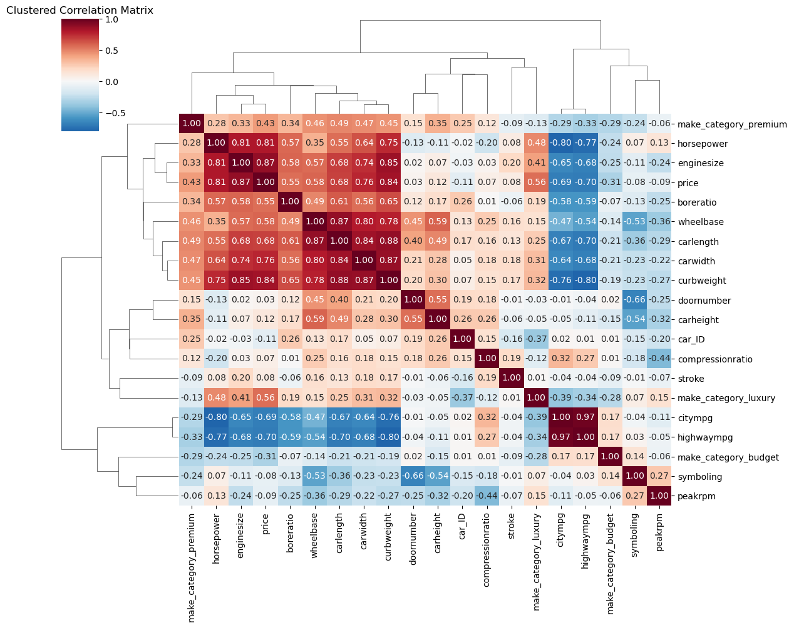
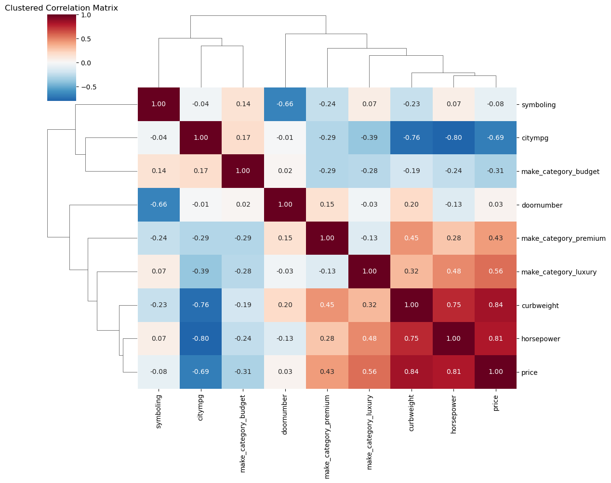
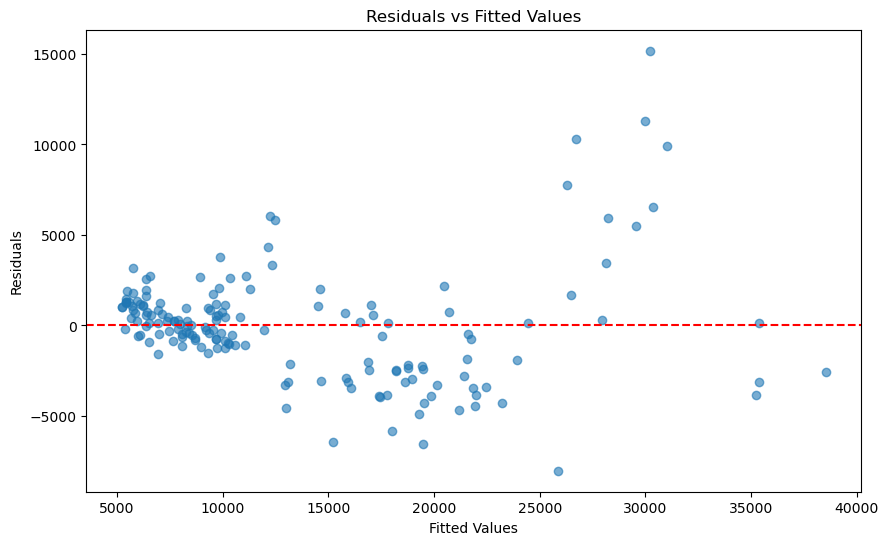
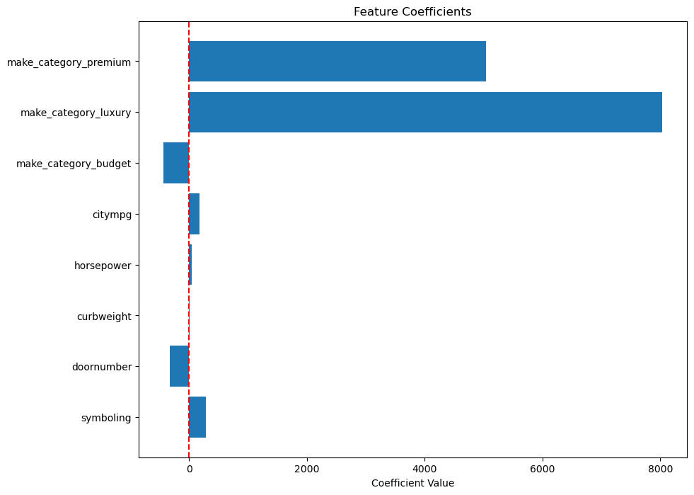

```python
import matplotlib.pyplot as plt
import numpy as np
import pandas as pd
import seaborn as sns
from sklearn import datasets, linear_model
from sklearn.metrics import mean_squared_error, r2_score
from sklearn.model_selection import train_test_split
from sklearn.model_selection import cross_val_score
from sklearn.tree import DecisionTreeRegressor
import statsmodels.api as sm
from scipy import stats
```


```python
# read in the data
df = pd.read_csv(r'C:\Users\jhack\ALY6020\Week Two\CarPrice_Assignment.csv')  
```


```python
# data summary 
summary = pd.DataFrame({
    'Data_Type': df.dtypes,
    'Unique_Count': df.nunique(),
    'Total_Count': len(df),
    'Null_Count': df.isnull().sum()
})
summary['Unique_Ratio'] = summary['Unique_Count'] / summary['Total_Count']
print(summary)
```

                     Data_Type  Unique_Count  Total_Count  Null_Count  \
    car_ID               int64           205          205           0   
    symboling            int64             6          205           0   
    CarName             object           147          205           0   
    fueltype            object             2          205           0   
    aspiration          object             2          205           0   
    doornumber          object             2          205           0   
    carbody             object             5          205           0   
    drivewheel          object             3          205           0   
    enginelocation      object             2          205           0   
    wheelbase          float64            53          205           0   
    carlength          float64            75          205           0   
    carwidth           float64            44          205           0   
    carheight          float64            49          205           0   
    curbweight           int64           171          205           0   
    enginetype          object             7          205           0   
    cylindernumber      object             7          205           0   
    enginesize           int64            44          205           0   
    fuelsystem          object             8          205           0   
    boreratio          float64            38          205           0   
    stroke             float64            37          205           0   
    compressionratio   float64            32          205           0   
    horsepower           int64            59          205           0   
    peakrpm              int64            23          205           0   
    citympg              int64            29          205           0   
    highwaympg           int64            30          205           0   
    price              float64           189          205           0   
    
                      Unique_Ratio  
    car_ID                1.000000  
    symboling             0.029268  
    CarName               0.717073  
    fueltype              0.009756  
    aspiration            0.009756  
    doornumber            0.009756  
    carbody               0.024390  
    drivewheel            0.014634  
    enginelocation        0.009756  
    wheelbase             0.258537  
    carlength             0.365854  
    carwidth              0.214634  
    carheight             0.239024  
    curbweight            0.834146  
    enginetype            0.034146  
    cylindernumber        0.034146  
    enginesize            0.214634  
    fuelsystem            0.039024  
    boreratio             0.185366  
    stroke                0.180488  
    compressionratio      0.156098  
    horsepower            0.287805  
    peakrpm               0.112195  
    citympg               0.141463  
    highwaympg            0.146341  
    price                 0.921951  
    


```python
# count by CarName
df['CarName'].astype('category').value_counts()
```


    CarName
    peugeot 504            6
    toyota corona          6
    toyota corolla         6
    subaru dl              4
    toyota mark ii         3
                          ..
    honda prelude          1
    honda civic 1500 gl    1
    honda civic 1300       1
    honda civic (auto)     1
    vw rabbit              1
    Name: count, Length: 147, dtype: int64


```python
# make a new variable for make from CarName
def split(x):
    return x.split(' ')[0]

df['make'] = df['CarName'].apply(split)
```


```python
# count by make
df['make'].astype('category').value_counts()
```


    make
    toyota         31
    nissan         17
    mazda          15
    honda          13
    mitsubishi     13
    subaru         12
    peugeot        11
    volvo          11
    dodge           9
    volkswagen      9
    buick           8
    bmw             8
    plymouth        7
    audi            7
    saab            6
    isuzu           4
    porsche         4
    chevrolet       3
    jaguar          3
    alfa-romero     3
    vw              2
    renault         2
    maxda           2
    porcshce        1
    toyouta         1
    vokswagen       1
    mercury         1
    Nissan          1
    Name: count, dtype: int64


```python
# fix make names
df['make'] = df['make'].apply(lambda y: y.lower())

df.loc[(df['make'] == 'vw') | (df['make'] == 'vokswagen'), 'make'] = 'volkswagon'
df.loc[(df['make'] == 'toyouta'),'make'] = 'toyota'
df.loc[(df['make'] == 'maxda'),'make'] = 'mazda'
df.loc[(df['make'] == 'porcshce'),'make'] = 'porsche'
```


```python
# Count unique make values
print("Unique make valeus", df['make'].nunique())
```

    Unique make valeus 23
    


```python
# bucket make variable, 23 is too many for regression analysis
def categorize_make(make):
    if make in ['bmw', 'porsche', 'jaguar', 'audi']:
        return 'luxury'
    elif make in ['buick', 'saab', 'volvo']:
        return 'premium'  
    elif make in ['honda', 'toyota', 'nissan', 'mazda']:
        return 'mainstream'
    else:
        return 'budget'

df['make_category'] = df['make'].apply(categorize_make)
df = pd.get_dummies(df, columns=['make_category'], dtype=int)
```


```python
categorical_cols = ['fuelsystem', 'enginelocation', 'aspiration', 'fueltype', 'doornumber','carbody', 'drivewheel',
                   'enginetype', 'cylindernumber', 'enginesize']

for col in categorical_cols:
    print(f"\n{col.upper()}:")
    print(df[col].value_counts())
```

    
    FUELSYSTEM:
    fuelsystem
    mpfi    94
    2bbl    66
    idi     20
    1bbl    11
    spdi     9
    4bbl     3
    mfi      1
    spfi     1
    Name: count, dtype: int64
    
    ENGINELOCATION:
    enginelocation
    front    202
    rear       3
    Name: count, dtype: int64
    
    ASPIRATION:
    aspiration
    std      168
    turbo     37
    Name: count, dtype: int64
    
    FUELTYPE:
    fueltype
    gas       185
    diesel     20
    Name: count, dtype: int64
    
    DOORNUMBER:
    doornumber
    four    115
    two      90
    Name: count, dtype: int64
    
    CARBODY:
    carbody
    sedan          96
    hatchback      70
    wagon          25
    hardtop         8
    convertible     6
    Name: count, dtype: int64
    
    DRIVEWHEEL:
    drivewheel
    fwd    120
    rwd     76
    4wd      9
    Name: count, dtype: int64
    
    ENGINETYPE:
    enginetype
    ohc      148
    ohcf      15
    ohcv      13
    dohc      12
    l         12
    rotor      4
    dohcv      1
    Name: count, dtype: int64
    
    CYLINDERNUMBER:
    cylindernumber
    four      159
    six        24
    five       11
    eight       5
    two         4
    three       1
    twelve      1
    Name: count, dtype: int64
    
    ENGINESIZE:
    enginesize
    122    15
    92     15
    97     14
    98     14
    108    13
    90     12
    110    12
    109     8
    120     7
    141     7
    152     6
    181     6
    146     6
    121     6
    156     5
    136     5
    91      5
    183     4
    130     4
    171     3
    70      3
    194     3
    209     3
    164     3
    258     2
    140     2
    134     2
    234     2
    132     2
    131     2
    173     1
    203     1
    161     1
    80      1
    151     1
    103     1
    304     1
    308     1
    326     1
    119     1
    111     1
    79      1
    61      1
    145     1
    Name: count, dtype: int64
    


```python
# convert categorical variables to numeric 
df['doornumber'] = df['doornumber'].replace({'two': 2, 'four': 4}).astype('int64')
```

    C:\Users\jhack\AppData\Local\Temp\ipykernel_20536\1701962330.py:2: FutureWarning: Downcasting behavior in `replace` is deprecated and will be removed in a future version. To retain the old behavior, explicitly call `result.infer_objects(copy=False)`. To opt-in to the future behavior, set `pd.set_option('future.no_silent_downcasting', True)`
      df['doornumber'] = df['doornumber'].replace({'two': 2, 'four': 4}).astype('int64')
    


```python
# Convert boolean columns to int
bool_cols = df.select_dtypes(include=['bool']).columns
df[bool_cols] = df[bool_cols].astype(int)
```


```python
# get only numeric values 
numeric = df.select_dtypes(include=['int64', 'float64', 'int32'])
```


```python
numeric.info()
```

    <class 'pandas.core.frame.DataFrame'>
    RangeIndex: 205 entries, 0 to 204
    Data columns (total 21 columns):
     #   Column                    Non-Null Count  Dtype  
    ---  ------                    --------------  -----  
     0   car_ID                    205 non-null    int64  
     1   symboling                 205 non-null    int64  
     2   doornumber                205 non-null    int64  
     3   wheelbase                 205 non-null    float64
     4   carlength                 205 non-null    float64
     5   carwidth                  205 non-null    float64
     6   carheight                 205 non-null    float64
     7   curbweight                205 non-null    int64  
     8   enginesize                205 non-null    int64  
     9   boreratio                 205 non-null    float64
     10  stroke                    205 non-null    float64
     11  compressionratio          205 non-null    float64
     12  horsepower                205 non-null    int64  
     13  peakrpm                   205 non-null    int64  
     14  citympg                   205 non-null    int64  
     15  highwaympg                205 non-null    int64  
     16  price                     205 non-null    float64
     17  make_category_budget      205 non-null    int32  
     18  make_category_luxury      205 non-null    int32  
     19  make_category_mainstream  205 non-null    int32  
     20  make_category_premium     205 non-null    int32  
    dtypes: float64(8), int32(4), int64(9)
    memory usage: 30.6 KB
    


```python
# Drop one category (make it the baseline for comparison)
numeric = numeric.drop('make_category_mainstream', axis=1)  # mainstream becomes baseline
```


```python
# create corrleation matrix 
corr_matrix = numeric.corr()
# Clustermap groups highly correlated variables together
plt.figure(figsize=(12, 10))
sns.clustermap(corr_matrix, 
               annot=True, 
               cmap='RdBu_r', 
               center=0,
               fmt='.2f',
               figsize=(12, 10))
plt.title('Clustered Correlation Matrix')
plt.show()
```


    <Figure size 1200x1000 with 0 Axes>


    

    


```python
# remove highly correlated or unncessary columns 
# car_ID is not needed
# enginesize, boreratio, stroke, peakrpm all correlate to horsepower
# carlength, carwidth, carheight, wheelbase all correlate to curbweight
# highway mpg correlates to citympg
numeric = numeric.drop(columns=['car_ID','enginesize', 'boreratio', 'wheelbase', 'carlength', 'stroke', 
                                'highwaympg', 'peakrpm', 'compressionratio','carwidth', 'carheight'])
```


```python
# re create corrleation matrix 
corr_matrix = numeric.corr()
# Clustermap groups highly correlated variables together
plt.figure(figsize=(12, 10))
sns.clustermap(corr_matrix, 
               annot=True, 
               cmap='RdBu_r', 
               center=0,
               fmt='.2f',
               figsize=(12, 10))
plt.title('Clustered Correlation Matrix')
plt.show()
```


    <Figure size 1200x1000 with 0 Axes>


    

    


```python
# split the target variable
y=numeric[['price']]
x=numeric.drop(columns=['price'])
x_train,x_test,y_train,y_test=train_test_split(x,y,test_size=0.2)
```


```python
# check split 
x_train.info()
```

    <class 'pandas.core.frame.DataFrame'>
    Index: 164 entries, 99 to 97
    Data columns (total 8 columns):
     #   Column                 Non-Null Count  Dtype
    ---  ------                 --------------  -----
     0   symboling              164 non-null    int64
     1   doornumber             164 non-null    int64
     2   curbweight             164 non-null    int64
     3   horsepower             164 non-null    int64
     4   citympg                164 non-null    int64
     5   make_category_budget   164 non-null    int32
     6   make_category_luxury   164 non-null    int32
     7   make_category_premium  164 non-null    int32
    dtypes: int32(3), int64(5)
    memory usage: 9.6 KB
    


```python
# fit the model and produce results
X2 = sm.add_constant(x_train)
est = sm.OLS(y_train, X2)
est2 = est.fit()
print(est2.summary())
```

                                OLS Regression Results                            
    ==============================================================================
    Dep. Variable:                  price   R-squared:                       0.858
    Model:                            OLS   Adj. R-squared:                  0.851
    Method:                 Least Squares   F-statistic:                     117.1
    Date:                Sat, 31 May 2025   Prob (F-statistic):           1.07e-61
    Time:                        08:31:50   Log-Likelihood:                -1551.6
    No. Observations:                 164   AIC:                             3121.
    Df Residuals:                     155   BIC:                             3149.
    Df Model:                           8                                         
    Covariance Type:            nonrobust                                         
    =========================================================================================
                                coef    std err          t      P>|t|      [0.025      0.975]
    -----------------------------------------------------------------------------------------
    const                 -2.073e+04   4054.280     -5.112      0.000   -2.87e+04   -1.27e+04
    symboling               290.5202    276.116      1.052      0.294    -254.916     835.956
    doornumber             -331.4658    347.397     -0.954      0.341   -1017.710     354.778
    curbweight                9.4907      0.961      9.879      0.000       7.593      11.388
    horsepower               46.1123     12.968      3.556      0.001      20.495      71.730
    citympg                 180.6715     75.359      2.397      0.018      31.809     329.534
    make_category_budget   -431.1956    581.857     -0.741      0.460   -1580.589     718.198
    make_category_luxury   8030.7239    998.431      8.043      0.000    6058.436       1e+04
    make_category_premium  5046.4366    975.496      5.173      0.000    3119.454    6973.419
    ==============================================================================
    Omnibus:                       55.131   Durbin-Watson:                   1.950
    Prob(Omnibus):                  0.000   Jarque-Bera (JB):              188.444
    Skew:                           1.273   Prob(JB):                     1.20e-41
    Kurtosis:                       7.593   Cond. No.                     4.25e+04
    ==============================================================================
    
    Notes:
    [1] Standard Errors assume that the covariance matrix of the errors is correctly specified.
    [2] The condition number is large, 4.25e+04. This might indicate that there are
    strong multicollinearity or other numerical problems.
    


```python
# plot residuals vs fitted values 
residuals = est2.resid
fitted = est2.fittedvalues

plt.figure(figsize=(10, 6))
plt.scatter(fitted, residuals, alpha=0.6)
plt.axhline(y=0, color='red', linestyle='--')
plt.xlabel('Fitted Values')
plt.ylabel('Residuals')
plt.title('Residuals vs Fitted Values')
plt.show()
```


    

    


```python
# Plot coefficients (excluding intercept)
coefs = est2.params[1:]  
coef_names = coefs.index

plt.figure(figsize=(10, 8))
plt.barh(range(len(coefs)), coefs.values)
plt.yticks(range(len(coefs)), coef_names)
plt.xlabel('Coefficient Value')
plt.title('Feature Coefficients')
plt.axvline(x=0, color='red', linestyle='--')
plt.show()
```


    

    

