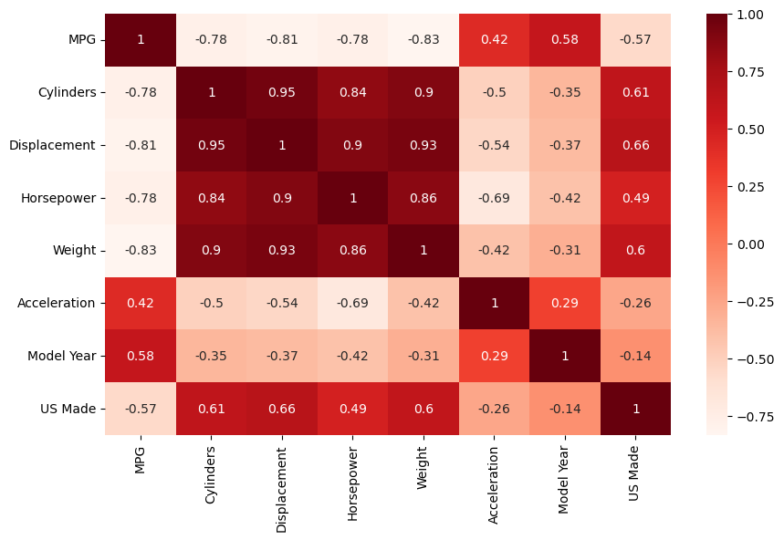
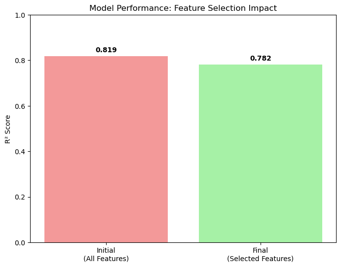

```python
# Packages
import matplotlib.pyplot as plt
import numpy as np
import pandas as pd
import seaborn as sns
from sklearn import datasets, linear_model
from sklearn.metrics import mean_squared_error, r2_score
from sklearn.model_selection import train_test_split
from sklearn.model_selection import cross_val_score
from sklearn.tree import DecisionTreeRegressor
from statsmodels.stats.outliers_influence import variance_inflation_factor
from sklearn.linear_model import LinearRegression
import statsmodels.api as sm
from scipy import stats
```


```python
# Load the data from csv
df = pd.read_csv('car.csv')
```


```python
df.info()
```

    <class 'pandas.core.frame.DataFrame'>
    RangeIndex: 398 entries, 0 to 397
    Data columns (total 8 columns):
     #   Column        Non-Null Count  Dtype  
    ---  ------        --------------  -----  
     0   MPG           398 non-null    float64
     1   Cylinders     398 non-null    int64  
     2   Displacement  398 non-null    float64
     3   Horsepower    398 non-null    object 
     4   Weight        398 non-null    int64  
     5   Acceleration  398 non-null    float64
     6   Model Year    398 non-null    int64  
     7   US Made       398 non-null    int64  
    dtypes: float64(3), int64(4), object(1)
    memory usage: 25.0+ KB
    


```python
df.describe()
```


<div>
<style scoped>
    .dataframe tbody tr th:only-of-type {
        vertical-align: middle;
    }

    .dataframe tbody tr th {
        vertical-align: top;
    }

    .dataframe thead th {
        text-align: right;
    }
</style>
<table border="1" class="dataframe">
  <thead>
    <tr style="text-align: right;">
      <th></th>
      <th>MPG</th>
      <th>Cylinders</th>
      <th>Displacement</th>
      <th>Weight</th>
      <th>Acceleration</th>
      <th>Model Year</th>
      <th>US Made</th>
    </tr>
  </thead>
  <tbody>
    <tr>
      <th>count</th>
      <td>398.000000</td>
      <td>398.000000</td>
      <td>398.000000</td>
      <td>398.000000</td>
      <td>398.000000</td>
      <td>398.000000</td>
      <td>398.000000</td>
    </tr>
    <tr>
      <th>mean</th>
      <td>23.514573</td>
      <td>5.454774</td>
      <td>193.425879</td>
      <td>2970.424623</td>
      <td>15.568090</td>
      <td>76.010050</td>
      <td>0.625628</td>
    </tr>
    <tr>
      <th>std</th>
      <td>7.815984</td>
      <td>1.701004</td>
      <td>104.269838</td>
      <td>846.841774</td>
      <td>2.757689</td>
      <td>3.697627</td>
      <td>0.484569</td>
    </tr>
    <tr>
      <th>min</th>
      <td>9.000000</td>
      <td>3.000000</td>
      <td>68.000000</td>
      <td>1613.000000</td>
      <td>8.000000</td>
      <td>70.000000</td>
      <td>0.000000</td>
    </tr>
    <tr>
      <th>25%</th>
      <td>17.500000</td>
      <td>4.000000</td>
      <td>104.250000</td>
      <td>2223.750000</td>
      <td>13.825000</td>
      <td>73.000000</td>
      <td>0.000000</td>
    </tr>
    <tr>
      <th>50%</th>
      <td>23.000000</td>
      <td>4.000000</td>
      <td>148.500000</td>
      <td>2803.500000</td>
      <td>15.500000</td>
      <td>76.000000</td>
      <td>1.000000</td>
    </tr>
    <tr>
      <th>75%</th>
      <td>29.000000</td>
      <td>8.000000</td>
      <td>262.000000</td>
      <td>3608.000000</td>
      <td>17.175000</td>
      <td>79.000000</td>
      <td>1.000000</td>
    </tr>
    <tr>
      <th>max</th>
      <td>46.600000</td>
      <td>8.000000</td>
      <td>455.000000</td>
      <td>5140.000000</td>
      <td>24.800000</td>
      <td>82.000000</td>
      <td>1.000000</td>
    </tr>
  </tbody>
</table>
</div>


```python
df.isnull().sum()
```


    MPG             0
    Cylinders       0
    Displacement    0
    Horsepower      0
    Weight          0
    Acceleration    0
    Model Year      0
    US Made         0
    dtype: int64


```python
df['Horsepower'] = pd.to_numeric(df['Horsepower'], errors = 'coerce')
```


```python
df.Horsepower.unique()
```


    array([130., 165., 150., 140., 198., 220., 215., 225., 190., 170., 160.,
            95.,  97.,  85.,  88.,  46.,  87.,  90., 113., 200., 210., 193.,
            nan, 100., 105., 175., 153., 180., 110.,  72.,  86.,  70.,  76.,
            65.,  69.,  60.,  80.,  54., 208., 155., 112.,  92., 145., 137.,
           158., 167.,  94., 107., 230.,  49.,  75.,  91., 122.,  67.,  83.,
            78.,  52.,  61.,  93., 148., 129.,  96.,  71.,  98., 115.,  53.,
            81.,  79., 120., 152., 102., 108.,  68.,  58., 149.,  89.,  63.,
            48.,  66., 139., 103., 125., 133., 138., 135., 142.,  77.,  62.,
           132.,  84.,  64.,  74., 116.,  82.])


```python
print(df[df['Horsepower'].isna()][['Cylinders', 'Displacement', 'Weight','Acceleration', 'Model Year', 'US Made']])
```

         Cylinders  Displacement  Weight  Acceleration  Model Year  US Made
    32           4          98.0    2046          19.0          71        1
    126          6         200.0    2875          17.0          74        1
    330          4          85.0    1835          17.3          80        0
    336          4         140.0    2905          14.3          80        1
    354          4         100.0    2320          15.8          81        0
    374          4         151.0    3035          20.5          82        1
    


```python
# Drop rows where Horsepower is NaN
df = df.dropna(subset=['Horsepower'])
```


```python
df.describe()
```


<div>
<style scoped>
    .dataframe tbody tr th:only-of-type {
        vertical-align: middle;
    }

    .dataframe tbody tr th {
        vertical-align: top;
    }

    .dataframe thead th {
        text-align: right;
    }
</style>
<table border="1" class="dataframe">
  <thead>
    <tr style="text-align: right;">
      <th></th>
      <th>MPG</th>
      <th>Cylinders</th>
      <th>Displacement</th>
      <th>Horsepower</th>
      <th>Weight</th>
      <th>Acceleration</th>
      <th>Model Year</th>
      <th>US Made</th>
    </tr>
  </thead>
  <tbody>
    <tr>
      <th>count</th>
      <td>392.000000</td>
      <td>392.000000</td>
      <td>392.000000</td>
      <td>392.000000</td>
      <td>392.000000</td>
      <td>392.000000</td>
      <td>392.000000</td>
      <td>392.000000</td>
    </tr>
    <tr>
      <th>mean</th>
      <td>23.445918</td>
      <td>5.471939</td>
      <td>194.411990</td>
      <td>104.469388</td>
      <td>2977.584184</td>
      <td>15.541327</td>
      <td>75.979592</td>
      <td>0.625000</td>
    </tr>
    <tr>
      <th>std</th>
      <td>7.805007</td>
      <td>1.705783</td>
      <td>104.644004</td>
      <td>38.491160</td>
      <td>849.402560</td>
      <td>2.758864</td>
      <td>3.683737</td>
      <td>0.484742</td>
    </tr>
    <tr>
      <th>min</th>
      <td>9.000000</td>
      <td>3.000000</td>
      <td>68.000000</td>
      <td>46.000000</td>
      <td>1613.000000</td>
      <td>8.000000</td>
      <td>70.000000</td>
      <td>0.000000</td>
    </tr>
    <tr>
      <th>25%</th>
      <td>17.000000</td>
      <td>4.000000</td>
      <td>105.000000</td>
      <td>75.000000</td>
      <td>2225.250000</td>
      <td>13.775000</td>
      <td>73.000000</td>
      <td>0.000000</td>
    </tr>
    <tr>
      <th>50%</th>
      <td>22.750000</td>
      <td>4.000000</td>
      <td>151.000000</td>
      <td>93.500000</td>
      <td>2803.500000</td>
      <td>15.500000</td>
      <td>76.000000</td>
      <td>1.000000</td>
    </tr>
    <tr>
      <th>75%</th>
      <td>29.000000</td>
      <td>8.000000</td>
      <td>275.750000</td>
      <td>126.000000</td>
      <td>3614.750000</td>
      <td>17.025000</td>
      <td>79.000000</td>
      <td>1.000000</td>
    </tr>
    <tr>
      <th>max</th>
      <td>46.600000</td>
      <td>8.000000</td>
      <td>455.000000</td>
      <td>230.000000</td>
      <td>5140.000000</td>
      <td>24.800000</td>
      <td>82.000000</td>
      <td>1.000000</td>
    </tr>
  </tbody>
</table>
</div>


```python
# relationship visuals
```


```python
predictors = ['Cylinders', 'Model Year', 'US Made']

fig, axes = plt.subplots(1,3, figsize=(16, 4))
axes = axes.flatten()

for i, var in enumerate(predictors):
    df.boxplot(column='MPG', by=var, ax=axes[i])
    axes[i].set_title(f'MPG by {var}')
    axes[i].set_xlabel(var)
    axes[i].set_ylabel('MPG')

plt.tight_layout()
plt.show()
```


    

    


```python
predictors2 = ['Displacement', 'Horsepower', 'Weight', 'Acceleration']

fig, axes = plt.subplots(2, 2, figsize=(16, 8))
axes = axes.flatten()

for i, var in enumerate(predictors2):  
    df.plot.scatter(x=var, y='MPG', ax=axes[i])
    axes[i].set_title(f'MPG by {var}')
    axes[i].set_xlabel(var)
    axes[i].set_ylabel('MPG')

plt.tight_layout()
plt.show()
```


    

    


```python
# correlation
plt.figure(figsize=(10, 6))
sns.heatmap(df.corr(), cmap=plt.cm.Reds,annot=True)
plt.show()
```


    

    


```python
# Calculate VIF for each variable
def calculate_vif(df, features):
    vif_data = pd.DataFrame()
    vif_data["Feature"] = features
    vif_data["VIF"] = [variance_inflation_factor(df[features].values, i) 
                       for i in range(len(features))]
    return vif_data.sort_values('VIF', ascending=False)

features = ['Cylinders', 'Displacement', 'Horsepower', 'Weight', 
           'Acceleration', 'Model Year', 'US Made']
print(calculate_vif(df, features))
```

            Feature         VIF
    3        Weight  137.515824
    0     Cylinders  116.972922
    5    Model Year  111.461535
    1  Displacement  101.294390
    4  Acceleration   69.462808
    2    Horsepower   65.025201
    6       US Made    5.211925
    


```python
# stepwise selection 
def stepwise_selection(X, y, threshold_in=0.05, threshold_out=0.10):
    """
    Perform stepwise feature selection
    """
    # Start with no variables
    included = []
    
    while True:
        changed = False
        
        # Forward step - add variables
        excluded = [col for col in X.columns if col not in included]
        new_pval = pd.Series(index=excluded, dtype=float)
        
        for new_column in excluded:
            model = sm.OLS(y, sm.add_constant(X[included + [new_column]])).fit()
            new_pval[new_column] = model.pvalues[new_column]
            
        best_pval = new_pval.min()
        if best_pval < threshold_in:
            best_feature = new_pval.idxmin()
            included.append(best_feature)
            changed = True
            print(f'Added {best_feature} with p-value {best_pval:.4f}')
            
        # Backward step - remove variables
        if len(included) > 0:
            model = sm.OLS(y, sm.add_constant(X[included])).fit()
            pvalues = model.pvalues.iloc[1:]  # Exclude intercept
            worst_pval = pvalues.max()
            
            if worst_pval > threshold_out:
                worst_feature = pvalues.idxmax()
                included.remove(worst_feature)
                changed = True
                print(f'Removed {worst_feature} with p-value {worst_pval:.4f}')
                
        if not changed:
            break
            
    return included

# Use it:
# Prepare your data
X = df[['Cylinders', 'Displacement', 'Horsepower', 'Weight', 
        'Acceleration', 'Model Year', 'US Made']]
y = df['MPG']

# Run stepwise selection
selected_features = stepwise_selection(X, y)
print(f"\nFinal selected features: {selected_features}")

# Fit final model
final_model = sm.OLS(y, sm.add_constant(X[selected_features])).fit()
print(final_model.summary())
```

    Added Weight with p-value 0.0000
    Added Model Year with p-value 0.0000
    Added US Made with p-value 0.0000
    
    Final selected features: ['Weight', 'Model Year', 'US Made']
                                OLS Regression Results                            
    ==============================================================================
    Dep. Variable:                    MPG   R-squared:                       0.819
    Model:                            OLS   Adj. R-squared:                  0.818
    Method:                 Least Squares   F-statistic:                     585.0
    Date:                Sat, 31 May 2025   Prob (F-statistic):          1.47e-143
    Time:                        14:16:35   Log-Likelihood:                -1026.2
    No. Observations:                 392   AIC:                             2060.
    Df Residuals:                     388   BIC:                             2076.
    Df Model:                           3                                         
    Covariance Type:            nonrobust                                         
    ==============================================================================
                     coef    std err          t      P>|t|      [0.025      0.975]
    ------------------------------------------------------------------------------
    const        -16.3891      3.921     -4.180      0.000     -24.097      -8.681
    Weight        -0.0059      0.000    -22.731      0.000      -0.006      -0.005
    Model Year     0.7725      0.048     16.017      0.000       0.678       0.867
    US Made       -2.0951      0.436     -4.804      0.000      -2.953      -1.238
    ==============================================================================
    Omnibus:                       31.193   Durbin-Watson:                   1.244
    Prob(Omnibus):                  0.000   Jarque-Bera (JB):               55.174
    Skew:                           0.497   Prob(JB):                     1.04e-12
    Kurtosis:                       4.545   Cond. No.                     7.21e+04
    ==============================================================================
    
    Notes:
    [1] Standard Errors assume that the covariance matrix of the errors is correctly specified.
    [2] The condition number is large, 7.21e+04. This might indicate that there are
    strong multicollinearity or other numerical problems.
    


```python
# check correleations 
print(df[['Weight', 'Model Year', 'US Made']].corr())
```

                  Weight  Model Year   US Made
    Weight      1.000000   -0.309120  0.600978
    Model Year -0.309120    1.000000 -0.136065
    US Made     0.600978   -0.136065  1.000000
    


```python
# Calculate VIF for final selected features
final_features = ['Weight', 'Model Year', 'US Made']
vif_final = calculate_vif(df, final_features)
print(vif_final)
```

          Feature        VIF
    0      Weight  18.638401
    1  Model Year  12.581913
    2     US Made   4.142989
    


```python
# Check model assumptions
residuals = final_model.resid
fitted = final_model.fittedvalues

# Residual plots
plt.figure(figsize=(12, 4))

plt.subplot(1, 3, 1)
plt.scatter(fitted, residuals)
plt.xlabel('Fitted Values')
plt.ylabel('Residuals')
plt.title('Residuals vs Fitted')
plt.axhline(y=0, color='r', linestyle='--')

plt.subplot(1, 3, 2)
import scipy.stats as stats
stats.probplot(residuals, dist="norm", plot=plt)
plt.title('Q-Q Plot')

plt.subplot(1, 3, 3)
plt.hist(residuals, bins=20, edgecolor='black')
plt.xlabel('Residuals')
plt.title('Residual Distribution')

plt.tight_layout()
plt.show()
```


    

    


```python
# Find cars with large positive residuals
large_residuals = df[residuals > 2.5]  # or whatever threshold
print("Cars with large positive residuals:")
print(large_residuals[['MPG', 'Weight', 'Model Year', 'US Made']])
```

    Cars with large positive residuals:
          MPG  Weight  Model Year  US Made
    0    18.0    3504          70        1
    2    18.0    3436          70        1
    5    15.0    4341          70        1
    6    14.0    4354          70        1
    7    14.0    4312          70        1
    ..    ...     ...         ...      ...
    383  38.0    1965          82        0
    385  38.0    1995          82        0
    387  38.0    3015          82        1
    391  36.0    2370          82        1
    394  44.0    2130          82        0
    
    [69 rows x 4 columns]
    


```python
X = df[['Weight', 'Model Year', 'US Made']]
y = df['MPG']
X_train, X_test, y_train, y_test = train_test_split(
    X, y, test_size=0.2, random_state=42)
print(f"Training set: {X_train.shape[0]} observations")
print(f"Test set: {X_test.shape[0]} observations")
```

    Training set: 313 observations
    Test set: 79 observations
    


```python
# Fit model on training data only
model = LinearRegression()
model.fit(X_train, y_train)
```


<style>#sk-container-id-1 {
  /* Definition of color scheme common for light and dark mode */
  --sklearn-color-text: black;
  --sklearn-color-line: gray;
  /* Definition of color scheme for unfitted estimators */
  --sklearn-color-unfitted-level-0: #fff5e6;
  --sklearn-color-unfitted-level-1: #f6e4d2;
  --sklearn-color-unfitted-level-2: #ffe0b3;
  --sklearn-color-unfitted-level-3: chocolate;
  /* Definition of color scheme for fitted estimators */
  --sklearn-color-fitted-level-0: #f0f8ff;
  --sklearn-color-fitted-level-1: #d4ebff;
  --sklearn-color-fitted-level-2: #b3dbfd;
  --sklearn-color-fitted-level-3: cornflowerblue;

  /* Specific color for light theme */
  --sklearn-color-text-on-default-background: var(--sg-text-color, var(--theme-code-foreground, var(--jp-content-font-color1, black)));
  --sklearn-color-background: var(--sg-background-color, var(--theme-background, var(--jp-layout-color0, white)));
  --sklearn-color-border-box: var(--sg-text-color, var(--theme-code-foreground, var(--jp-content-font-color1, black)));
  --sklearn-color-icon: #696969;

  @media (prefers-color-scheme: dark) {
    /* Redefinition of color scheme for dark theme */
    --sklearn-color-text-on-default-background: var(--sg-text-color, var(--theme-code-foreground, var(--jp-content-font-color1, white)));
    --sklearn-color-background: var(--sg-background-color, var(--theme-background, var(--jp-layout-color0, #111)));
    --sklearn-color-border-box: var(--sg-text-color, var(--theme-code-foreground, var(--jp-content-font-color1, white)));
    --sklearn-color-icon: #878787;
  }
}

#sk-container-id-1 {
  color: var(--sklearn-color-text);
}

#sk-container-id-1 pre {
  padding: 0;
}

#sk-container-id-1 input.sk-hidden--visually {
  border: 0;
  clip: rect(1px 1px 1px 1px);
  clip: rect(1px, 1px, 1px, 1px);
  height: 1px;
  margin: -1px;
  overflow: hidden;
  padding: 0;
  position: absolute;
  width: 1px;
}

#sk-container-id-1 div.sk-dashed-wrapped {
  border: 1px dashed var(--sklearn-color-line);
  margin: 0 0.4em 0.5em 0.4em;
  box-sizing: border-box;
  padding-bottom: 0.4em;
  background-color: var(--sklearn-color-background);
}

#sk-container-id-1 div.sk-container {
  /* jupyter's `normalize.less` sets `[hidden] { display: none; }`
     but bootstrap.min.css set `[hidden] { display: none !important; }`
     so we also need the `!important` here to be able to override the
     default hidden behavior on the sphinx rendered scikit-learn.org.
     See: https://github.com/scikit-learn/scikit-learn/issues/21755 */
  display: inline-block !important;
  position: relative;
}

#sk-container-id-1 div.sk-text-repr-fallback {
  display: none;
}

div.sk-parallel-item,
div.sk-serial,
div.sk-item {
  /* draw centered vertical line to link estimators */
  background-image: linear-gradient(var(--sklearn-color-text-on-default-background), var(--sklearn-color-text-on-default-background));
  background-size: 2px 100%;
  background-repeat: no-repeat;
  background-position: center center;
}

/* Parallel-specific style estimator block */

#sk-container-id-1 div.sk-parallel-item::after {
  content: "";
  width: 100%;
  border-bottom: 2px solid var(--sklearn-color-text-on-default-background);
  flex-grow: 1;
}

#sk-container-id-1 div.sk-parallel {
  display: flex;
  align-items: stretch;
  justify-content: center;
  background-color: var(--sklearn-color-background);
  position: relative;
}

#sk-container-id-1 div.sk-parallel-item {
  display: flex;
  flex-direction: column;
}

#sk-container-id-1 div.sk-parallel-item:first-child::after {
  align-self: flex-end;
  width: 50%;
}

#sk-container-id-1 div.sk-parallel-item:last-child::after {
  align-self: flex-start;
  width: 50%;
}

#sk-container-id-1 div.sk-parallel-item:only-child::after {
  width: 0;
}

/* Serial-specific style estimator block */

#sk-container-id-1 div.sk-serial {
  display: flex;
  flex-direction: column;
  align-items: center;
  background-color: var(--sklearn-color-background);
  padding-right: 1em;
  padding-left: 1em;
}


/* Toggleable style: style used for estimator/Pipeline/ColumnTransformer box that is
clickable and can be expanded/collapsed.
- Pipeline and ColumnTransformer use this feature and define the default style
- Estimators will overwrite some part of the style using the `sk-estimator` class
*/

/* Pipeline and ColumnTransformer style (default) */

#sk-container-id-1 div.sk-toggleable {
  /* Default theme specific background. It is overwritten whether we have a
  specific estimator or a Pipeline/ColumnTransformer */
  background-color: var(--sklearn-color-background);
}

/* Toggleable label */
#sk-container-id-1 label.sk-toggleable__label {
  cursor: pointer;
  display: block;
  width: 100%;
  margin-bottom: 0;
  padding: 0.5em;
  box-sizing: border-box;
  text-align: center;
}

#sk-container-id-1 label.sk-toggleable__label-arrow:before {
  /* Arrow on the left of the label */
  content: "▸";
  float: left;
  margin-right: 0.25em;
  color: var(--sklearn-color-icon);
}

#sk-container-id-1 label.sk-toggleable__label-arrow:hover:before {
  color: var(--sklearn-color-text);
}

/* Toggleable content - dropdown */

#sk-container-id-1 div.sk-toggleable__content {
  max-height: 0;
  max-width: 0;
  overflow: hidden;
  text-align: left;
  /* unfitted */
  background-color: var(--sklearn-color-unfitted-level-0);
}

#sk-container-id-1 div.sk-toggleable__content.fitted {
  /* fitted */
  background-color: var(--sklearn-color-fitted-level-0);
}

#sk-container-id-1 div.sk-toggleable__content pre {
  margin: 0.2em;
  border-radius: 0.25em;
  color: var(--sklearn-color-text);
  /* unfitted */
  background-color: var(--sklearn-color-unfitted-level-0);
}

#sk-container-id-1 div.sk-toggleable__content.fitted pre {
  /* unfitted */
  background-color: var(--sklearn-color-fitted-level-0);
}

#sk-container-id-1 input.sk-toggleable__control:checked~div.sk-toggleable__content {
  /* Expand drop-down */
  max-height: 200px;
  max-width: 100%;
  overflow: auto;
}

#sk-container-id-1 input.sk-toggleable__control:checked~label.sk-toggleable__label-arrow:before {
  content: "▾";
}

/* Pipeline/ColumnTransformer-specific style */

#sk-container-id-1 div.sk-label input.sk-toggleable__control:checked~label.sk-toggleable__label {
  color: var(--sklearn-color-text);
  background-color: var(--sklearn-color-unfitted-level-2);
}

#sk-container-id-1 div.sk-label.fitted input.sk-toggleable__control:checked~label.sk-toggleable__label {
  background-color: var(--sklearn-color-fitted-level-2);
}

/* Estimator-specific style */

/* Colorize estimator box */
#sk-container-id-1 div.sk-estimator input.sk-toggleable__control:checked~label.sk-toggleable__label {
  /* unfitted */
  background-color: var(--sklearn-color-unfitted-level-2);
}

#sk-container-id-1 div.sk-estimator.fitted input.sk-toggleable__control:checked~label.sk-toggleable__label {
  /* fitted */
  background-color: var(--sklearn-color-fitted-level-2);
}

#sk-container-id-1 div.sk-label label.sk-toggleable__label,
#sk-container-id-1 div.sk-label label {
  /* The background is the default theme color */
  color: var(--sklearn-color-text-on-default-background);
}

/* On hover, darken the color of the background */
#sk-container-id-1 div.sk-label:hover label.sk-toggleable__label {
  color: var(--sklearn-color-text);
  background-color: var(--sklearn-color-unfitted-level-2);
}

/* Label box, darken color on hover, fitted */
#sk-container-id-1 div.sk-label.fitted:hover label.sk-toggleable__label.fitted {
  color: var(--sklearn-color-text);
  background-color: var(--sklearn-color-fitted-level-2);
}

/* Estimator label */

#sk-container-id-1 div.sk-label label {
  font-family: monospace;
  font-weight: bold;
  display: inline-block;
  line-height: 1.2em;
}

#sk-container-id-1 div.sk-label-container {
  text-align: center;
}

/* Estimator-specific */
#sk-container-id-1 div.sk-estimator {
  font-family: monospace;
  border: 1px dotted var(--sklearn-color-border-box);
  border-radius: 0.25em;
  box-sizing: border-box;
  margin-bottom: 0.5em;
  /* unfitted */
  background-color: var(--sklearn-color-unfitted-level-0);
}

#sk-container-id-1 div.sk-estimator.fitted {
  /* fitted */
  background-color: var(--sklearn-color-fitted-level-0);
}

/* on hover */
#sk-container-id-1 div.sk-estimator:hover {
  /* unfitted */
  background-color: var(--sklearn-color-unfitted-level-2);
}

#sk-container-id-1 div.sk-estimator.fitted:hover {
  /* fitted */
  background-color: var(--sklearn-color-fitted-level-2);
}

/* Specification for estimator info (e.g. "i" and "?") */

/* Common style for "i" and "?" */

.sk-estimator-doc-link,
a:link.sk-estimator-doc-link,
a:visited.sk-estimator-doc-link {
  float: right;
  font-size: smaller;
  line-height: 1em;
  font-family: monospace;
  background-color: var(--sklearn-color-background);
  border-radius: 1em;
  height: 1em;
  width: 1em;
  text-decoration: none !important;
  margin-left: 1ex;
  /* unfitted */
  border: var(--sklearn-color-unfitted-level-1) 1pt solid;
  color: var(--sklearn-color-unfitted-level-1);
}

.sk-estimator-doc-link.fitted,
a:link.sk-estimator-doc-link.fitted,
a:visited.sk-estimator-doc-link.fitted {
  /* fitted */
  border: var(--sklearn-color-fitted-level-1) 1pt solid;
  color: var(--sklearn-color-fitted-level-1);
}

/* On hover */
div.sk-estimator:hover .sk-estimator-doc-link:hover,
.sk-estimator-doc-link:hover,
div.sk-label-container:hover .sk-estimator-doc-link:hover,
.sk-estimator-doc-link:hover {
  /* unfitted */
  background-color: var(--sklearn-color-unfitted-level-3);
  color: var(--sklearn-color-background);
  text-decoration: none;
}

div.sk-estimator.fitted:hover .sk-estimator-doc-link.fitted:hover,
.sk-estimator-doc-link.fitted:hover,
div.sk-label-container:hover .sk-estimator-doc-link.fitted:hover,
.sk-estimator-doc-link.fitted:hover {
  /* fitted */
  background-color: var(--sklearn-color-fitted-level-3);
  color: var(--sklearn-color-background);
  text-decoration: none;
}

/* Span, style for the box shown on hovering the info icon */
.sk-estimator-doc-link span {
  display: none;
  z-index: 9999;
  position: relative;
  font-weight: normal;
  right: .2ex;
  padding: .5ex;
  margin: .5ex;
  width: min-content;
  min-width: 20ex;
  max-width: 50ex;
  color: var(--sklearn-color-text);
  box-shadow: 2pt 2pt 4pt #999;
  /* unfitted */
  background: var(--sklearn-color-unfitted-level-0);
  border: .5pt solid var(--sklearn-color-unfitted-level-3);
}

.sk-estimator-doc-link.fitted span {
  /* fitted */
  background: var(--sklearn-color-fitted-level-0);
  border: var(--sklearn-color-fitted-level-3);
}

.sk-estimator-doc-link:hover span {
  display: block;
}

/* "?"-specific style due to the `<a>` HTML tag */

#sk-container-id-1 a.estimator_doc_link {
  float: right;
  font-size: 1rem;
  line-height: 1em;
  font-family: monospace;
  background-color: var(--sklearn-color-background);
  border-radius: 1rem;
  height: 1rem;
  width: 1rem;
  text-decoration: none;
  /* unfitted */
  color: var(--sklearn-color-unfitted-level-1);
  border: var(--sklearn-color-unfitted-level-1) 1pt solid;
}

#sk-container-id-1 a.estimator_doc_link.fitted {
  /* fitted */
  border: var(--sklearn-color-fitted-level-1) 1pt solid;
  color: var(--sklearn-color-fitted-level-1);
}

/* On hover */
#sk-container-id-1 a.estimator_doc_link:hover {
  /* unfitted */
  background-color: var(--sklearn-color-unfitted-level-3);
  color: var(--sklearn-color-background);
  text-decoration: none;
}

#sk-container-id-1 a.estimator_doc_link.fitted:hover {
  /* fitted */
  background-color: var(--sklearn-color-fitted-level-3);
}
</style><div id="sk-container-id-1" class="sk-top-container"><div class="sk-text-repr-fallback"><pre>LinearRegression()</pre><b>In a Jupyter environment, please rerun this cell to show the HTML representation or trust the notebook. <br />On GitHub, the HTML representation is unable to render, please try loading this page with nbviewer.org.</b></div><div class="sk-container" hidden><div class="sk-item"><div class="sk-estimator fitted sk-toggleable"><input class="sk-toggleable__control sk-hidden--visually" id="sk-estimator-id-1" type="checkbox" checked><label for="sk-estimator-id-1" class="sk-toggleable__label fitted sk-toggleable__label-arrow fitted">&nbsp;&nbsp;LinearRegression<a class="sk-estimator-doc-link fitted" rel="noreferrer" target="_blank" href="https://scikit-learn.org/1.5/modules/generated/sklearn.linear_model.LinearRegression.html">?<span>Documentation for LinearRegression</span></a><span class="sk-estimator-doc-link fitted">i<span>Fitted</span></span></label><div class="sk-toggleable__content fitted"><pre>LinearRegression()</pre></div> </div></div></div></div>


```python
# Predict on both sets
y_train_pred = model.predict(X_train)
y_test_pred = model.predict(X_test)
```


```python
# compare 
train_r2 = r2_score(y_train, y_train_pred)
test_r2 = r2_score(y_test, y_test_pred)
train_rmse = np.sqrt(mean_squared_error(y_train, y_train_pred))
test_rmse = np.sqrt(mean_squared_error(y_test, y_test_pred))

print(f"\nTraining R²: {train_r2:.3f}")
print(f"Test R²: {test_r2:.3f}")
print(f"Training RMSE: {train_rmse:.3f}")
print(f"Test RMSE: {test_rmse:.3f}")
```

    
    Training R²: 0.825
    Test R²: 0.782
    Training RMSE: 3.326
    Test RMSE: 3.334
    


```python
# Model performance comparison
models = ['Initial\n(All Features)', 'Final\n(Selected Features)']
r2_scores = [0.819, 0.782]  # Full dataset vs test performance

plt.figure(figsize=(8, 6))
bars = plt.bar(models, r2_scores, color=['lightcoral', 'lightgreen'], alpha=0.8)
plt.ylabel('R² Score')
plt.title('Model Performance: Feature Selection Impact')
plt.ylim(0, 1)

# Add value labels on bars
for bar, score in zip(bars, r2_scores):
    plt.text(bar.get_x() + bar.get_width()/2, bar.get_height() + 0.01, 
             f'{score:.3f}', ha='center', va='bottom', fontweight='bold')

plt.show()
```


    

    


```python
# Actionable insights for car manufacturer
fig, ax = plt.subplots(figsize=(10, 8))

recommendations = [
    "Reduce vehicle weight\n(Each 1000 lbs = +6 MPG)",
    "Focus on newer technology\n(Each year newer = +0.77 MPG)", 
    "Learn from foreign designs\n(US cars average -2.1 MPG penalty)"
]

impact_scores = [6.0, 0.77, 2.1]
colors = ['red', 'blue', 'green']

bars = ax.barh(recommendations, impact_scores, color=colors, alpha=0.7)
ax.set_xlabel('MPG Impact')
ax.set_title('Design Recommendations for Higher MPG\n(Based on Final Model Coefficients)')

# Add value labels
for bar, score in zip(bars, impact_scores):
    ax.text(bar.get_width() + -0.4, bar.get_y() + bar.get_height()/2, 
            f'+{score} MPG', va='center', fontweight='bold')

plt.tight_layout()
plt.show()
```


    

    

